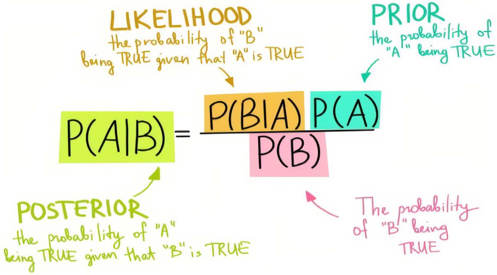
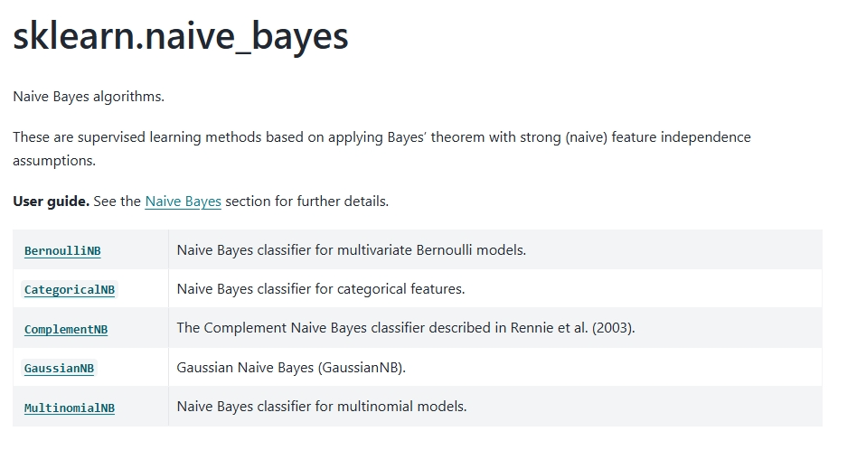
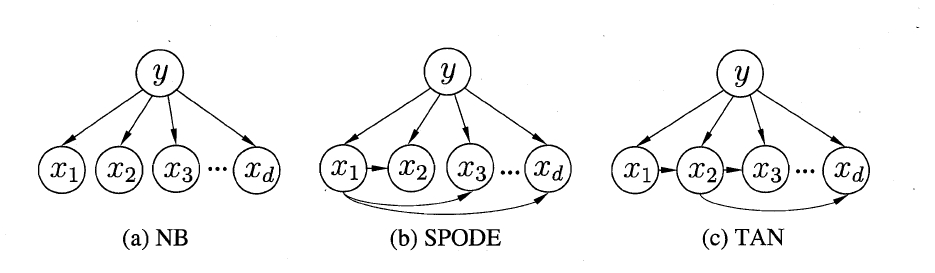

## 5.贝叶斯分类器

### 5.1 贝叶斯决策论

**贝叶斯决策论**（Bayesian decision theory）是**概率框架下实施决策的基本方法**。对分类任务来说，在所有相关概率都已知的理想情形下，贝叶斯决策论考虑如何基于这些概率和误判损失来选择最优的类别标记。下面我们以多分类任务为例来解释其基本原理。

假设有 $N$ 种可能的类别标记，即 $\mathcal{Y} = \{c_1, c_2, \ldots, c_N\}$，$\lambda_{ij}$ 是将一个真实标记为 $c_j$ 的样本误分类为 $c_i$ 所产生的损失。基于后验概率 $P(c_i \mid \boldsymbol{x})$ 可获得将样本 $\boldsymbol{x}$ 分类为 $c_i$ 所产生的**期望损失**（expected loss），即在样本 $\boldsymbol{x}$ 上的**条件风险**（conditional risk）

$$
R(c_i \mid \boldsymbol{x}) = \sum_{j=1}^{N} \lambda_{ij} P(c_j \mid \boldsymbol{x})
$$

> 决策论中将“期望损失”称为“风险”（Risk）

我们的任务是寻找一个**判定准则** $h: \mathcal{X} \mapsto \mathcal{Y}$ 以最小化总体风险
$$
R(h) = \mathbb{E}_x [R(h(\boldsymbol{x}) \mid \boldsymbol{x})]
$$

显然，对每个样本 $\boldsymbol{x}$，若 $h$ 能最小化条件风险 $R(h(\boldsymbol{x}) \mid \boldsymbol{x})$，则总体风险 $R(h)$ 也将被最小化。

这就产生了**贝叶斯判定准则**（Bayes decision rule）：为最小化总体风险，只需在每个样本上选择那个能使条件风险 $R(c \mid \boldsymbol{x})$ 最小的类别标记，即
$$
h^*(\boldsymbol{x}) = \arg \min_{c \in \mathcal{Y}} R(c \mid \boldsymbol{x})
$$

此时，$h^*$ 称为贝叶斯最优分类器（Bayes optimal classifier），与之对应的总体风险 $R(h^*)$ 称为贝叶斯风险（Bayes risk）。$1 - R(h^*)$ 反映了分类器所能达到的最好性能，即通过机器学习所能产生的模型精度的理论上限。

具体来说，若目标是最小化分类错误率，则误判损失 $\lambda_{ij}$ 可写为

$$
\lambda_{ij} = 
\begin{cases} 
0, & \text{if } i = j \ ; \\ 
1, & \text{otherwise},
\end{cases}
$$

> 错误率相当于对应的 0 / 1 损失

此时条件风险
$$
R(c \mid \boldsymbol{x}) = 1 - P(c \mid \boldsymbol{x})
$$

于是，最小化分类错误率的贝叶斯最优分类器为

$$
h^*(\boldsymbol{x}) = \arg \max_{c \in \mathcal{Y}} P(c \mid \boldsymbol{x})
$$

即对每个样本 $\boldsymbol{x}$，选择能使后验概率 $P(c \mid \boldsymbol{x})$ 最大的类别标记。

不难看出，欲使用贝叶斯判定准则来最小化决策风险，**首先要获得后验概率** $P(c \mid \boldsymbol{x})$ 。然而，在现实任务中这通常难以直接获得。从这个角度来看，机器学习所要实现的是基于有限的训练样本集尽可能准确地估计出后验概率 $P(c \mid \boldsymbol{x})$。

> 大体来说，主要有两种策略：
>
> - 给定样本 $\boldsymbol{x}$，可通过直接建模 $P(c \mid \boldsymbol{x})$ 来预测 $c$，这样得到的是**判别式模型**（discriminative models）；
> - 也可先对联合概率分布 $P(\boldsymbol{x}, c)$ 建模，然后再由此获得 $P(c \mid \boldsymbol{x})$，这样得到的是**生成式模型**（generative models）。

显然，决策树、BP神经网络、支持向量机等，都可归入判别式模型的范畴。对生成式模型来说，必然考虑
$$
P(c \mid \boldsymbol{x}) = \frac{P(\boldsymbol{x}, c)}{P(\boldsymbol{x})}
$$

基于贝叶斯定理，$P(c \mid x)$ 可写为

$$
P(c \mid \boldsymbol{x}) = \frac{P(c) P(\boldsymbol{x} \mid c)}{P(\boldsymbol{x})}
$$

式中，$P(c)$ 是类**先验（prior）概率**；$P(x \mid c)$ 是样本 $x$ 相对于类标记 $c$ 的**类条件概率**（class-conditional probability），或称为“似然”（likelihood）；$P(x)$ 是用于归一化的**证据（evidence）因子**。

> 对给定样本 $x$，证据因子 $P(x)$ 与类标记无关，因此**估计 $P(c \mid x)$ 的问题就转化为如何基于训练数据 $D$ 来估计先验 $P(c)$ 和似然 $P(x \mid c)$** 。
>
> - 类先验概率 $P(c)$ 表达了样本空间中各类样本所占的比例，根据大数定律，当训练集合含充足的独立同分布样本时，$P(c)$ 可通过各类样本出现的频率来进行估计。
>
> - 类条件概率 $P(x \mid c)$ 涉及关于 $x$ 所有属性的联合概率，直接根据样本出现的频率来估计十分困难。

### 5.2 极大似然估计

**估计类条件概率的一种常用策略是先假定其具有某种确定的概率分布形式**，再基于训练样本对概率分布的参数进行估计。具体地，记关于类别 $c$ 的类条件概率为 $P(\boldsymbol{x} \mid c)$，假设 $P(\boldsymbol{x} \mid c)$ 具有确定的形式并且被参数向量 $\boldsymbol{\theta}_c$ 唯一确定，则我们的任务就是利用训练集 $D$ 估计参数 $\boldsymbol{\theta}_c$ 。为明确起见，我们将 $P(\boldsymbol{x} \mid c)$ 记为 $P(\boldsymbol{x} \mid \boldsymbol{\theta}_c)$。

> 事实上，**概率模型的训练过程就是参数估计**（parameter estimation）过程。对于参数估计，统计学界的两个学派分别提供了不同的解决方案：
>
> - 频率主义学派（Frequentist）认为参数虽然未知，但却是客观存在的固定值，因此，可通过优化似然函数等准则来确定参数值；
>
> - 贝叶斯学派（Bayesian）则认为参数是未观察到的随机变量，其本身也可有分布，因此，可假定参数服从一个先验分布，然后基于观测到的数据来计算参数的后验分布。
>
> 本节介绍源自频率主义学派的**极大似然估计**（Maximum Likelihood Estimation, 简称 MLE），这是根据数据采样来估计概率分布参数的经典方法。

令 $D_c$ 表示训练集 $D$ 中第 $c$ 类样本组成的集合，假设这些样本是独立同分布的，则参数 $\boldsymbol{\theta}_c$ 对于数据集 $D_c$ 的似然是：

$$
P(D_c \mid \boldsymbol{\theta}_c) = \prod_{\boldsymbol{x}\in D_c} P(\boldsymbol{x} \mid \boldsymbol{\theta}_c)
$$

对 $\boldsymbol{\theta}_c$ 进行极大似然估计，就是去寻找能最大化似然 $P(D_c \mid \boldsymbol{\theta}_c)$ 的参数值 $\hat{\boldsymbol{\theta}}_c$ 。直观上看，极大似然估计是试图在 $\boldsymbol{\theta}_c$ 所有可能的取值中，找到一个能使数据出现的"可能性"最大的值。

由于连乘操作易造成下溢，通常使用**对数似然**（log-likelihood）

$$
\begin{aligned}
LL(\boldsymbol{\theta}_c) &= \log\ P(D_c \mid \boldsymbol{\theta}_c) \\[5pt]
&= \sum_{\boldsymbol{x}\in D_c} \log\ P(\boldsymbol{x} \mid \boldsymbol{\theta}_c),
\end{aligned}
$$
此时参数 $\boldsymbol{\theta}_c$ 的极大似然估计 $\hat{\boldsymbol{\theta}}_c$ 为：
$$
\hat{\boldsymbol{\theta}}_c = \underset{\boldsymbol{\theta}_c}{\arg \max} \ LL(\boldsymbol{\theta}_c)
$$
需注意的是，这种参数化的方法虽能使类条件概率分布变得相对简单，但**估计结果的准确性，严重依赖于所假设的概率分布形式是否符合潜在的真实数据分布**。

---

### 5.3 朴素贝叶斯分类器

不难发现，基于贝叶斯公式来估计后验概率 $P(c \mid \boldsymbol{x})$ 的主要困难在于：类条件概率 $P(\boldsymbol{x} \mid c)$ 是所有属性上的联合概率，难以从有限的训练样本直接估计而得。为避开这个障碍，朴素贝叶斯分类器（naive Bayes classifier）采用了**属性条件独立性假设**：对已知类别，假设所有属性相互独立。换言之，假设**每个属性独立地对分类结果发生影响**。

基于属性条件独立性假设，有：

$$
P(c \mid \boldsymbol{x}) = \frac{P(c)P(\boldsymbol{x} \mid c)}{P(\boldsymbol{x})} = \frac{P(c)}{P(\boldsymbol{x})} \prod_{i=1}^{d} P(x_i \mid c)
$$

其中 $d$ 为属性数目，$x_i$ 为 $\boldsymbol{x}$ 在第 $i$ 个属性上的取值。

由于对所有类别来说 $P(\boldsymbol{x})$ 相同，因此基于贝叶斯判定准则有：

$$
h(\boldsymbol{x}) = \underset{c \in \mathcal{Y}}{\arg\max}\ P(c) \prod_{i=1}^{d} P(x_i \mid c),
$$

这就是朴素贝叶斯分类器的表达式。

> 显然，朴素贝叶斯分类器的训练过程就是基于训练集 $D$ 来估计类先验概率 $P(c)$，并为每个属性估计条件概率 $P(x_i \mid c)$。
>
> 令 $D_c$ 表示训练集 $D$ 中第 $c$ 类样本组成的集合，若有充足的独立同分布样本，则可容易地估计出类先验概率
>
> $$
> P(c) = \frac{|D_c|}{|D|}
> $$
>
> 对离散属性而言，令 $D_{c,x_i}$ 表示 $D_c$ 中在第 $i$ 个属性上取值为 $x_i$ 的样本组成的集合，则条件概率 $P(x_i \mid c)$ 可估计为
>
> $$
> P(x_i \mid c) = \frac{|D_{c,x_i}|}{|D_c|}
> $$
> 为了避免其他属性携带的信息被训练集中未出现的属性值抹去，在估计概率值时通常要进行**平滑**：
> $$
> \hat{P}(c) = \frac{|D_c| + \alpha}{|D| + \alpha N}\\
> \hat{P}(x_i \mid c) = \frac{|D_{c,x_i}| + \alpha}{|D_c| + \alpha N_i}
> $$
> $N$ 表示训练集 $D$ 中可能的类别数， $N_i$ 表示第 $i$ 个属性可能的取值数。
>
>  $\alpha = 1$ 时称为拉普拉斯修正（Laplacian correction），$0 \leq \alpha < 1$ 时称为李德斯通（Lidstone）修正。

通过假设不同的 $P(x_i \mid c)$ 的分布，得到常用的几种贝叶斯分类器：

- **高斯朴素贝叶斯**（Gaussian Naive Bayes）

    `GaussianNB` 假定假定各个特征 $x_i$ 在各个类别 $c$ 下是服从正太分布的，即 $p(x_i \mid c) \sim \mathcal{N}(\mu_{c,i}, \sigma_{c,i}^2)$，其中 $\mu_{c,i}$ 和 $\sigma_{c,i}^2$ 分别是第 $c$ 类样本在第 $i$ 个属性上取值的均值和方差，则有：
    $$
    p(x_i \mid c) = \frac{1}{\sqrt{2\pi}\sigma_{c,i}} \exp\left(-\frac{(x_i - \mu_{c,i})^2}{2\sigma_{c,i}^2}\right).
    $$

- **多项式朴素贝叶斯**（Multinomial Naive Bayes）

    `MultinomialNB` 多用于文本分析（其中数据通常表示为词向量，尽管在实际中 TF-IDF 向量也是很好的）。分类由每个类 $c$ 的向量 $\theta_c = (\theta_{c1},\cdots , \theta_{cn})$ 参数化，其中 $n$ 是特征数（在文本分类中，即为词汇表的大小），$\theta_{ci}$ 是特征 $i$ 出现在属于 $c$ 类中的样本的概率 $p(x_i \mid c)$ 。

    参数 $\theta_c$ 是用平滑的最大似然(即相对频率计数)估计的：

    
    $$
    \hat{\theta}_{ci} = \hat{P}(x_i \mid c) = \frac{|D_{c,x_i}| + \alpha}{|D_c| + \alpha N_i}
    $$
    
- **伯努利朴素贝叶斯**（Bernoulli Naive Bayes）

    `BernoulliNB` 实现了按多元伯努利分布的数据的朴素贝叶斯训练和分类算法，即可能有多个特征，但每个特征都被假定为一个二元值(Bernoulli，boole)变量（也就是说，$i$ 的取值有且只有 2 个）。因此，该类要求样本被表示为二值化的特征向量。

    伯努利朴素贝叶斯的决策规则基于：
    $$
    P(x_i \mid c) = P(i \mid c) x_i + (1-P(i \mid c))(1-x_i)
    $$
    它不同于多项式朴素贝叶斯的规则，因为它明确地惩罚一个特征 $i$ 的不出现，它是 $y$ 类的指示，而多项式朴素贝叶斯会简单地忽略一个未出现的特征。

    在文本分类的情况下，可以使用单词出现向量(而不是单词统计向量)来训练和使用该分类器。`BernoulliNB`可能在一些数据集上表现更好，特别是那些文档较短的数据集。如果时间允许，最好对这两种模式都进行评估。

- **类别朴素贝叶斯**（Categorical Naive Bayes）

    `CategoricalNB` 对分类分布的数据实现了类别朴素贝叶斯算法。它假设由索引描述的每个特征都有自己的分类分布。它假设由索引描述的每个特征都有自己的绝对分布。

    对于训练集 $D$ 中的每一个特征 $i$， `CategoricalNB`估计 $D$ 在 $c$ 类中的每个特征 $i$ 的分类分布，样本的索引集定义为 $J = \{1,2,\cdots,m\}$，$m$ 为样本数。
    $$
    P(x_i = t \mid c;\alpha) = \dfrac{N_{tic} + \alpha}{N_c + \alpha n_i}
    $$
    $N_{tic} = \mid \{j \in J \mid x_{ij} = t,c \} \mid$ 是样本 $x_i$ 中出现类 $t$ 的次数，这些样本属于类别 $c$ 。

[BernoulliNB — scikit-learn 1.7.1 documentation](https://scikit-learn.org/stable/modules/generated/sklearn.naive_bayes.BernoulliNB.html)

[1.9 朴素贝叶斯-scikit-learn中文社区](https://scikit-learn.org.cn/view/88.html)

### 5.4 半朴素贝叶斯分类器

朴素贝叶斯采用的属性条件独立性假设，在显示任务中往往很难成立。于是，人们尝试对该假设进行一定程度的放松，由此产生称为“**半朴素贝叶斯分类器**”（Semi-naive Bayes Classifiers）。

半朴素贝叶斯分类器的基本想法是适当考虑一部分属性间的相互依赖关系，从而既不需要进行完全联合概率计算，又不至于彻底忽略了比较强的属性依赖关系。典型的策略为 **ODE**（One-Dependent Estimator，独依赖估计）。顾名思义，所谓“独依赖”就是假设每个属性在类别之外最多仅依赖一个其他属性，即：
$$
P(c \mid \boldsymbol{x}) \propto P(c) \prod_{i=1}^{d}P(x_i \mid c,\ pa_i)
$$
其中 $pa_i$ 为属性 $x_i$ 所依赖的属性，称为 $x_i$ 的父属性。此时，若对每个属性 $x_i$ 的父属性已知，则可采用频率估计概率的方法计算概率值 $P(x_i \mid c,\ pa_i)$ 。于是，问题的关键就转化为如何确定每个属性的父属性。不同的寻找父属性的方法形成不同的半朴素贝叶斯分类器，比较知名的有 SPODE 方法和 TAN 方法：

1. SPODE 方法

    假设所有属性都依赖于同一个属性，称之为“超父”（super-parent），然后通过交叉验证等模型选择方法来确定超父属性，由此形成 SPODE（Super-Parent ODE）方法。

2. TAN 方法

    TAN（Tree Augmented naive Bayes）是在最大带权生成树算法的基础上，通过一定的操作形成图示 (c) 中所示的树形结构。

3. AODE 方法

    AODE（Averaged One-Dependent Estimator）是一种基于集成学习机制、更为强大的独依赖分类器。它尝试将每个属性作为超父来构建 SPODE ，然后将这些具有足够训练数据支撑的 SPODE 集成起来作为最终结果，即：
    $$
    p(c \mid \boldsymbol{x}) \propto \sum_{\substack{ i=1 \\ \mid D_{x_i} \mid \geq m^{'}} }^{d} P(c,x_i) \prod_{j=1}^{d}P(c_j \mid c,x_i)
    $$
    其中 $D_{x_i}$ 是在第 $i$ 个属性上取值为 $x_i$ 的样本的集合，$m^{'}$ 为阈值常数（一般设为30）。

    对 $P(c,x_i)$ 和 $P(c_j \mid c,x_i)$ 的估计：
    $$
    \hat{P}(c,x_i) = \dfrac{\mid D_{c,x_i} \mid + 1}{\mid D \mid + N_i}\\[5pt]
    \hat{P}(x_j \mid c,x_i) = \dfrac{\mid D_{c,x_i,x_j} \mid + 1}{\mid D_{c,x_i} \mid + N_j}
    $$

### 5.5 贝叶斯网

### 5.6 EM 算法

概率模型有时既含有观测变量（observable variable），又含有隐变量或潜在变量（latent variable）。如果概率模型的变量都是观测变量，那么给定数据，可以直接用极大似然估计法或贝叶斯估计法估计模型参数。但是，当模型含有隐变量时，就不能简单地使用这些估计方法。EM 算法就是用于含有隐变量的概率模型参数的极大似然估计法（或极大后验概率估计法）。我们仅讨论极大似然估计，极大后验概率估计与其类似。

> 未观测变量的学名是"隐变量"(latent variable)。

令 $X$ 表示已观测变量集，$Z$ 表示隐变量集，$\Theta$ 表示模型参数。若欲对 $\Theta$ 做极大似然估计，则应最大化对数似然
$$
LL(\Theta \mid X, Z) = \ln P(X, Z \mid \Theta)
$$

然而由于 $Z$ 是隐变量，上式无法直接求解。此时我们可通过最大化已观测数据的对数"边际似然"(marginal likelihood)

$$
LL(\Theta \mid X) = \ln P(X \mid \Theta) = \ln \sum_{Z} P(X, Z \mid \Theta)
$$

EM (Expectation-Maximization) 算法是常用的估计含隐变量参数的利器，它是一种迭代式的方法，其基本想法是：
> 1. 若参数 $\Theta$ 已知，则可根据训练数据推断出最优隐变量 $Z$ 的值（E 步）
> 2. 若 $Z$ 的值已知，则可方便地对参数 $\Theta$ 做极大似然估计（M 步）
>

于是，以初始值 $\Theta^0$ 为起点，可迭代执行以下步骤直至收敛：
- 基于 $\Theta^t$ 推断隐变量 $Z$ 的期望，记为 $Z^t$
- 基于已观测变量 $X$ 和 $Z^t$ 对参数 $\Theta$ 做极大似然估计，记为 $\Theta^{t+1}$

进一步，若我们不是取 $Z$ 的期望，而是基于 $\Theta^t$ 计算隐变量 $Z$ 的概率分布 $P(Z \mid X, \Theta^t)$，则 EM 算法的两个步骤是：

**E 步 (Expectation)**：以当前参数 $\Theta^t$ 推断隐变量分布 $P(Z \mid X, \Theta^t)$，并计算对数似然 $LL(\Theta \mid X, Z)$ 关于 $Z$ 的期望

$$
Q(\Theta \mid \Theta^t) = \mathbb{E}_{Z \mid X,\Theta^t} LL(\Theta \mid X, Z). \tag{7.36}
$$

**M 步 (Maximization)**：寻找参数最大化期望似然

$$
\Theta^{t+1} = \arg \max_{\Theta} Q(\Theta \mid \Theta^t). \tag{7.37}
$$

简要来说，EM 算法使用两个步骤交替计算：**第一步是期望（E）步**：利用当前估计的参数值计算对数似然的期望值。**第二步是最大化（M）步**：寻找能使 E 步产生的似然期望最大化的参数值。然后新得到的参数值重新被用于 E 步，如此迭代直至收敛到局部最优解。

事实上，隐变量估计问题也可通过梯度下降等优化算法求解，但由于求和的项数将随着隐变量的数目以指数级上升，会给梯度计算带来麻烦；而 EM 算法则可看作一种非梯度优化方法。EM 算法可看作坐标下降法来最大化对数似然下界的过程。