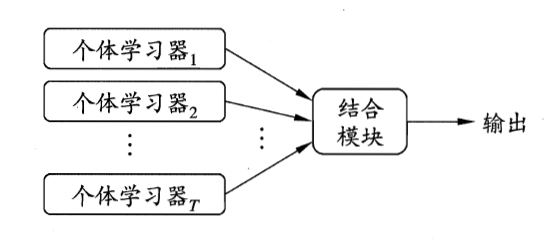
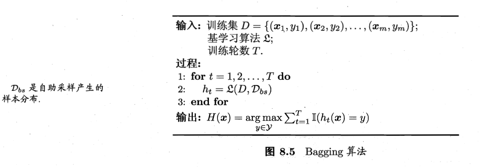
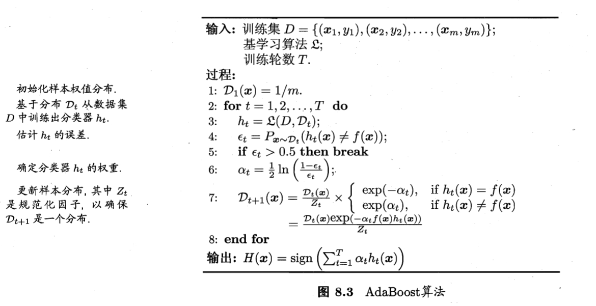
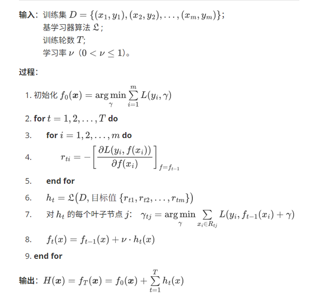
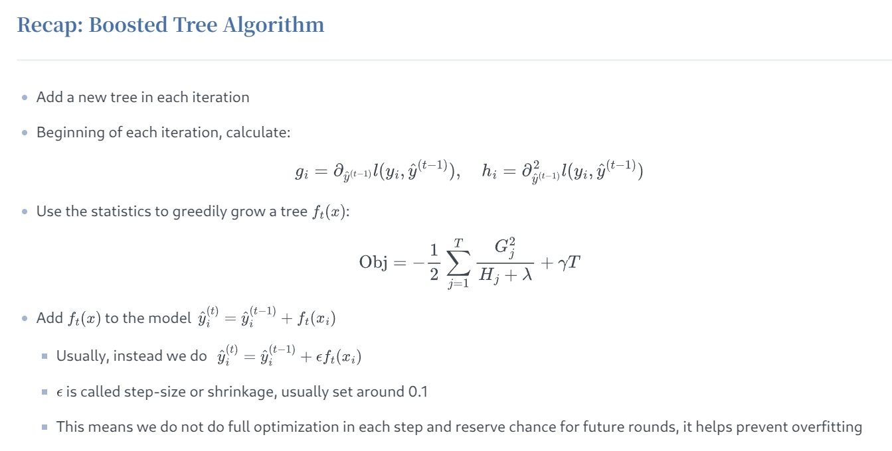

## 6. 集成学习

### 6.1 个体与集成

**集成学习**（Ensemble Learning）**通过构建并结合多个学习器来完成学习任务**，有时也被称为多分类任务系统（multi-classifier system）、基于委员会的学习（committee-based learning）等。



上图显示出集成学习的一般结构：先训练一组个体学习器（也可以称为弱学习器），再通过某种策略（得到强学习器）将他们结合起来，得到最终输出结果。

集成一般有两种：**同质**（Homogeneous）和**异质**（Heterogeneous）。同质是指个体学习器全是同一类型，这种同质集成中的个体学习器又称“基学习器”。异质是指个体学习器包含不同类型得学习算法，比如同时包含决策树和神经网络。一般我们常用的都是同质的，即个体学习器都是同一类型的。

集成学习通过将多个基学习器结合，通常都会获得比单一学习器显著优越的泛化性能。也可能会获得相同或更差的性能。

> 要想获得较好的集成性能，基分类器需要满足两个基本条件（好而不同）：
>
> - 基分类器要有一定的性能，至少不差于随机猜测的性能，即基分类器准确率不低于50% $\quad \Rightarrow \quad$ ”准确性“
> - 基学习器要具有多样性，即基学习器间要有差异性 $\quad \Rightarrow \quad$ ”多样性“
>
> 提升集成学习性能主要通过这一条“多样性”来做，因为第一条很容易满足。

**多样性增强的几种方法**

一般的做法主要是对数据样本，输入属性，输出表示，算法参数进行扰动。

1. **数据样本扰动**
    这个其实主要就是采样，比如在bagging中的自助采样法，数据样本扰动对决策树，神经网络这样对数据样本变化非常敏感的学习算法非常有效，但是对支持向量机，朴素贝叶斯，k近邻这些对样本扰动不敏感的算法没用。对此类算法作为基学习器进行集成时往往需要使用输入属性扰动等机制。

2. **输入属性扰动**
    这个就是从样本的特征空间中产生不同的特征子集。这样训练出来的基学习器必然是不同的。在包含大量冗余属性的数据，在特征子集中训练基学习器不仅能产生多样性大的个体，还会因属性数的减少而大幅节省时间开销，同时，由于冗余属性多，减少一些冗余属性后训练出来的基学习器性能也不会差。若数据只包含少量属性，或者冗余属性少，则不适宜使用输入属性扰动法。

3. **输出表示扰动**
    这类做法的基本思路是对输出表示进行操纵以增强多样性。比如可对训练样本的label稍作变动，比如“翻转法”随机改变一些训练样本的标记；也可以对输出表示进行转化，如“输出调制法”将分类输出转化为回归输出后构建基学习器。这一类貌似用的不多。

4. **算法参数扰动**
    这个在现在深度学习比赛中很常见，主要是神经网络有很多参数可以设置，不同的参数往往可以产生差别比较大的基学习器。


目前常见的集成学习算法主要有2种：基于Bagging的算法和基于Boosting的算法，基于Bagging的代表算法有**随机森林**（Random Forest），而基于Boosting的代表算法则有**Adaboost**、**GBDT**、**XGBOOST**等。

1. **Bagging**：这一类方法个体学习器之间不存在强依赖关系，因此可用**并行**的方式去学习。

    对训练集进行抽样（一般采用Bootstrap的策略，即自助采样）, 将抽样的结果用于训练 $g(x)$ 。

2. **Boosting**：这一类个体之间学习器之间存在强依赖关系，必须使用**串行**的方法去学习。

    利用训练集训练出模型，根据本次模型的预测结果，调整训练集，然后利用调整后的训练集训练下一个模型。

---

### 6.2 Bagging 与随机森林

 #### 6.2.1 Bagging 

有 6.1 节的内容可知，**欲得到泛化性能强的集成，个体学习器应尽可能相互独立**，一个最朴素的想法就是减少每个学习器训练所用的样本数，将总样本分成更多训练集；但每个个体学习器的性能也不能太差，这就要求供个体学习器训练的样本数不能太少。为了平衡这两者之间的关系，我们考虑采用 **Bootstrap 的采样方法**，得到互相有交叠的采样子集。

> Bagging 这个名字是由 Bootstrap AGGregatING 缩写而来



Bagging 算法的描述如上图所示，采用 Bootstrap 的方法从初始训练集中采样出 $T$ 个含 $m$ 个样本的采样集，然后基于每个采样集训练出一组基学习器，再将这些基学习器进行组合，这是 Bagging 的基本流程。

在对基学习器的预测进行组合时，Bagging 通常采用一下办法：

- 对分类任务使用简单投票法
- 对回归任务使用简单平均法

周志华著作《机器学习》2.3节”性能度量“中给出**自助采样初始训练集中约只有 $62.3\%$ 的样本出现在采样集中**，所以另外的样本可作为验证集来对泛化性能做 ”**外包估计**“（out-of-bag estimate）：

不妨令 $D_t$ 表示基学习器 $h_t$ 实际使用的训练样本集，令 $H^{oob} (\boldsymbol{x})$ 表示对样本 $\boldsymbol{x}$ 的外包预测，即仅考虑那些未使用 $\boldsymbol{x}$ 训练的基学习器在 $\boldsymbol{x}$ 上的预测，有：
$$
H^{oob}(\boldsymbol{x}) = \underset{y\in\mathcal{Y}}{\arg\max}\ \sum_{t=1}^{T} \mathbb{I}(h_t(\boldsymbol{x}) = y) \cdot \mathbb{I}(\boldsymbol{x} \notin D_t)
$$
则 Bagging 泛化误差的外包估计为：
$$
\epsilon^{oob} = \dfrac{1}{\mid D \mid} \sum_{(\boldsymbol{x}, y) \in D} \mathbb{I}(H^{oob}(\boldsymbol{x}) \neq y)
$$
事实上，外包样本还有许多其他用途。例如当基学习器为**决策树**时，可使用外包样本来辅助剪枝，或用于估计决策树中个结点的后验概率对零训练样本结点的处理；当基学习器为**神经网络**时，可使用外包样本来辅助早期停止减小过拟合风险。


从**偏差-方差分解**的角度看，Bagging 主要关注降低方差（对多个估计进行平均），因此它在不剪枝决策树、神经网络等易受样本扰动的学习器上效用更为明显。

> **偏差-方差分解**
>
> 对于回归任务, 泛化误差可以分解为
> $$
> \begin{aligned}
> 
> E(f;D) &= \mathbb{E}_{D}[(f(\boldsymbol{x};D)-y_{D})^{2}]  \\[5pt]
> 
> &= \mathbb{E}_{D}[(f(\boldsymbol{x};D)-\bar{f}(\boldsymbol{x}))^{2}] + (\bar{f}(\boldsymbol{x})-y)^{2} + \mathbb{E}_{D}[(y_{D}-y)^{2}]  \\[5pt]
> 
> &= \operatorname{bias}^{2}(\boldsymbol{x}) + \operatorname{var}(\boldsymbol{x}) + \epsilon^{2}
> 
> \end{aligned}
> $$
>
> 也就是说，**泛化误差可分解为偏差，方差和噪声之和**。偏差刻画了学习算法本身的拟合能力；方差度量了同样大小的训练集的变动所导致的学习性能的变化，即数据扰动所造成的影响；噪声表达了当前任务任何学习算法期望泛化误差的下界，是问题本身的难度。
>
> 偏差和方差是有冲突的，称为偏差-方差窘境。
>
> 详细内容见：[generalization_error_reduce.md](../source/article/generalization_error_reduce.md) or [generalization_error_reduce.pdf](../source/article/generalization_error_reduce.pdf)

#### 6.2.2 随机森林

**随机森林**（Random Forest，简称 RF ）是 Bagging 的一个拓展变体。RF 在以决策树为基学习器构建 Bagging 集成的基础上，进一步在决策树的训练过程中引入随机属性选择。

具体来说，传统决策树是在当前结点的属性集合（假定有 $d$ 个属性）中选择一个最优属性；而**在 RF 中，对基决策树的每个结点，先从该结点的属性集合中随机选择包含 $k$ 个属性的子集，然后再从这个子集中选择一个最优属性用于划分。**

>这里的 $k$ 控制了随机性的引入程度：
>
>- 若令 $k = d$ ：基决策树与传统决策树相同
>- 若令 $k = 1$ ：则是随机选择一个属性用于划分
>- 一般情况下，建议取 $k = \log_2 d$ 

随机森林简单、容易实现、计算开销小，并且在很多现实任务中展现出强大的i性能，被誉为”代表集成学习技术水平的方法“。

虽然随机森林看起来只是对 Bagging 做了一个小改动，但这个改动却在 Bagging 仅通过”**样本扰动**“的基础上，引入了”**属性改动**“，这使得集成的繁华性能可通过个体之间差异度的增加进一步提升。

```python
from sklearn.ensemble import RandomForestClassifier     # 随机森林分类器
from sklearn.model_selection import train_test_split
from sklearn.metrics import accuracy_score
from sklearn.datasets import load_iris 

# 以鸢尾花数据集为例
iris = load_iris()
X = iris.data[:, :2] # 花萼长度和宽度
y = iris.target
X_train, X_test, y_train, y_test = train_test_split(X, y, test_size=0.33, random_state=42) 


rnd_clf = RandomForestClassifier(n_estimators=5, max_leaf_nodes=16, n_jobs=1, oob_score=True)
rnd_clf.fit(X_train, y_train) 


y_pred_rf = rnd_clf.predict(X_test)
print(accuracy_score(y_test, y_pred_rf))


# Feature Importance
iris = load_iris()
rnd_clf = RandomForestClassifier(n_estimators=500, n_jobs=-1)
rnd_clf.fit(iris["data"], iris['target'])
for name, score in zip(iris['feature_names'], rnd_clf.feature_importances_): 
    print(name, score)

```

> **关键参数调整**：
>
> ```python
> from sklearn.ensemble import RandomForestClassifier
> 
> # 推荐的基础配置
> model = RandomForestClassifier(
>  n_estimators=200,	 			# 森林中决策树的数量，推荐100-500之间
>  criterion='gini',				# 分裂划分准则，default='gini'（计算快），可选'entropy'
>  max_depth=10,					# 单棵树的最大深度
>  max_features='sqrt',			# 节点分裂时考虑的最大特征数
>  min_samples_split=5,			# 分裂节点所需的最小样本数，default=2
>  class_weight='balanced',  		# 当数据不平衡时
>  oob_score=True,				# 是否使用袋外样本(OOB)评估模型
>  n_jobs=-1,						# 并行计算设置
>  random_state=42				# 控制随机性确保结果可复现
> )
> ```
>
> 调参经验法则：优先调整 `n_estimators` 和 `max_depth`，再优化 `max_features` 和 `min_samples_split`，最后用 `class_weight` 处理不平衡数据

---

### 6.3 Boosting 及相关算法

Boosting 是一族将弱学习器提升为强学习器的算法，这类算法的工作机制类似：先从初始训练集寻来你出一个基学习器，再根据基学习器的表现对训练样本分布进行调整，使得先前学习器做错的部分在后续得到更多的关注，然后基于调整后的样本分布来训练下一个基学习器；如此循环重复，直至基学习器数目达到事先指定的值 $T$ ，最终将这 $T$ 个基学习器进行加权结合。主要思想是“**三个臭皮匠顶个诸葛亮**”。

#### 6.3.1 AdaBoost 算法

Boosting 族算法最著名的代表是 Adaboost，其描述如下图所示：



AdaBoost 算法有多种推导方式，比较容易的是基于“加性模型”（additive model），即基学习器的线性组合：
$$
H(\boldsymbol{x}) = \sum_{t=1}^{T} \alpha_t h_t(\boldsymbol{x})
$$


Friedman 指出，可用**指数损失函数**（exponential loss function）来衡量 AdaBoost 算法的性能：
$$
\ell_{\exp}(H \mid D) = \mathbb{E}_{\boldsymbol{x} \sim D} [e^{-f(\boldsymbol{x})H(\boldsymbol{x})}]
$$
---

1. **为什么指数损失函数能成为AdaBoost 算法的损失函数**

     

    若 $H(\boldsymbol{x})$ 能令 $\ell_{\exp}$ 最小化，则考虑上式对 $H(\boldsymbol{x})$ 的偏导：
    $$
    \dfrac{\partial \ell_{\exp}(H \mid D)}{\partial H(\boldsymbol{x})} = - e^{-H(\boldsymbol{x})} P(f(\boldsymbol{x}) = 1 \mid \boldsymbol{x}) + e^{H(\boldsymbol{x})} P(f(\boldsymbol{x}) = -1 \mid \boldsymbol{x})
    $$
    令偏导为 0 ，有：
    $$
    H(\boldsymbol{x}) = \dfrac{1}{2} \ln \dfrac{P(f(\boldsymbol{x}) = 1 \mid \boldsymbol{x})}{ P(f(\boldsymbol{x}) = -1 \mid \boldsymbol{x})}
    $$
    因此，有：
    $$
    \begin{aligned}
    \text{sign}(H(\boldsymbol{x})) 
    &= \text{sign} \ (\dfrac{1}{2} \ln \dfrac{P(f(\boldsymbol{x}) = 1 \mid \boldsymbol{x})}{ P(f(\boldsymbol{x}) = -1 \mid \boldsymbol{x})} )\\[8pt]
    &= \begin{cases}
        1, &\quad P(f(\boldsymbol{x}) = 1 \mid \boldsymbol{x}) > P(f(\boldsymbol{x}) = -1 \mid \boldsymbol{x})\\[5pt]
        -1, &\quad P(f(\boldsymbol{x}) = 1 \mid \boldsymbol{x}) > P(f(\boldsymbol{x}) = -1 \mid \boldsymbol{x})
        \end{cases}\\[8pt]
    &= \underset{y \in \{-1, 1\}}{\arg \max} \ P(f(\boldsymbol{x}) = y \mid \boldsymbol{x})
    \end{aligned}
    $$

    >这里的 $\text{sign}(\cdot)$ 在推导时忽略了 $P(f(\boldsymbol{x}) = 1 \mid \boldsymbol{x}) = P(f(\boldsymbol{x}) = -1 \mid \boldsymbol{x})$ 的情形

    这意味着 $\text{sign}(H(\boldsymbol{x}))$ 达到了**贝叶斯最优错误率**。换言之，若指数损失函数最小化，则分类错误率也最小化；这说明指数损失函数是分类任务原本 0 / 1 损失函数的一致的（consistent）替代损失损失函数（Surrogate Loss Function）。

    > 有关“一致性”与代替损失函数（Surrogate Loss Function）:
    >
    > [替代损失函数 Surrogate Loss Function | 百科 | HyperAI超神经](https://hyper.ai/cn/wiki/2532)
    >
    > [机器学习数学基础课程复习——（5）一致性_机器学习中的数据一致性-CSDN博客](https://blog.csdn.net/GOLD1010/article/details/139689808)

    由于这个代替函数有更好的数学性质，例如它连续、可微，因此我们用它代替 0 / 1 损失函数作为优化目标。

    

2. **权重 $\alpha_t$ 迭代更新公式**
    $$
    \begin{aligned}
    \ell_{\exp}(\alpha_t h_t \mid D_t) 
    &= \mathbb{E}_{\boldsymbol{x} \sim D_t} \Bigl[\ e^{-f(\boldsymbol{x})\alpha_t h_t(\boldsymbol{x})}\ \Bigr]\\[5pt]
    &= \mathbb{E}_{\boldsymbol{x} \sim D_t} \Bigl[\ e^{-\alpha_t} \mathbb{I}(f(\boldsymbol{x}) = h_t(\boldsymbol{x})) + e^{\alpha_t} \mathbb{I}(f(\boldsymbol{x}) \neq h_t(\boldsymbol{x}))\ \Bigr]\\[5pt]
    &= e^{-\alpha_t} P_{\boldsymbol{x} \sim D_t} (f(\boldsymbol{x}) = h_t(\boldsymbol{x})) + e^{\alpha_t} P_{\boldsymbol{x} \sim D_t} (f(\boldsymbol{x}) \neq h_t(\boldsymbol{x}))\\[8pt]
    &= e^{-\alpha_t} (1-\epsilon_t) + e^{\alpha_t} \epsilon_t
    \end{aligned}
    $$
    其中 $\epsilon_t = P_{\boldsymbol{x} \sim D_t} (h_t(\boldsymbol{x}) \neq f(\boldsymbol{x}))$ ，表示错误率。所以指数损失函数的导数有：
    $$
    \dfrac{\partial \ell_{\exp} (\alpha_t h_t \mid D_t)}{\partial \alpha_t} = -e^{-\alpha_t}(1-\epsilon_t) + e^{\alpha_t}\epsilon_t
    $$

    令其为 0 ，可解得：
    $$
    \alpha_t = \dfrac{1}{2} \ln (\dfrac{1-\epsilon_t}{\epsilon_t})
    $$
    这就是 Adaboost算法中迭代过程的权重的更新公式 。

    > **这说明错误率高的弱学习器对最后训练出来的模型贡献较少。**这与我们的直觉一致。
    >
    > 在 AdaBoost 算法中，第一个基分类器 $h_1$ 是通过直接将基学习算法用于初始数据分布而得；后迭代地产生基学习器 $h_t$ 和权重 $\alpha_t$ 。

    
    
3. **基学习器训练集 $D_t$ 更新公式**

    由于 AdaBoost 算法是在 $H_{t-1}$ 的基础上，更新学习得 $h_t$ ，所以理想的 $h_t$ 能纠正 $H_{t-1}$ 的全部错误，那么我们考虑最小化 $\ell_{\exp} (H_{t-1} + h_t \mid D)$ ，使得性能更加完善。

    $$
    \begin{aligned}
    \ell_{\exp} (H_{t-1} + h_t \mid D) 
    &= \mathbb{E}_{\boldsymbol{x} \sim D} \Bigl[\  e^{-f(\boldsymbol{x})(\ H_{t-1}(\boldsymbol{x})+h_t(\boldsymbol{x})\ )}\  \Bigr]\\[5pt]
    &= \mathbb{E}_{\boldsymbol{x} \sim D} \Bigl[\  e^{-f(\boldsymbol{x}) H_{t-1}(\boldsymbol{x})}\ \cdot e^{-f(\boldsymbol{x}) h_t(\boldsymbol{x})}  \Bigr]
    \end{aligned}
    $$

    注意到 $f^2(\boldsymbol{x}) = h_t^2(\boldsymbol{x}) = 1$ ,上式可使用 $e^{-f(\boldsymbol{x}) h_t(\boldsymbol{x})}$ 得泰勒展开近似为：

    $$
    \begin{aligned}
    \ell_{\exp}(H_{t-1} + h_t \mid D) 
    &\approx \mathbb{E}_{\boldsymbol{x} \sim D} \left[\ e^{-f(\boldsymbol{x}) H_{t-1}(\boldsymbol{x})} \left(1- f(\boldsymbol{x}) h_t(\boldsymbol{x}) + \dfrac{f^2(\boldsymbol{x}) h_t^2(\boldsymbol{x})}{2} \right)\  \right]\\[8pt]
    &= \mathbb{E}_{\boldsymbol{x} \sim D} \left[\ e^{-f(\boldsymbol{x}) H_{t-1}(\boldsymbol{x})} \left(1- f(\boldsymbol{x}) h_t(\boldsymbol{x}) + \dfrac{1}{2} \right)\  \right]
    \end{aligned}
    $$

    于是，理想的基学习器：
    $$
    \begin{aligned}
    h_t(\boldsymbol{x}) 
    &= \underset{h}{\arg \min} \ \ell_{\exp} (H_{t-1}+h \mid D)\\[5pt]
    &= \underset{h}{\arg \min} \  \mathbb{E}_{\boldsymbol{x} \sim D} \left[\ e^{-f(\boldsymbol{x}) H_{t-1}(\boldsymbol{x})} \left(1- f(\boldsymbol{x}) h_t(\boldsymbol{x}) + \dfrac{1}{2} \right)\  \right]\\[8pt]
    &= \underset{h}{\arg \max} \  \mathbb{E}_{\boldsymbol{x} \sim D} \left[ e^{-f(\boldsymbol{x})H_{t-1}(\boldsymbol{x})} f(\boldsymbol{x}) h(\boldsymbol{x}) \right]\\[5pt]  
    &= \underset{h}{\arg \max} \  \mathbb{E}_{\boldsymbol{x} \sim D} \left[ \dfrac{e^{-f(\boldsymbol{x}) H_{t-1}(\boldsymbol{x})}}{\mathbb{E}_{\boldsymbol{x} \sim D} \left[e^{-f(\boldsymbol{x}) H_{t-1}(\boldsymbol{x})} \right]} f(\boldsymbol{x}) h(\boldsymbol{x})\  \right]  
    \end{aligned}
    $$

    令 $D_t$ 表示一个分布：

    $$
    D_t (\boldsymbol{x}) = \dfrac{D(\boldsymbol{x})e^{-f(\boldsymbol{x}) H_{t-1}(\boldsymbol{x})}}{\mathbb{E}_{\boldsymbol{x} \sim D} \left[e^{-f(\boldsymbol{x}) H_{t-1}(\boldsymbol{x})} \right]}
    $$

    所以有：
    $$
    h_t(\boldsymbol{x}) = \underset{h}{\arg \max}\  \mathbb{E}_{\boldsymbol{x} \sim D_t} \Bigl[\ f(\boldsymbol{x})h(\boldsymbol{x})\ \Bigr]
    $$

    由 $f(\boldsymbol{x}),\ h(\boldsymbol{x}) \in \{-1, +1\}$，所以：

    $$
    f(\boldsymbol{x})h(\boldsymbol{x}) = 1 - 2\ \mathbb{I}(f(\boldsymbol{x}) \neq h(\boldsymbol{x}))
    $$

    则理想的基学习器为：
    $$
    h_t(\boldsymbol{x}) = \underset{h}{\arg \max}\  \mathbb{E}_{\boldsymbol{x} \sim D_t} \Bigl[\ \mathbb{I}(f(\boldsymbol{x}) \neq h(\boldsymbol{x}))\ \Bigr]
    $$
    由此可见，理想的 $h_t$ 将在分布 $D_t$ 下由最小的分类误差，这与我们的需求也是一致的。因此弱学习器会基于分布 $D_t$ 来训练，且针对 $D_t$ 的分类误差应小于 0.5 。这在一定程度上类似“**残差逼近**”的思想。

    考虑到 $D_t$ 的迭代需求，分析 $D_{t+1}$ 与 $D_t$ 的关系：
    $$
    \begin{aligned}
    D_{t+1} 
    &= \dfrac{D(\boldsymbol{x})e^{-f(\boldsymbol{x}) H_{t}(\boldsymbol{x})}}{\mathbb{E}_{\boldsymbol{x} \sim D} \left[e^{-f(\boldsymbol{x}) H_{t}(\boldsymbol{x})} \right]}\\[5pt]
    &= D_t(\boldsymbol{x}) \cdot e^{-f(\boldsymbol{x}) \alpha_t h_t(\boldsymbol{x})} \cdot \dfrac{\mathbb{E}_{\boldsymbol{x} \sim D} [e^{-f(\boldsymbol{x})H_{t-1} (\boldsymbol{x})}]}{\mathbb{E}_{\boldsymbol{x} \sim D} [e^{-f(\boldsymbol{x})H_{t} (\boldsymbol{x})}]}
    \end{aligned}
    $$
    这就是 AdaBoost 的样本分布更新公式。

---

**Adaboost算法优缺点**

**Adaboost的优点：**

1）Adaboost作为分类器时，分类精度很高；

2）在Adaboost的框架下，可以使用各种回归分类模型来构建弱学习器，非常灵活；

3）作为简单的二元分类器时，构造简单，容易实施，结果可理解；

4）不容易发生过拟合。

**Adaboost的缺点：**

1）对异常样本敏感，异常样本在迭代中可能会获得较高的权重，影响最终的强学习器的预测准确性；

2）训练时间过长，每次一个分类器都要用全部样本学习，对于弱分类器学习来讲，时间及速度上影响不大，强分类器的学习时间会就会比较大。


现在 AdaBoost 算法用的比较少，但对 Boosting 思路的理解有很大帮助。

---

#### 6.3.2 GBDT 算法

GBDT（Gradient Boosting Decision Tree），全名叫**梯度提升决策树**。GBDT 是以 CART 回归树为基学习器的 Boosting 算法，是一个加性模型，它串行地训练一组 CART 回归树，最终对所有回归树的预测结果加和，由此得到一个强学习器，每一颗新树都拟合当前损失函数的负梯度方向。最后输出这一组回归树的加和，直接得到回归结果或者套用 sigmod 或者 softmax 函数获得二分类或者多分类结果。

由于 GBDT 也是加性模型，所以 $T$ 次迭代后的输出为：
$$
F_T(\boldsymbol{x}) = \sum\limits_{t=1}^T \nu_t h_t(\boldsymbol{x})
$$
GBDT 通过迭代的方式逐步构建模型。记损失函数为 $\ell(\cdot)$ ，在每一步，模型会添加一个新的基学习器 $h_t(\boldsymbol{x})$，最小化损失函数 $\ell(\ y, F_{t-1}(\boldsymbol{x})+h_t(\boldsymbol{x})\ )$ ，即 $h_t(\boldsymbol{x})$ 是在函数空间 $\mathcal{H}$ 上最小化损失函数：
$$
h_t(\boldsymbol{x}) = \underset{h \in \mathcal{H}}{\arg \min}\ \ell\Bigl(\ y,\ F_{t-1}(\boldsymbol{x})+h(\boldsymbol{x})\ \Bigr)\\[5pt]
F_t(\boldsymbol{x}) = F_{t-1}(\boldsymbol{x}) + \nu_t h_t(\boldsymbol{x})
$$
 $h_t(\boldsymbol{x})$ 的优化问题一般来说这是比较难以做到的，但是，如果我们只考虑精确地拟合训练数据的话，可以借鉴梯度下降法的思路。

---

1.  **函数空间的梯度下降（Gradient Descent in Function Space）**

    
    
    通过一阶泰勒展开可以证明负梯度方向是下降最快的方向。对于函数 $f$ ：
    $$
    f(\theta_{k+1}) \approx f(\theta_k) + \dfrac{\partial f(\theta_k)}{\partial \theta_k}(\theta_{k+1} - \theta_k)
    $$
    则在参数空间，优化函数 $f$ 时，可以构造这样的梯度下降：
    $$
    \theta_{k+1} = \theta_k - \eta \dfrac{\partial f(\theta_k)}{\partial \theta_k}
    $$
    对于 GBDT 的损失函数，利用一阶泰勒展开，有：
    $$
    \ell\Bigl(\ y,\ F_{t-1}(\boldsymbol{x})+h(\boldsymbol{x})\ \Bigr) \approx \ell(y,\ F_{t-1}(\boldsymbol{x}))\ + \ \dfrac{\partial}{\partial F_{t-1}} \ell(y,\ F_{t-1}(\boldsymbol{x})) \cdot h(\boldsymbol{x})\\
    F_{t-1}(\boldsymbol{x})+h(\boldsymbol{x}) = F_t(\boldsymbol{x})
    $$
    所以有：
    $$
    \ell(y,\ F_t(\boldsymbol{x})) = \ell(y,\ F_{t-1}(\boldsymbol{x})) + \dfrac{\partial}{\partial F_{t-1}} \ell(y,\ F_{t-1}(\boldsymbol{x})) h(\boldsymbol{x})
    $$
    到此，我们可以构造函数空间的梯度下降：
    $$
    F_t(\boldsymbol{x}) = F_{t-1}(\boldsymbol{x}) - \eta\ \dfrac{\partial \ell(y,\ F_{t-1}(\boldsymbol{x}))}{\partial F_{t-1}}
    $$
    这里可以看出，**DT 的每一次迭代都是在拟合一个负梯度**：
    $$
    h_t(\boldsymbol{x}) = - \dfrac{\partial \ell(y,\ F_{t-1}(\boldsymbol{x}))}{\partial F_{t-1}}\\[5pt]
    \nu_t = \eta^* = \underset{\eta}{\arg \max}\ (F_t(\boldsymbol{x})-F_{t-1}(\boldsymbol{x}))
    $$
    > $\eta^*$ 是最速下降法得到的。
    > 有关梯度下降-最速下降-GBDT： [从最速下降到梯度提升树GBDT1_哔哩哔哩_bilibili](https://www.bilibili.com/video/BV17S4y1N75V/?spm_id_from=333.337.search-card.all.click&vd_source=62b6bb4c48ac16b4c1e4b27a2fce3817)

2. **GBDT 做回归任务**

      

    对于训练样本$\{(x_i,y_i)\}_{i=1}^m$ ，GBDT 做回归任务时，**损失函数用的是平方和损失**，即：
    $$
    \ell(y,\ f) = \sum_{i=1}^m \frac{1}{2} (y_i-f(x_i)\ )^2\\
    $$
    所以，负梯度有：
    $$
    r_{t,i} = -\dfrac{\partial\ \ell}{\partial f_i} = y_i - f_i
    $$
    发现与残差的定义是一致的，所以**这个负梯度可以视为残差 $r_{t,i}$** 。

    以残差 $r_{t,i}$ 为新的样本标签，特征不变，训练一个新的 CART 回归树 $h_t(\boldsymbol{x})$ 拟合残差：
    $$
    h_t(\boldsymbol{x}) = \underset{h \in \mathcal{H}}{\arg \min} \sum_{i=1}^m \left(r_{t,i} - h(\boldsymbol{x}_i)\right)^2
    $$

    > 注意：这里使用平方误差作为拟合准则，但实际损失函数可以是任意的（只需可微）。

3. **GBDT 做分类任务**

      

    对于训练样本$\{(x_i,y_i)\}_{i=1}^m$ ，**GDBT 做二分类问题时考虑逻辑回归，损失函数常用交叉熵**：
    $$
    \ell = \sum_{i=1}^{m} - y_i \ln \hat{y}_i - (1-y_i)\ln(1-\hat{y}_i)\\
    \hat{y}_i = f(x_i) = \dfrac{1}{1-e^{F_t(x)}}
    $$

    损失函数对当前学习器的负梯度为：
    $$
    -\dfrac{\partial \ell}{\partial F(x_i)} = y_i - \hat{y}_i
    $$
    这里的 $\hat{y}$ 是由 Sigmoid 缩放到 0 和 1 之间的后验概率。由此可以看到，**这里的拟合对象类似于“残差”**，与回归问题类似。

    

    类似的，**GBDT 做多分类时，考虑 Softmax 模型**:
    $$
    P(y = 1 \mid x) = \dfrac{e^{F_1(x)}}{\sum_{i=1}^k e^{F_i(x)}}\\
    P(y = 2 \mid x) = \dfrac{e^{F_2(x)}}{\sum_{i=1}^k e^{F_i(x)}}\\
    \cdots\\
    P(y = k \mid x) = \dfrac{e^{F_k(x)}}{\sum_{i=1}^k e^{F_i(x)}}
    $$

    > 其中 $F_1,F_2,\cdots,F_k$ 是 k 个不同的 tree ensemble。每一轮的训练实际上是训练了 k 棵树去拟合 softmax 的每一个分支模型的负梯度。

    单样本损失为：
    $$
    \ell = - \sum_{i=1}^{k} y_i \ln P(y_i \mid x) = -\sum_{i=1}^k y_i \ln \dfrac {e^{F_i(x)}}{\sum_{j=1}^k e^{F_j(x)}}
    $$
    这里的 $y_i \ (i = 1,2,\cdots,k)$ 是样本 label 在 k 个类别上**做 one-hot 编码**之后的取值，只有一维为 1 ，其余都是 0 。

    由以上表达式不难推导：
    $$
    -\dfrac{\partial \ell}{\partial F_q} = y_q - \hat{y_q}
    $$
    可见，这k棵树同样是拟合了样本的真实标签与预测概率之差，


**GBDT 算法描述如下**：



---

#### 6.3.3 XGBoost 算法

**XGBoost**（Extreme Gradient Boost，简称XGB），即极致梯度提升树，是 Boosting 类算法中目前最高级最智能的集成算法。与 GBDT 一样，它的基学习器也是回归树，对分类问题的处理与 GBDT 的方法一样（Sigmoid / Softmax）。XGBoost 算法与 GBDT 最大的不同就是，它的**目标函数不仅包含损失函数，还考虑控制模型的复杂度**：
$$
Obj_t = \sum_{i=1}^m \ell(y_i, \hat{y}_i^{(t)}) + \Omega(f_t)\\
\Omega(f) = \gamma T + Penalty
$$

> **参数定义**：
>
> - $Obj_t$ ：迭代过程中第 $t$ 棵决策树的目标函数。
>
> - $\hat{y}_i^{(t)}$ ：表示前 $t$ 棵树对样本 $\boldsymbol{x}_i$ 做出的预测值，$\hat{y}_i^{(t)} = \hat{y}_i^{(t-1)} + f_t(\boldsymbol{x}_i)$ 。
>
> - $\Omega(f_k)$ ：表示第 $t$ 棵树的模型复杂度，$T$ 为当前子树的深度，Penalty 常用 L2 正则项，即：
>
> $$
> \Omega (f) = \gamma T + \frac{1}{2} \lambda \|w\|^2
> $$

---

下面进行模型的推导：

1. **从牛顿法说起**

    

    对于最优化问题 $x^* = \underset{x}{\arg \min}\ f(x)$ ，我们试着将 $f(x)$ 在迭代的初始点（随机）$x_0$ 处进行二阶泰勒展开，得到：
    $$
    f(x_0 + \Delta) \approx f(x_0) + f'(x_0) \Delta + \frac{1}{2} f''(x_0) \Delta^2
    $$
    对 $\Delta$ 求导：
    $$
    \frac{\partial f}{\partial \Delta} = f'(x_0) + f''(x_0) \Delta
    $$
    令上式等于 0 ，我们可以得到一个最优的 $\Delta$ 使得目标函数最小，有：
    $$
    \Delta = - \frac{f'(x_0)}{f''(x_0)}
    $$
    在应用到算法中时，将上式可以改写为递推式：
    $$
    x^{(k+1)} = x^{(k)} - \frac{f'(x^{(k)})}{f''(x^{(k)})} \quad (\Delta = x^{(k+1)} - x^{(k)})
    $$

2. **到 XGBoost 的应用**

    

    在 XGBoost 算法的目标函数的优化中，也将目标函数做泰勒二次展开：
    $$
    \begin{aligned}
    Obj_t &= \sum_{i=1}^m \ell(y_i, \hat{y}_i^{(t-1)}+f_t(x_i)) + \Omega(f_t)\\
    &\approx \sum_{i=1}^n \left[ \ell(y_i, \hat{y}_i^{(t-1)}) + g_i f_t(x_i) + \frac{1}{2} h_i f_t^2(x_i) \right] + \Omega(f_t)\\
    \end{aligned}
    $$

    > **其中**：
    >
    > $g_i = \dfrac{\partial \ell(y_i, \hat{y}_i^{(t-1)})}{\partial \hat{y}_i^{(t-1)}}$ （一阶梯度）
    >
    > $h_i = \dfrac{\partial^2 \ell(y_i, \hat{y}_i^{(t-1)})}{(\partial \hat{y}_i^{(t-1)})^2}\\$ （二阶梯度）

    移除常数项后，得到简化目标：
    $$
    \tilde{Obj}^{(t)} = \sum_{i=1}^n \left[ g_i f_t(x_i) + \frac{1}{2} h_i f_t^2(x_i) \right] + \Omega(f_t)
    $$
    我们回到每一步生成回归树的过程：

    - $ f_t(x) = w_{q(x)} $ ，$q(x)$ 将样本映射到叶子节点
    - 叶子节点 $j$ 包含的样本集合为：$I_j = \{i \mid q(x_i) = j\}$

    引入真实的 $f_t(x)$ 和正则化项代换，目标函数又改写为：
	
    $$
    \begin{aligned}
    \tilde{Obj}^{(t)} &= \sum_{j=1}^T \left[ \left(\sum_{i \in I_j} g_i\right) w_j + \frac{1}{2} \left(\sum_{i \in I_j} h_i + \lambda\right) w_j^2 \right] + \gamma T\\[8pt]
    &= \sum_{j=1}^T \left[ G_j\  w_j + \frac{1}{2} \left(H_i + \lambda\right) w_j^2 \right] + \gamma T
    \end{aligned}
    $$

    将上式对 $w_j$ 求导，并令其为零，得到：
    $$
    w_j^* = - \dfrac{G_j}{H_j + \lambda}
    $$
    
3. **划分准则**

    

    将求得的这个最优参数带回到目标函数中，得到**结构分数**（Structure Score）：
    $$
    \tilde{Obj}^{(t)*} = -\frac{1}{2} \sum_{j=1}^T \frac{G_j^2}{H_j + \lambda} + \gamma T
    $$
    这个结构分数刻画了这棵树结构的好坏程度，它越小，表明这个模型越好。

    于是，XGBoost 选择利用这个参数来进行**枝叶的分裂**。也就是说，XGBoost 创造出另外一种构造决策树的划分准则，它直接使用结构分数来进行分裂。

    与**信息增益**的构造方式类似，将结构分数也可以造出一个“增益”：
    $$
    \text{Gain} = \frac{1}{2} \left[ \frac{G_L^2}{H_L + \lambda} + \frac{G_R^2}{H_R + \lambda} - \frac{(G_L + G_R)^2}{H_L + H_R + \lambda} \right] - \gamma
    $$
    信息增益相关内容：[3_Decision_tree  3.3.3 划分选择](./3_Decision_tree.md)


