				HTML


​				
​				
​						
​				
​				<style>
details {
​    border: 1px solid #ddd;
​    border-radius: 4px;
​    padding: 0.5em;
​    margin-bottom: 1em;
}
details[open] {
​    background-color;
}
summary {
​    cursor: pointer;
​    font-weight: bold;
​    color: #ff6666; 
​    padding: 0.5em;
}
details[open] summary {
​    border-bottom: 1px solid #ddd;
​    margin-bottom: 0.5em;
}
</style>

## 7.聚类

### 7.0 导入

无监督机器学习是从无标注（Unlabelled）的数据中学习数据的统计规律或者说内在结构的机器学习，其基本问题包括**聚类**（Clustering）、**降维**（Dimensionality Reduction）和**概率估计**（Probability Estimation）。无监督机器学习可以用于数据分析或者监督学习的前处理。

### 7.1 聚类问题概述

聚类（Clustering）是将样本集合中相似的样本（实例）分配到相同的类，不相似的样本分配到不同的类。即依据给定样本特征的相似度或距离，将其归并到若干个“类”或“簇”。聚类时，样本通常时欧氏空间中的向量，类别不是事先划定的，而是在数据中自动发现，但类别的个数通常是事先给定的。样本之间的相似度或距离由实际应用决定。若一个样本只能属于一个类，则称为硬聚类（Hard Clustering）；若一个样本可以属于多个类，则称为软聚类（Soft Clustering）。

> 聚类问题的目标是将一组**未标记**的对象（数据点）分成若干个组（称为**簇**或**类**），使得：
>
> 1. **组内相似性高：** 同一个簇内的对象彼此之间尽可能相似。
> 2. **组间相似性低：** 不同簇之间的对象尽可能不相似。

聚类的算法很多，如 k 均值聚类、层次聚类、密度聚类等。

下面介绍一些基本概念。

#### 7.1.1 相似度或距离

1. **相似度**（Similarity）

    - 含义：衡量两个对象有多“像”。数值越大表示越相似。

    - 范围： 通常在 [0, 1] 或 [-1, 1] 之间。1 表示完全相同，0 表示完全不相关（有时下限可能更低）。

    - 常见度量：

        - **余弦相似度** （Cosine Similarity）：衡量**两个向量**的方向一致性，常用在文本挖掘（如 TF-IDF 向量）、高维数据。
            $$
            \cos (\theta) = \dfrac{\vec{a} \cdot \vec{b}}{\|\vec{a}\| \|\vec{b}\|}
            $$

        - **Jaccard 系数** （Jaccard Coefficient）： 衡量**两个集合**的相似度，常用在集合数据（如用户购买记录、文档的词集合）。
            $$
            J(A,B) = \frac{|A \cap B|}{|A \cup B|}
            $$

        - **皮尔逊相关系数** （Pearson Correlation Coefficient）： 衡量**两个变量**之间的**线性相关程度**。值在 [-1, 1] 之间。
            $$
            \rho_{X,Y} = \dfrac{\text{cov}(X,Y)}{\sigma_X \sigma_Y} = \dfrac{\mathbb{E}(XY) - \mathbb{E}(X) \mathbb{E}(Y)}{\sqrt{\mathbb{E}(X^2) - \mathbb{E}^2(X)} \sqrt{\mathbb{E}(Y^2) - \mathbb{E}^2(Y)}}
            $$

        - **结构相似性** （Structural Similarity - SSIM)）：常用于图像比较，衡量结构信息的相似性。

2. **距离**（Distance / Dissimilarity）

    - 含义： 衡量两个对象有多“不同”或相隔多远。数值越大表示差异越大（越不相似）。

    - 范围： 通常是非负实数 [0, ∞)。0 表示完全相同。

    - 性质： 一个有效的距离度量通常需要满足：

        - 非负性 (Non-negativity）：$d(i,j) \geq 0$
        - 同一性 (Identity of Indiscernibles）：$d(i,j) = 0,\ \text{当且仅当}i = j$
        - 对称性 (Symmetry）：$d(i,j) = d(j,i)$
        - 三角不等式 (Triangle Inequality）：$d(i,j) \leq d(i,k) + d(k,j)$ （对于某些度量如欧氏距离成立，但并非所有距离都严格满足，如编辑距离）。

    - 常见度量：

        - **闵可夫斯基距离** （Minkowski Distance）：
            $$
            d(i,j) = \left(\sum_k \mid x_{ki} - x_{kj} \mid^p \right)^{\frac{1}{p}} \quad (p \geq 1)
            $$
            当 $p = 2$ 时称为**欧氏距离**（Euclidean Distance），最常用，衡量多维空间中的直线距离，对量纲和异常值敏感。
            $$
            d(i,j) = \sqrt{\sum_k^{} (x_{ki} - x_{kj})^2}
            $$
            当 $p = 1$ 时称为**曼哈顿距离**（Manhattan Distance / City Block Distance），衡量网格路径距离（只能沿坐标轴走）。对异常值比欧氏距离稍鲁棒。
            $$
            d(i,j) = \sum_k \mid x_{ki} - x_{kj} \mid
            $$
            当 $p = \infty$ 时称为**切比雪夫距离** （Chebyshev Distance），各维度差值绝对值的最大值。
            $$
            d(x,j) = \max_k \mid x_{ki} - x_{kj} \mid
            $$
            关于闵可夫斯基距离（就是在 LR 中的 P 范数）：[向量的【范数】：模长的推广，柯西不等式_哔哩哔哩_bilibili](https://www.bilibili.com/video/BV1GM4y1c78K/?spm_id_from=333.1387.homepage.video_card.click&vd_source=62b6bb4c48ac16b4c1e4b27a2fce3817)

        - **马哈拉诺比斯距离**（Mahalanobis Distance），简称马氏距离，考虑特征间协方差，消除特征间相关性和量纲影响。马氏距离越大相似度越小。对数据分布敏感。
            $$
            d(\boldsymbol{x},\boldsymbol{y}) = \sqrt{(\boldsymbol{x}-\boldsymbol{y})^T \boldsymbol{\Sigma}^{-1}(\boldsymbol{x}-\boldsymbol{y})}
            $$
            其中的 $\boldsymbol\Sigma$ 是多维随机变量的协方差矩阵。如果协方差矩阵是单位向量，也就是各维度独立同分布，马氏距离就变成了欧氏距离。

        - **汉明距离**（Hamming Distance）：比较两个等长字符串（或向量）在对应位置上不同字符（或值）的个数。常用于信息编码、分类变量。

**关于上述几种距离的可视化**：[数学中的距离，你都知道哪些？_哔哩哔哩_bilibili](https://www.bilibili.com/video/BV1rjimYPEoh/?spm_id_from=333.337.search-card.all.click&vd_source=62b6bb4c48ac16b4c1e4b27a2fce3817)


相似度和距离通常是**互逆**的。一个高的相似度对应一个低的距离，反之亦然。有时可以将相似度转换为距离（例如，`distance = 1 - similarity` 当相似度在 [0,1] 时）


**选择的重要性：** 选择哪种相似度/距离度量极其关键，它直接决定了数据点如何被分组。选择应基于：

- 数据的类型（连续数值、分类、文本、图像等）
- 数据的分布和尺度（是否需要标准化 / 归一化？）
- 具体应用场景和希望捕捉的相似性类型（例如，方向相似用余弦，绝对位置接近用欧氏）


#### 7.1.2 类或簇

通过聚类得到的类或簇，**本质是样本的子集**。如果一个聚类方法假定一个样本只能属于一个类，或类的交集为空集，那么该方法称为硬聚类方法。否则，如果一个样本可以属于多个类，或类的交集不为空集，那么该方法称为软聚类方法。下面只考虑硬聚类方法。

用 $G$ 表示类或簇（cluster），用 $x_i$ ，$x_j$ 表示类中的样本，用 $n_G$ 表示 $G$ 中样本的个数，用 $d_{ij}$ 表示样本 $x_i$ 与样本 $x_j$ 之间的距离。类或簇有多种定义，下面给出几个常见的定义。

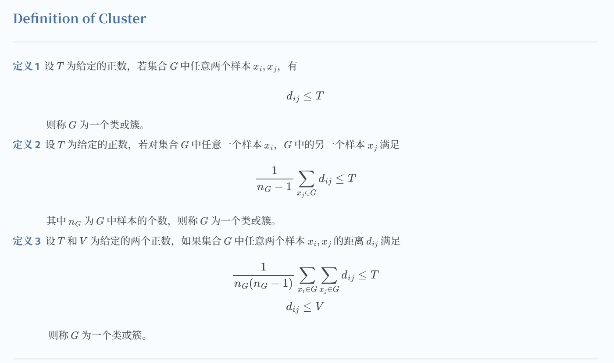

上面的几个定义，定义 1 最为常见。

类的特征可以通过不同的角度来刻画，常见的有以下三种：

- 类的均值 $\bar{x}_G$（类的中心）
    $$
    \bar{x}_G = \frac{1}{n_G} \sum_{i=1}^{n_G} x_i
    $$
    其中 $n_G$ 是类 $G$ 的样本个数。

    
    
- 类的直径 $D_G$
    $$
    D_G = \max_{x_i, x_j \in G} d_{ij} 
    $$
    
- 类的样本散布矩阵 $A_G$ 与协方差矩阵 $S_G$
  
    **样本散布矩阵** $A_G$：
    $$
    A_G = \sum_{i=1}^{n_G} (x_i - \bar{x}_G)(x_i - \bar{x}_G)^\mathrm{T} 
    $$
    
    **样本协方差矩阵** $S_G$：
    $$
    S_G = \frac{1}{m-1}A_G = \frac{1}{m-1}\sum_{i=1}^{n_G}(x_i - \bar{x}_G)(x_i - \bar{x}_G)^\mathrm{T}
    $$
    其中 $m$ 为样本的维数（样本属性的个数）。


#### 7.1.3 类与类之间的距离

下面考虑类 $G_p$ 与类 $G_q$ 之间的距离 $D(p,q)$，也称为连接（linkage）。类与类之间的距离也有多种定义。设类 $G_p$ 包含 $n_p$ 个样本，$G_q$ 包含 $n_q$ 个样本，分别用 $\bar{x}_p$ 和 $\bar{x}_q$ 表示 $G_p$ 和 $G_q$ 的均值，即类的中心。

1. 最短距离或单连接（single linkage）

    定义类 $G_p$ 的样本与 $G_q$ 的样本之间的最短距离为两类之间的距离

    $$
    D_{pq} = \min \{ d_{ij} \mid x_i \in G_p, x_j \in G_q \}
    $$

2. 最长距离或完全连接（complete linkage）

    定义类 $G_p$ 的样本与 $G_q$ 的样本之间的最长距离为两类之间的距离

    $$
    D_{pq} = \max \{ d_{ij} \mid x_i \in G_p, x_j \in G_q \}
    $$

3. 中心距离

    定义类 $G_p$ 与类 $G_q$ 的中心 $\bar{x}_p$ 与 $\bar{x}_q$ 之间的距离为两类之间的距离

    $$
    D_{pq} = d_{\bar{x}_p \bar{x}_q}
    $$

4. 平均距离

    定义类 $G_p$ 与类 $G_q$ 任意两个样本之间距离的平均值为两类之间的距离

    $$
    D_{pq} = \frac{1}{n_p n_q} \sum_{x_i \in G_p} \sum_{x_j \in G_q} d_{ij}
    $$

### 7.2 原型聚类

原型聚类亦称“基于原型的聚类”（Prototype-based Clustering），此类算法假设聚类结构能通过一组原型刻画，在现实聚类任务中极为常用。通常情况下算法先对原型进行初始化，然后对原型进行迭代更新求解。采用不同的原型表示、不同的求解方式，将产生不同的算法。

> “原型”是指样本空间中具有代表性的点。

#### 7.2.1 K-means 聚类算法

给定样本集 $D = \{x_1,x_2,\cdots,x_m\}$ ，k-means 算法针对聚类所得簇划分 $\mathcal{C} = \{ C_1,C_2,\cdots,C_k\}$ ，采用样本与其所属类中心的欧氏距离平方总和作为损失函数：
$$
\ell = \sum_{i=1}^{k} \sum_{\boldsymbol{x} \in C_i} \| \boldsymbol{x} - \boldsymbol{\bar{x}_i} \|_2^2
$$

> 其中，$\boldsymbol{\bar{x}_i} = \dfrac{1}{\mid C_i \mid} \sum\limits_{\boldsymbol{x} \in C_i} \boldsymbol{x}$ 是簇 $C_i$ 的均值向量。
>
> 直观来看，上式刻画了簇内样本围绕簇均值向量（中心）的紧密程度，它的值越小则簇内样本的相似度越高。
>
> 但最小化上式并不容易，找到它的最优解需要考察样本集 $D$ 内的所有可能的簇划分，这是一个 **NP 难问题**。因此，k-means 算法采用**贪心策略**，通过迭代优化来近似最优解。

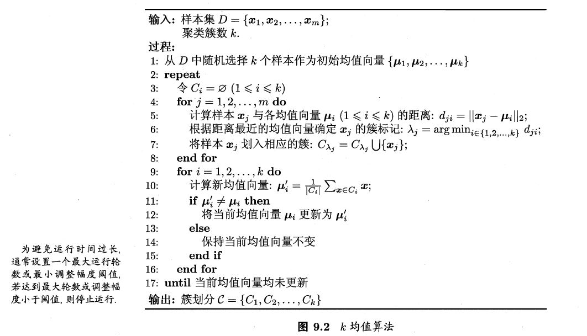

> **关于贪心策略**：
>
> 贪心算法（又称贪婪算法）是指，在对问题求解时，总是做出在当前看来是最好的选择。也就是说，不从整体最优上加以考虑，算法得到的是在某种意义上的局部最优解 。
>
> [贪心算法 看这一篇就够了-CSDN博客](https://blog.csdn.net/m0_50597166/article/details/116782775)


**算法特征**

$k$ 均值算法时基于划分的聚类方法，类别数 $k$ 事先指定，以欧氏距离的平方表示样本之间的距离，以样本的均值表示类别。得到的类别是平坦的、非层次化的。算法采用启发式的方法，不能保证收敛到全局最优解，并且初始中心样本的选择会直接影响聚类结果。关于类别数 $k$ 的选择，可以采用二分查找，快速找到最优的 $k$ 值。


> - K-means 尤其容易受到异常值的影响。当算法遍历质心时，在达到稳定性和收敛性之前，离群值对质心的移动方式有显著的影响。
> - K-means 只能应用球形簇，如果数据不是球形的，它的准确性就会受到影响。


K-means 的衍生算法有（ [KMeans聚类变形.pdf](..\source\article\KMeans聚类变形.pdf) ）：

- **K-medoids** ：采用中位数作为类别的中心，对异常值没那么敏感
- **二分 K-means** ：克服 K-means 算法收敛于局部最小值问题
- **K-means ++** ：通过一个更聪明的初始化中心的方法确保聚类的质量
- **Elkan K-means** ：利用三角不等式减少不需要计算的距离的计算，优化迭代效率（ [kmeansicml03.pdf](..\source\article\kmeansicml03.pdf) ）
- **Mini Batch K-means** ：Mini Batch K-means 比 K-means有更快的收敛速度，但同时也降低了聚类的效果，但是在实际项目中却表现得不明显。


#### 7.2.2 学习向量量化

**学习向量量化**（Learning Vector Quantization，简称 LVQ）也是试图找到一组原型向量来刻画聚类结构，但与一般聚类算法不同的是，LVQ 假设数据样本带有类别标记，学习过程利用样本的这些监督信息来辅助聚类。

给定样本集 $D = \{(\boldsymbol{x}_1, y_1), (\boldsymbol{x}_2, y_2), \ldots, (\boldsymbol{x}_m, y_m)\}$，每个样本 $\boldsymbol{x}_j$ 是由 $n$ 个属性描述的特征向量 $(x_{j1}, x_{j2}, \ldots, x_{jn})$，$y_j \in \mathcal{Y}$ 是样本 $x_j$ 的类别标记。LVQ 的目标是学得一组 $n$ 维原型向量 $\{\boldsymbol{p}_1, \boldsymbol{p}_2, \ldots, \boldsymbol{p}_q\}$，每个原型向量代表一个聚类簇，簇标记 $t_i \in \mathcal{Y}$。

LVQ 算法描述如下图所示。

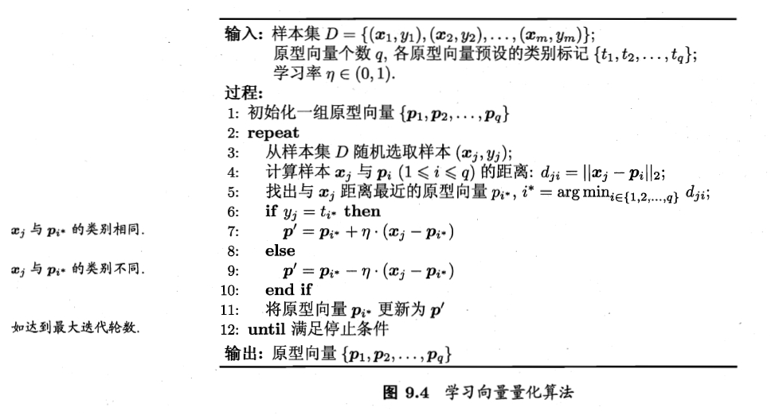


#### 7.2.3 高斯混合聚类

高斯混合模型（Gaussian Mixture Model，简称 GMM）假设数据集是由多个高斯分布混合而成的（也可以说是不同的簇数据来自于不同的高斯分布）。这是这个高斯混合模型的核心思想。

对 $n$ 维样本空间 $\mathcal{X}$ 中的随机向量 $\boldsymbol{x}$ ，若 $\boldsymbol{x}$ 服从（多元）高斯分布，即 $\boldsymbol{x} \sim \mathcal{N}(\mu,\Sigma) $ ，其概率密度函数为：
$$
p(\boldsymbol{x} \mid \boldsymbol{\mu},\boldsymbol{\Sigma}) = \dfrac{1}{(2 \pi)^{\frac{n}{2}} \mid \boldsymbol\Sigma \mid^{\frac{1}{2}} } \exp \left(-\frac{1}{2}(\boldsymbol{x} - \boldsymbol{\mu})^T \boldsymbol{\Sigma}^{-1}(\boldsymbol{x} - \boldsymbol{\mu}) \right)
$$

> 其中 $\boldsymbol\mu$ 为 $n$ 维均值向量，$\boldsymbol{\Sigma}$ 为 $n \times n$ 的协方差矩阵（对称正定的）

假设数据蕴含着 $k$ 个簇，那么 $\boldsymbol{\mu}$ 和 $\boldsymbol{\Sigma}$ 也同样需要为了每一个簇 $i$ 进行**参数估计**。


我们可以定义高斯混合分布：
$$
p_{\mathcal{M}}(\boldsymbol{x}) = \sum_{i=1}^{k} \alpha_i \cdot p(\boldsymbol{x} \mid \boldsymbol{\mu}_i,\boldsymbol{\Sigma}_i)
$$
上式有以下性质：
$$
\int_{-\infty}^{+\infty} p_{\mathcal{M}}(\boldsymbol{x}) d \boldsymbol{x} = 1\\
\sum_{i=1}^k \alpha_i = 1 ,\ \alpha_i > 0 \text{为第}\ i\ \text{个分布的混合系数}
$$
考察样本的生成过程（高斯混合分布给出），其给出的 $\alpha_i$ 是高斯混合分布中选择第 $i$ 个混合分布的概率，然后根据被选择的混合部分的 PDF 进行采样，从而生成相应的样本：

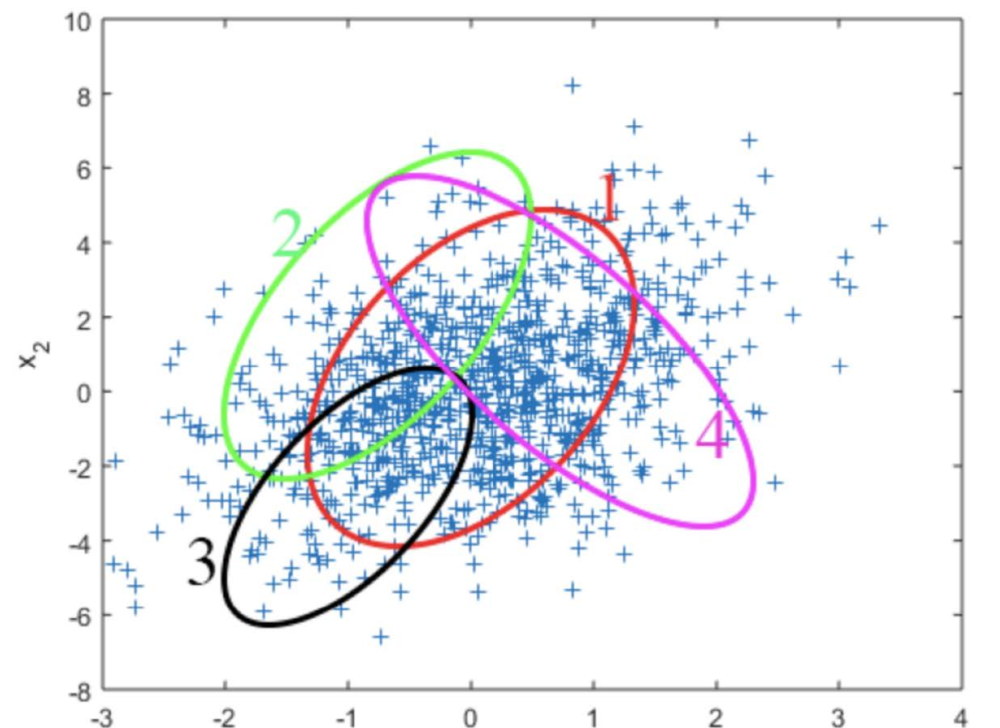

由上述过程生成的样本构成训练集 $D = \{\boldsymbol{x}_1,\boldsymbol{x}_2,\cdots,\boldsymbol{x}_m \}$ ，令随机变量 $z_j \in \{ 1,2,\cdots,k \}$ 表示生成样本 $\boldsymbol{x}_j$ 的高斯混合成分，其取值未知。显然，$z_j$ 的先验概率 $P(x_j = i)$ 对应 $\alpha_i (i = 1,2,\cdots,k)$ 。根据贝叶斯定理，$z_j$ 的后验概率为：
$$
\begin{aligned}
P_{\mathcal{M}}(z_j = i \mid \boldsymbol{x}_j) 
&= \dfrac{P(z_j = i)  \cdot p_{\mathcal{M}}(\boldsymbol{x}_j \mid z_j = i)}{p_{\mathcal{M}}(\boldsymbol{x}_j )}\\[5pt]
&= \dfrac{\alpha_i \cdot p(\boldsymbol{x}_j \mid \boldsymbol{\mu}_i,\boldsymbol{\Sigma}_i)}{\sum\limits_{l=1}^{k} \alpha_l \cdot p(\boldsymbol{x}_j \mid \boldsymbol{\mu}_l,\boldsymbol{\Sigma}_l)}\\[5pt]
&= \gamma_{ji} \quad (\text{为方便叙述，简记为} \gamma_{ji})
\end{aligned}
$$

> 这里使用的是贝叶斯定理的**推广形式**（或称为贝叶斯定理的连续-离散混合版本）
>
> 因为这里处理的是一个**离散随机变量**（混合成分 $z_j$）和一个**连续随机变量**（样本 $\boldsymbol{x}_j$）的混合问题。
> $$
> P(z_{j}=i \mid x_{j}=x) = \frac{p(x_{j}=x \mid z_{j}=i) \cdot P(z_{j}=i)}{p(x_{j}=x)}
> $$

当高斯混合分布已知时，高斯混合聚类将把样本集 $D$ 划分为 $k$ 个簇 $\mathcal{C} = \{C_1,C_2,\cdots,C_k \}$ ，每个样本 $\boldsymbol{x}_j$ 的簇标记 $\lambda_j$ 如下确定：
$$
\lambda_j = \underset{i \in \{ 1,2,\cdots,k\}}{\arg \max}\ \gamma_{ji}
$$
由此，**高斯混合聚类是采用概率模型对原型进行刻画，簇划分则由原型对应后验概率确定**。


下面回到高斯混合模型的求解上来。对于模型 $p_{\mathcal{M}}(\boldsymbol{x}) = \sum_{i=1}^{k} \alpha_i \cdot p(\boldsymbol{x} \mid \boldsymbol{\mu}_i,\boldsymbol{\Sigma}_i)$ ，参数 $\theta = \{(\alpha_i ,\mu_i, \Sigma_i) \mid 1 \leq i \leq k \}$ 可以采用极大似然估计（MLE）的方法求解。
$$
LL(D) = \ln \left(\prod_{j=1}^{m} p_{\mathcal{M}}(\boldsymbol{x}_j) \right) \
= \sum_{j=1}^{m} \ln \left(\sum_{i=1}^{k} \alpha_i \cdot p(\boldsymbol{x} \mid \boldsymbol{\mu}_i,\boldsymbol{\Sigma}_i) \right)\\[8pt]
\theta^* = \underset{\theta}{\arg \max}\ LL(D) = \underset{\theta}{\arg \max}\ \sum_{j=1}^{m} \ln \left(\sum_{i=1}^{k} \alpha_i \cdot p(\boldsymbol{x} \mid \boldsymbol{\mu}_i,\boldsymbol{\Sigma}_i) \right)
$$
常采用 EM 算法进行迭代优化求解。


经过理论推导可得：
$$
\boldsymbol{\mu}_i = \dfrac{\sum\limits_{j=1}^{m} \gamma_{ji} \boldsymbol{x}_j}{\sum\limits_{j=1}^{m} \gamma_{ji}} \quad \quad
\boldsymbol{\Sigma}_i = \dfrac{\sum\limits_{j=1}^m \gamma_{ji} (\boldsymbol{x}_j - \boldsymbol{\mu}_i) (\boldsymbol{x}_j - \boldsymbol{\mu}_i)^T}{\sum\limits_{j=1}^{m} \gamma_{ji}}
$$

$$
\alpha_i = \dfrac{1}{m}\sum_{j=1}^m \gamma_{ji}
$$

算法步骤如下：

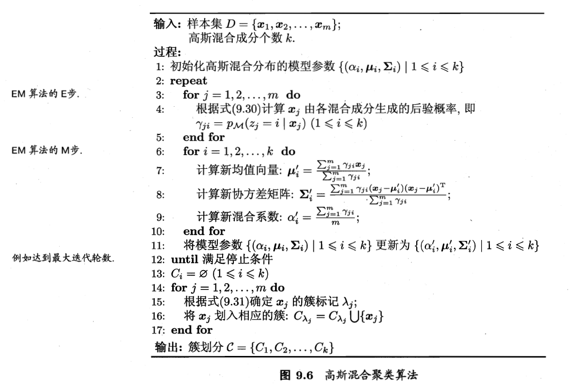

### 7.3 密度聚类

密度聚类亦称“基于密度的聚类”（density-based clustering），此类算法假设**聚类结构能通过样本的紧密程度确定**。通常情况下，密度聚类算法从样本密度的角度来考察样本之间的可连接性，并基于可连接样本不断扩展聚类簇以获得最终的聚类结果。

#### 7.3.1 DBSCAN 算法

DBSCAN（Density-Based Spatial Clustering of Application with Noise），是一种著名的密度聚类算法，它基于一组邻域参数 $(\epsilon , MinPts)$ 来刻画样本分布的紧密程度。DBSCAN不要求我们指定 cluster 簇的数量，避免了异常值，并且在任意形状和大小的 cluster 簇中工作得非常好。它没有质心，聚类簇是通过将相邻的点连接在一起的过程形成的。

> 给定数据集 $D = \{\boldsymbol{x}_1, \boldsymbol{x}_2, \cdots ,\boldsymbol{x}_m \}$ ，定义下面几个概念：
>
> - **$\epsilon$ - 邻域**：对于样本向量 $\boldsymbol{x}_j \in D$，其 $\epsilon$ - 邻域包含样本集 $D$ 中与 $\boldsymbol{x}_j$ 的距离不大于 $\epsilon$ 的样本，即
>     $$
>     N_\epsilon(\boldsymbol{x}_j) = \{ \boldsymbol{x}_i \in D \mid \text{dist}(\boldsymbol{x}_i, \boldsymbol{x}_j) \leq \epsilon \}
>     $$
>
> - **核心对象**（core object）：若样本 $\boldsymbol{x}_j$ 的 $\epsilon$ - 邻域至少包含 $MinPts$ 个样本，即  $ |N_\epsilon(\boldsymbol{x}_j)| \geq MinPts $ ，则 $\boldsymbol{x}_j$ 是一个核心对象。
>
> - **密度直达**（directly density-reachable）：若 $\boldsymbol{x}_j$ 位于 $\boldsymbol{x}_i$ 的 $\epsilon$ - 邻域中，且 $\boldsymbol{x}_i$ 是核心对象，则称 $\boldsymbol{x}_j$ 由 $\boldsymbol{x}_i$ 密度直达。密度直达关系通常不满足对称性
>
> - **密度可达** (density-reachable)：对 $\boldsymbol{x}_i$ 与 $\boldsymbol{x}_j$，若存在样本序列 $\boldsymbol{p}_1, \boldsymbol{p}_2, \ldots, \boldsymbol{p}_n$（$\boldsymbol{p}_1 = \boldsymbol{x}_i$, $\boldsymbol{p}_n = \boldsymbol{x}_j$），且 $\boldsymbol{p}_{k+1}$ 由 $\boldsymbol{p}_k$ 密度直达($k=1,2,\ldots,n-1$)，则称 $\boldsymbol{x}_j$ 由 $\boldsymbol{x}_i$ 密度可达。密度可达关系满足直递性，但不满足对称性
>
> - **密度相连** (density-connected)：对 $\boldsymbol{x}_i$ 与 $\boldsymbol{x}_j$，若存在核心对象 $\boldsymbol{x}_k$ 使得$\boldsymbol{x}_i$ 与 $\boldsymbol{x}_j$ 均由 $\boldsymbol{x}_k$ 密度可达，则称 $\boldsymbol{x}_i$ 与 $\boldsymbol{x}_j$ 密度相连。密度相连关系满足对称性
>
> 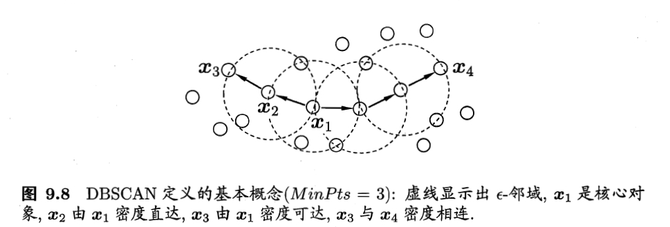

基于这些概念，DBSCAN 将“簇”定义为：**由密度可达关系导出的最大密度相连样本集合**。形象的说，给定邻域参数 $(\epsilon , MinPts)$ ，簇 $C \subseteq D$ 是满足以下性质的非空子集：

- 连接性（connectivity）：$\boldsymbol{x}_i \in C, \boldsymbol{x}_j \in C \quad \Rightarrow \quad \boldsymbol{x}_i \ \text{与} \ \boldsymbol{x}_j \ \text{密度相连}$
- 最大性（maximality）：$\boldsymbol{x}_i \in C ,\boldsymbol{x}_j \ \text{由} \ \boldsymbol{x}_i \ \text{密度可达} \quad \Rightarrow \quad \boldsymbol{x}_j \in C$

> $D$ 中不属于任何簇的样本被认为是噪声或异常样本

根据上述定义，DBSCAN 先任选一个核心对象作为种子，然后，对核心点的 $\epsilon$ - 邻域内的每个点进行评估，如果该点满足 $MinPts$ 标准，它将成为另一个核心点，cluster 簇将扩展。如果一个点不满足 $MinPts$ 标准，它成为边界点。

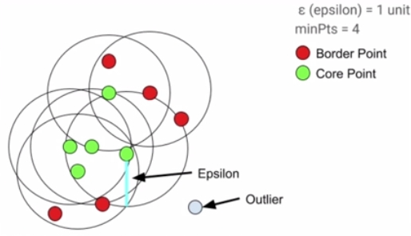

DBSCAN 算法实现过程为：

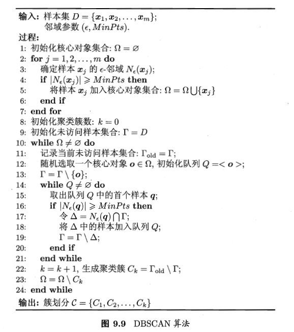

---

####  7.3.2 OPTICS 算法

在 DBCSAN算法中需要输入两个参数：$\epsilon$ 和 $MinPts$ ，DBCSAN 对于输入参数过于敏感。OPTICS（Ordering Points To Identify the Clustering Structure）算法的提出就是为了帮助 DBSCAN 算法选择合适的参数，降低输入参数的敏感度。在另一方面， OPTICS 算法建立了一个可达性图（Reachability Graph），放松了 $\epsilon$ 的取值，能够将局部不同“密度”的簇也划分出来。

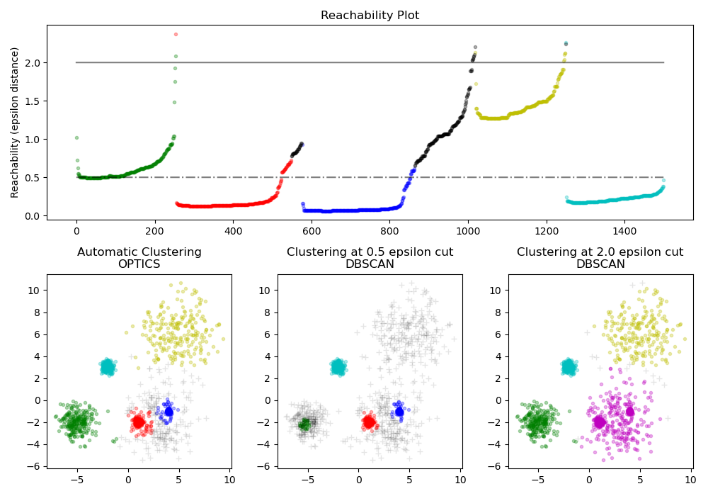

由于 OPTICS  算法是DBSCAN 算法的一种改进，因此有些概念是共用的，比如： ϵ -邻域，核心对象，密度直达，密度可达，密度相连等。OPTICS 的“ **OP** ”（Ordering Points）是该算法的核心，引入了两种新的“距离”的定义，来对点进行排序：

> - **核心距离**（core-distance）：对样本 $\boldsymbol{x} \in D$ ，对于给定的 $\epsilon$ 和 $MinPts$ ，使得 $\boldsymbol{x}$ 成为核心对象的最小邻域半径称为 $\boldsymbol{x}$ 的核心距离。令 $N_{\epsilon}^i (\boldsymbol{x}) $ 表示邻域集合 $N_{\epsilon}(\boldsymbol{x})$ 中核心对象 $\boldsymbol{x}$ 第 $i$ 近邻的点，核心距离数学表达为：
>     $$
>     \text{core-dist}(\boldsymbol{x}) = 
>     \begin{cases}
>     undefined \quad &\mid N_{\epsilon}(\boldsymbol{x}) \mid < MinPts\\[8pt]
>     \text{dist}(\boldsymbol{x}, N_{\epsilon}^{MinPts}(\boldsymbol{x})) &\mid N_{\epsilon}(\boldsymbol{x}) \mid \geq MinPts
>     \end{cases}
>     $$
>
> - **可达距离**（reachability-distance）：对样本 $\boldsymbol{x}_i\ \text{,}\ \boldsymbol{x}_j \in D$ ，对于给定的 $\epsilon$ 和 $MinPts$ ，$\boldsymbol{x}_j$ 关于 $\boldsymbol{x}_i$ 的可达距离定义为：
>     $$
>     \text{reachability-dist}(\boldsymbol{x}_i\ \text{,}\ \boldsymbol{x}_j) = 
>     \begin{cases}
>     undefined \quad &\mid N_{\epsilon}(\boldsymbol{x}_i) \mid < MinPts\\[8pt]
>     \max \Bigl\{\text{core-dist}(\boldsymbol{x}_i), \text{dist}(\boldsymbol{x}_i\ \text{,}\ \boldsymbol{x}_j) \Bigr\} &\mid N_{\epsilon}(\boldsymbol{x}_i) \mid \geq MinPts
>     \end{cases}
>     $$
>
> 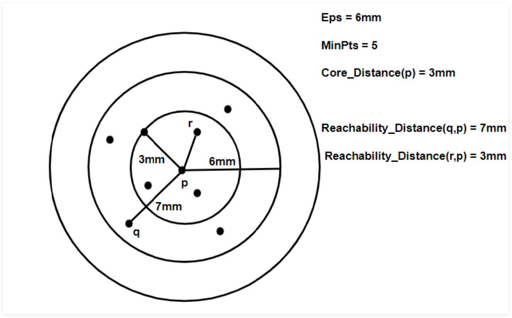


**算法伪代码**： [OPTICS_Algorithm.pdf](..\source\article\OPTICS_Algorithm.pdf) 

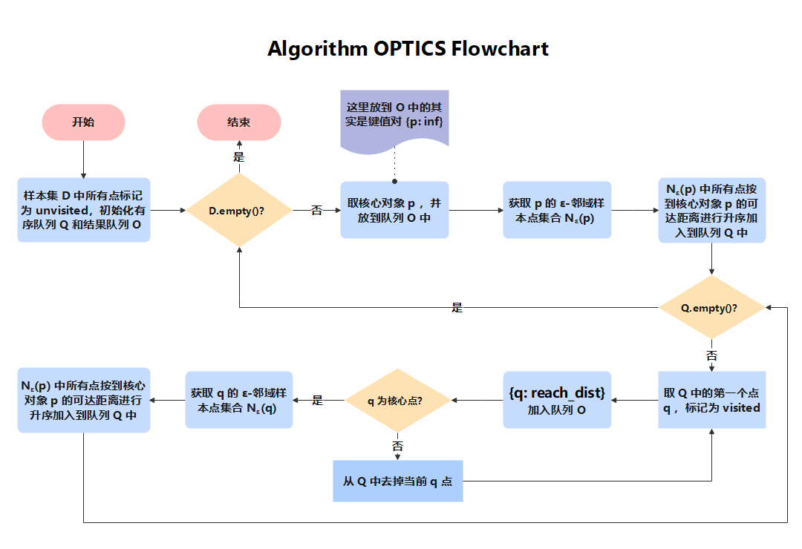

<details>
  <summary>使用 numpy 实现 OPTICS 算法</summary>

```python
import numpy as np
import matplotlib.pyplot as plt
import time
import operator
from scipy.spatial.distance import pdist
from scipy.spatial.distance import squareform

def compute_squared_EDM(X):
	return squareform(pdist(X,metric='euclidean'))
# 显示决策图
def plotReachability(data,eps):
    plt.figure()
    plt.plot(range(0,len(data)), data)
    plt.plot([0, len(data)], [eps, eps])
    plt.show()
# 显示分类的类别
def plotFeature(data,labels):
    clusterNum = len(set(labels))
    fig = plt.figure()
    scatterColors = ['black', 'blue', 'green', 'yellow', 'red', 'purple', 'orange', 'brown']
    ax = fig.add_subplot(111)
    for i in range(-1, clusterNum):
        colorSytle = scatterColors[i % len(scatterColors)]
        subCluster = data[np.where(labels == i)]
        ax.scatter(subCluster[:, 0], subCluster[:, 1], c=colorSytle, s=12)
    plt.show()
def updateSeeds(seeds,core_PointId,neighbours,core_dists,reach_dists,disMat,isProcess):
    # 获得核心点core_PointId的核心距离
    core_dist=core_dists[core_PointId]
    # 遍历core_PointId 的每一个邻居点
    for neighbour in neighbours:
        # 如果neighbour没有被处理过，计算该核心距离
        if(isProcess[neighbour]==-1):
            # 首先计算改点的针对core_PointId的可达距离
            new_reach_dist = max(core_dist, disMat[core_PointId][neighbour])
            # 如果可达距离没有被计算过，将计算的可达距离赋予
            if(np.isnan(reach_dists[neighbour])):
                reach_dists[neighbour]=new_reach_dist
                seeds[neighbour] = new_reach_dist
            # 如果可达距离已经被计算过，判读是否要进行修改
            elif(new_reach_dist<reach_dists[neighbour]):
                reach_dists[neighbour] = new_reach_dist
                seeds[neighbour] = new_reach_dist
    return seeds
def OPTICS(data,eps=np.inf,minPts=15):
    # 获得距离矩阵
    orders = []
    disMat = compute_squared_EDM(data)
    # 获得数据的行和列(一共有n条数据)
    n, m = data.shape
    # np.argsort(disMat)[:,minPts-1] 按照距离进行 行排序 找第minPts个元素的索引
    # disMat[np.arange(0,n),np.argsort(disMat)[:,minPts-1]] 计算minPts个元素的索引的距离
    temp_core_distances = disMat[np.arange(0,n),np.argsort(disMat)[:,minPts-1]]
    # 计算核心距离
    core_dists = np.where(temp_core_distances <= eps, temp_core_distances, -1)
    # 将每一个点的可达距离未定义
    reach_dists= np.full((n,), np.nan)
    # 将矩阵的中小于minPts的数赋予1，大于minPts的数赋予零，然后1代表对每一行求和,然后求核心点坐标的索引
    core_points_index = np.where(np.sum(np.where(disMat <= eps, 1, 0), axis=1) >= minPts)[0]
    # 用于标识是否被处理，没有被处理，设置为-1
    isProcess = np.full((n,), -1)
    # 遍历所有的核心点
    for pointId in core_points_index:
        # 如果核心点未被分类，将其作为的种子点，开始寻找相应簇集
        if (isProcess[pointId] == -1):
            # 将点pointId标记为当前类别(即标识为已操作)
            isProcess[pointId] = 1
            orders.append(pointId)
            # 寻找种子点的eps邻域且没有被分类的点，将其放入种子集合
            neighbours = np.where((disMat[:, pointId] <= eps) & (disMat[:, pointId] > 0) & (isProcess == -1))[0]
            seeds = dict()
            seeds=updateSeeds(seeds,pointId,neighbours,core_dists,reach_dists,disMat,isProcess)
            while len(seeds)>0:
                nextId = sorted(seeds.items(), key=operator.itemgetter(1))[0][0]
                del seeds[nextId]
                isProcess[nextId] = 1
                orders.append(nextId)
                # 寻找newPoint种子点eps邻域（包含自己）
                # 这里没有加约束isProcess == -1，是因为如果加了，本是核心点的，可能就变成了非和核心点
                queryResults = np.where(disMat[:, nextId] <= eps)[0]
                if len(queryResults) >= minPts:
                    seeds=updateSeeds(seeds,nextId,queryResults,core_dists,reach_dists,disMat,isProcess)
                # 簇集生长完毕，寻找到一个类别
    # 返回数据集中的可达列表，及其可达距离
    return orders,reach_dists
def extract_dbscan(data,orders, reach_dists, eps):
    # 获得原始数据的行和列
    n,m=data.shape
    # reach_dists[orders] 将每个点的可达距离，按照有序列表排序（即输出顺序）
    # np.where(reach_dists[orders] <= eps)[0]，找到有序列表中小于eps的点的索引，即对应有序列表的索引
    reach_distIds=np.where(reach_dists[orders] <= eps)[0]
    # 正常来说：current的值的值应该比pre的值多一个索引。如果大于一个索引就说明不是一个类别
    pre=reach_distIds[0]-1
    clusterId=0
    labels=np.full((n,),-1)
    for current in reach_distIds:
        # 正常来说：current的值的值应该比pre的值多一个索引。如果大于一个索引就说明不是一个类别
        if(current-pre!=1):
            # 类别+1
            clusterId=clusterId+1
        labels[orders[current]]=clusterId
        pre=current
    return labels
data = np.loadtxt("cluster2.csv", delimiter=",")
start = time.clock()
orders,reach_dists=OPTICS(data,np.inf,30)
end = time.clock()
print('finish all in %s' % str(end - start))
labels=extract_dbscan(data,orders,reach_dists,3)
plotReachability(reach_dists[orders],3)
plotFeature(data,labels)
```
</details>

---

#### 7.3.3 MeanShift 算法

MeanShift（均值漂移）算法在目标追踪中应用广泛。本身其实是一种**基于密度的聚类算法**。

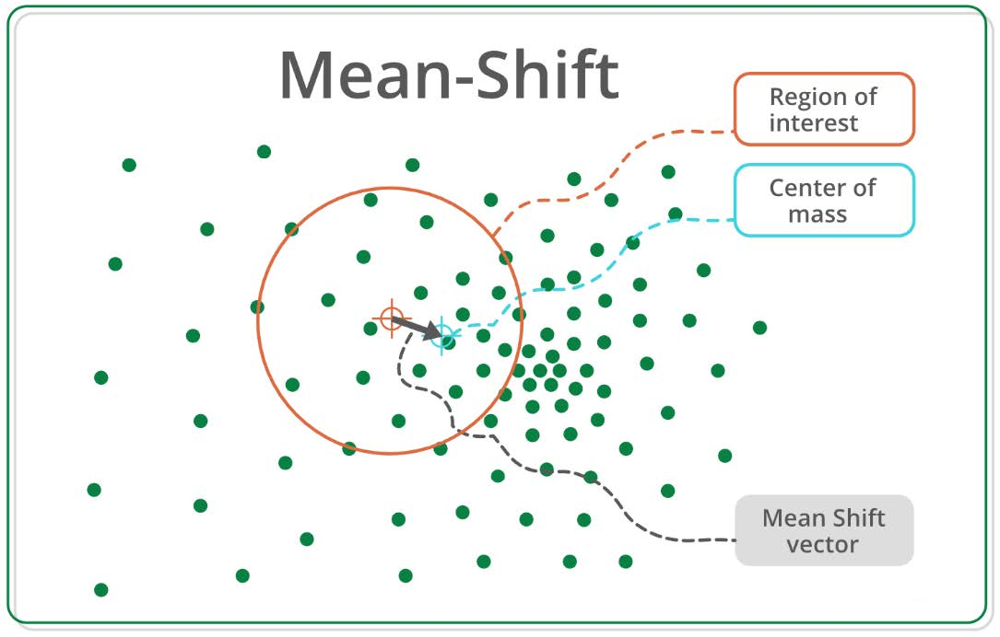

主要思路是：计算某一点 $\vec{a}$ 与其周围半径 $R$ 内的向量距离的平均值 $\vec{m}$，计算出该点下一步漂移（移动）的方向（$\vec{a}^{new} = \vec{m} + \vec{a}$）。当该点不再移动时，其与周围点形成一个类簇，计算这个类簇与历史类簇的距离，满足小于阈值即合并为同一个类簇，不满足则自身形成一个类簇。直到所有的数据点选取完毕。

<details>
  <summary>数学推导</summary>

MeanShift 是一种基于密度估计的非参数聚类算法，它通过迭代寻找概率密度函数的局部极大值点（模态）来实现聚类。以下是其数学推导过程：

1. 核密度估计 (Kernel Density Estimation)

    给定数据集 $\{\boldsymbol{x}_i\}_{i=1}^{n} \subset \mathbb{R}^d$，在点 $\boldsymbol{x}$ 处的核密度估计为：

    $$
    \hat{f}(\boldsymbol{x}) = \frac{1}{n} \sum_{i=1}^{n} K_H(\boldsymbol{x} - \boldsymbol{x}_i)
    $$

    > 其中：
    > - $K_H(\boldsymbol{z}) = |H|^{-1/2}K(H^{-1/2}\boldsymbol{z})$ 是核函数
    > - $H$ 是带宽矩阵（通常取为 $h^2I$，$h$ 为带宽参数）
    > - $K(\cdot)$ 是核函数，满足 $\int K(\boldsymbol{z})d\boldsymbol{z} = 1$

2. 均值漂移向量推导

   
    对密度函数求梯度：
    $$
    \nabla \hat{f}(\boldsymbol{x}) = \frac{1}{n} \sum_{i=1}^{n} \nabla K_H(\boldsymbol{x} - \boldsymbol{x}_i)
    $$
    
    假设核函数可表示为 $K(\boldsymbol{z}) = k(\|\boldsymbol{z}\|^2)$，其中 $k(\cdot)$ 称为**轮廓函数**（profile function）。则有：
    
    $$
    \nabla K(\boldsymbol{z}) = 2k'(\|\boldsymbol{z}\|^2)\boldsymbol{z}
    $$
    
    代入轮廓函数表达式，梯度重写为：
    
    $$
    \nabla \hat{f}(\boldsymbol{x}) = \frac{2}{n} \sum_{i=1}^{n} k'\left(\left\|\frac{\boldsymbol{x} - \boldsymbol{x}_i}{h}\right\|^2\right) \frac{\boldsymbol{x}_i - \boldsymbol{x}}{h^2}
    $$
    
    引入辅助函数 $g(u) = -k'(u)$，则上式可重写为：
    
    $$
    \nabla \hat{f}(\boldsymbol{x}) = \frac{2}{nh^{d+2}} \left[ \sum_{i=1}^{n} g\left(\left\|\frac{\boldsymbol{x} - \boldsymbol{x}_i}{h}\right\|^2\right) \right] \ \boldsymbol{m}(\boldsymbol{x})
    $$
    
    其中 $\boldsymbol{m}(\boldsymbol{x})$ 是**均值漂移向量**（其实就是通过核函数加权平均）：
    
    $$
    \boldsymbol{m}(\boldsymbol{x}) = \frac{
    \sum_{i=1}^{n} \boldsymbol{x}_i g\left(\left\|\frac{\boldsymbol{x} - \boldsymbol{x}_i}{h}\right\|^2\right)
    }{
    \sum_{i=1}^{n} g\left(\left\|\frac{\boldsymbol{x} - \boldsymbol{x}_i}{h}\right\|^2\right)
    } - \boldsymbol{x}
    $$
    
3. 均值漂移迭代

    由梯度表达式可得：

    $$
    \nabla \hat{f}(\boldsymbol{x}) = \hat{f}(\boldsymbol{x}) \frac{2}{h^2}\ \boldsymbol{m}(\boldsymbol{x})
    $$

    这表明均值漂移向量 $\boldsymbol{m}(\boldsymbol{x})$ 与密度梯度成正比，即 $\boldsymbol{m}(\boldsymbol{x})$ 指向密度增加最快的方向。

    因此，**均值漂移迭代公式**为：

    $$
    \boldsymbol{x}^{(k+1)} = \boldsymbol{x}^{(k)} + \boldsymbol{m}(\boldsymbol{x}^{(k)})
    $$

    或等价地：

    $$
    \boldsymbol{x}^{(k+1)} = \frac{
    \sum_{i=1}^{n} \boldsymbol{x}_i g\left(\left\|\frac{\boldsymbol{x}^{(k)} - \boldsymbol{x}_i}{h}\right\|^2\right)
    }{
    \sum_{i=1}^{n} g\left(\left\|\frac{\boldsymbol{x}^{(k)} - \boldsymbol{x}_i}{h}\right\|^2\right)
    }
    $$

4. 收敛性证明

    均值漂移算法可视为一种**梯度上升**方法：

    $$
    \boldsymbol{x}^{(k+1)} = \boldsymbol{x}^{(k)} + \eta \nabla \hat{f}(\boldsymbol{x}^{(k)})
    $$

    其中 $\eta = \dfrac{h^2}{2\hat{f}(\boldsymbol{x}^{(k)})}$。由于 $\eta > 0$，每次迭代都向密度增加方向移动，最终收敛到局部极大值点。

5. 常用核函数

    高斯核 (Gaussian Kernel)：

    $$
    K(\boldsymbol{z}) = \dfrac{1}{(2\pi)^{d/2}} \exp\left(-\dfrac{1}{2}\|\boldsymbol{z}\|^2\right)
    $$

    > 轮廓函数：$k(u) = \exp\left(-\frac{u}{2}\right)$  
    > 导函数：$g(u) = -k'(u) = \frac{1}{2}\exp\left(-\frac{u}{2}\right)$

    Epanechnikov 核：

    $$
    K(\boldsymbol{z}) = \begin{cases} 
    \dfrac{d+2}{2c_d}(1 - \|\boldsymbol{z}\|^2) & if\ \|\boldsymbol{z}\| \leq 1 \\[8pt]
    0 & otherwise
    \end{cases}
    $$

    > 轮廓函数：$k(u) = (1 - u)$  
    > 导函数：$g(u) = -k'(u) = 1$

6. 算法步骤

    ```python
    def meanshift(X, bandwidth, max_iter=100, tol=1e-3):
        """
        X: 输入数据 (n_samples, n_features)
        bandwidth: 带宽参数
        """
        n = X.shape[0]
        centroids = X.copy()
        converged = [False] * n
        
        for _ in range(max_iter):
            for i in range(n):
                if not converged[i]:
                    # 计算当前点的权重
                    distances = np.linalg.norm(X - centroids[i], axis=1)
                    weights = gaussian_kernel(distances / bandwidth)
                    
                    # 计算均值漂移
                    new_center = np.sum(X * weights[:, None], axis=0) / np.sum(weights)
                    
                    # 检查收敛
                    if np.linalg.norm(new_center - centroids[i]) < tol:
                        converged[i] = True
                    centroids[i] = new_center
            
            if all(converged):
                break
        
        # 合并收敛到同一点的簇
        return cluster_centers(centroids)
    
    def gaussian_kernel(u):
        return np.exp(-0.5 * u**2)
    ```

</details>

### 7.4 层次聚类

**层次聚类假设类别之间存在层次结构，将样本聚类到层次化的类中**。层次聚类可以分为**聚合（Agglomerative）聚类**（或称自下而上聚类）和**分裂（Divisive）聚类**（或称自上而下聚类）两种方法。

聚合聚类开始将每个样本各自分到一个类，之后将相聚最近的两类合并，建立一个新的类，重复此操作直到满足停止条件，得到层次化的类别。分裂聚类开始将所有样本分到一个类，之后将已有类中相距最远的样本分到两个新类，重复此操作直到满足停止条件，得到层次化的类别。

以聚合聚类为例，聚合聚类需要预先确定下面三个要素：

- 距离或相似度
- 合并规则
- 停止条件

根据这些要素的不同组合，就可以构成不同的聚类方法。距离或相似度可以是闵可夫斯基距离、马哈拉诺比斯距离、相关系数、夹角余弦；合并规则一般是类间距离最小，类间距离可以是最短距离、最长距离、中心距离、平均距离；停止条件可以是类别数达到阈值、类直径超过阈值。


#### 7.4.1 AGNES 算法

AGNES（Agglomerative Nesting）是一种典型的聚合聚类策略算法。

算法描述见文档： [AGNES_Algorithm.pdf](..\source\article\AGNES_Algorithm.pdf) 

AGNES 算法的核心在于如何定义“两个簇之间的距离”。不同的定义方法会产生不同的聚类效果。以下是三种最常见的链接准则：

> 1. **单链接**（Single Linkage）
>
> ​	定义：两个簇之间的距离定义为两个簇中所有点之间最近的距离。
>
> ​	公式：$d_{min}(C_i, C_j) = \underset{a \in C_i, b \in C_j}{\min} d(a, b)$
>
> ​	特点：容易形成“长链条”状的簇（Chaining Effect），对噪声比较敏感。擅长发现非椭圆形状的簇，但可能过度扩展。
>
> 2. **全链接**（Complete Linkage）
>
> ​	定义：两个簇之间的距离定义为两个簇中所有点之间最远的距离。
>
> ​	公式：$d_{max}(C_i, C_j) = \underset{a \in C_i, b \in C_j}{\max} d(a, b)$
>
> ​	特点：倾向于形成紧凑的、大小相近的球形簇。对噪声相对不敏感，但可能拆分大的簇。
>
> 3. **平均链接**（Average Linkage）
>
> ​	定义：两个簇之间的距离定义为两个簇中所有点对之间的平均距离。这是最常用的方法，是单链接和全链接的一个良好折中。
>
> ​	公式：$d_{avg}(C_i, C_j) = \dfrac{1}{|C_i||C_j|} \sum\limits_{a \in C_i} \sum\limits_{b \in C_j} d(a, b)$
>
> ​	特点：效果通常比较好，兼顾了紧凑性和分离性，相对稳健。
>

`from sklearn.cluster import AgglomerativeClustering`

Example:：[AGNES_example](../source/py/AGNES_example.py)

#### 7.4.2 DIANA 算法

DINVA（Divisive Analys） 算法采用自上而下的策略。首先将所有对影响置于一个簇中，然后按照某种规则逐渐细分为越来越小的簇（例如 $d_{\max}$），直到达到某个终止条件。

#### 7.4.3 BIRCH算法

BIRCH（Balanced Iterative Reducing and Clustering using Hierarchies）算法比较适合于数据量大，类别数K也比较多的情况。它运行速度很快，只需要单遍扫描数据集就能进行聚类。

> 1. 首先产生一个小的但又尽可能整合大数据集的摘要信息
> 2. 然后这个小的摘要信息被聚类，而不是针对大数据集进行聚类。

BIRCH算法利用了一个树结构来帮助我们快速的聚类，一般将它称之为聚类特征树（Clustering Feature Tree，简称CF Tree）。这颗树的每一个节点是由若干个**聚类特征**（Clustering Feature，简称CF）组成。

1. 聚类特征

    BIRCH 总结大数据集到小的、稠密的区域，被称为聚类特征项。

    形式上，一个聚类特征项被定义为一个有序的三元组`(N, LS, SS)` 这里 `N` 是簇中数据点数量，`LS`是簇中数据点的线性加和，`SS` 是簇中数据点的平方和。

    对于一个聚类特征项是有可能由其它多个聚类特征项组成的。

    CF有一个很好的性质，就是满足线性关系。
    
    质心： $Centroid = \dfrac{LS}{N}$
    
    半径： $Radius = \sqrt{\Bigl( \dfrac{SS}{N} - (\dfrac{LS}{N})^2 \Bigr)} $（表示簇内点到质心的平均距离）
    
    直径： $Diameter = \sqrt{\dfrac{2N\cdot SS - 2\cdot LS^2}{N(N-1)}}$ （表示簇内点两两之间的平均距离）

2. CF 树

    

### 7.5 图聚类

现在现实世界从互联网技术（IT）时代基本进入了数据技术（DT）时代。数据作为新一代的核心驱动力，受到越来越大的关注和应用，如数据建模、数据挖掘、数据科学、数据安全等。
数据是信息的载体。信息包括**结构化信息**和**非结构信息**。

- 结构化信息（欧式数据）
    - 语音、文本、图像、视频 ……
    - 具有规范的数据存储或表示形式
    - 迎合人类的认知和计算机的存取处理

- 非结构信息（非欧式数据）
    - 社交网络、化学分子、引文网络 ……
    - 没有规范的数据格式
    - 来自于自然世界

非结构数据往往可以使用关系进行表示，即被视为关系数据。而关系数据的主流数据结构就是**图结构**。图结构是一种比线性表和树更为复杂的数据结构[ 数据结构：图的基本概念 - 知乎](https://zhuanlan.zhihu.com/p/683707934)，主流的图结构有以下几种

1. 普通图：由节点和边组成，且每条边只能两个节点。且节点之间、边之间不做区分。
2. 二部图：将节点分为两类，所有的边只会连接不同类的节点；
3. 超图：由节点和超边组成，每条超边可以连接不限数量的节点；
4. 异质图：节点之间、边之间可以具有不同的语义。

#### 7.5.1 AP 聚类

标准 AP（Affinity Propagation，近邻传播）聚类算法是通过在所给定的数据集中的数据点之间迭代传送**吸引度信息**和**归属度信息**来达到高效、准确的数据聚类目的。它基于数据点间的"信息传递"的一种聚类算法，把一对数据点之间的相似度作为输入，在数据点之间交换真实有价值的信息，直到一个最优的类代表点集合(称为聚类中心或者 exemplar)和聚类逐渐形成。此时所有的数据点到其最近的类代表点的相似度之和最大。

> `exemplar` 模型、模范、**典型**、原型
>
> `examplar` 楷模

与k-均值算法或k中心点算法不同，AP算法不需要在运行算法之前确定聚类的个数，他所寻找的"exemplars"就是聚类中心点，同时也**是数据集合中实际存在的点**，作为每类的代表。

> AP聚类的一些相关名词介绍
>
> - **Exemplar**：指的是聚类中心，类似于 K-Means 中的质心。
>
> - **Similarity**：数据点 $i$ 和点 $j$ 的**相似度**记为 $s(i, j)$ ，是指点j作为点i的聚类中心的相似度。一般使用**欧氏距离**来计算，一般点与点的相似度值全部取为负值；因此，$s(i, j)$ 相似度值越大说明点 $i$ 与点 $j$ 的距离越近，AP算法中理解为数据点 $j$ 作为数据点 $i$ 的聚类中心的能力。
>
> - **Preference**：数据点 $i$ 的**参考度**称为 $p(i)$ 或 $s(i,i)$，是指点 $i$ 作为聚类中心的参考度。若按欧氏距离计算其值应为 0，但在AP聚类中其表示数据点 $i$ 作为聚类中心的程度，因此不能为 0。迭代开始前假设所有点成为聚类中心的能力相同，因此参考度一般设为相似度矩阵中所有值得**最小值**或者**中位数**，但是参考度越大则说明个数据点成为聚类中心的能力越强，则最终聚类中心的个数则越多；
>
> - **Responsibility**：$r(i,k)$ 用来描述点 $k$ 适合作为数据点 $i$ 的聚类中心的程度。从点 $i$ 发送至候选聚类中心点 $k$，反映了在考虑其他潜在聚类中心后，点 $k$ 适合作为点 $i$ 的聚类中心的程度。
>
> - **Availability**：$a(i,k)$ 用来描述点 $i$ 选择点 $k$ 作为其聚类中心的**适合程度**。从候选聚类中心点 $k$ 发送至点 $i$，反映了在考虑其他点对点 $k$ 成为聚类中心的支持后，点 $i$ 选择点 $k$ 作为聚类中心的合适程度。
>
> - **Damping factor**(阻尼系数)：为了避免振荡，AP 算法更新信息时引入了衰减系数 $\lambda$。每条信息被设置为它前次迭代更新值的 $\lambda$ 倍加上本次信息更新值的 $1-λ$ 倍。其中，衰减系数 $\lambda$ 是介于 0 到 1 之间的实数。
>
>
> 在实际计算应用中，最重要的两个参数（也是需要手动指定）：
>
> `Preference` - 影响聚类数量的多少，值越大聚类数量越多
>
> `Damping factor` - 控制算法收敛效果

<details>
  <summary> 算法原理 算法</summary>
Affinity Propagation 算法中，在点之间发送的消息属于两类之一。第一类是责任 $r(i, k)$，它表示样本 $k$ 应当作为样本 $i$ 的代表的累积证据。第二类是可用性 $a(i, k)$，它表示样本 $i$ 应当选择样本 $k$ 作为其代表的累积证据，并考虑所有其他样本认为 $k$ 应当是一个代表的情况。通过这种方式，样本选择代表的条件是：

（1）它们与许多样本足够相似

（2）被许多样本选择作为自身的代表。

更正式地，样本 $k$ 作为样本 $i$ 的代表的责任由以下公式给出：

$$
r(i, k) \leftarrow s(i, k) - \underset{k' \neq k }{\max} \Bigl[\ a(i, k') + s(i, k')\ \Bigr]
$$

其中 $s(i, k)$ 是样本 $i$ 和 $k$ 之间的相似度，可以由下式表示：
$$
s(i,j) = -\|i - k \|^2
$$


样本 $k$ 作为样本 $i$ 的代表的可用性由以下公式给出：
$$
a(i, k) \leftarrow \min \Bigl[\ 0,\ r(k, k) + \sum_{~i' \notin \{i, k\} } \max [\ 0,\ {r(i', k)\ ] }\ \Bigr]\\
a(k,k) \leftarrow \sum_{i' \neq k} \max[\ 0,\ r(i', k)]
$$

开始时，所有 $r$ 和 $a$ 的值被设为零，并通过迭代计算直至收敛。如上所述，为了避免更新消息时出现数值振荡，在迭代过程中引入了阻尼因子 $\lambda$：

$$
r_{t+1}(i, k) = \lambda\cdot r_{t}(i, k) + (1-\lambda)\cdot r_{t+1}(i, k)\\
a_{t+1}(i, k) = \lambda\cdot a_{t}(i, k) + (1-\lambda)\cdot a_{t+1}(i, k)
$$

其中 $t$ 表示迭代次数。

</details> 

[plot_affinity_propagation.py](..\source\py\plot_affinity_propagation.py) 

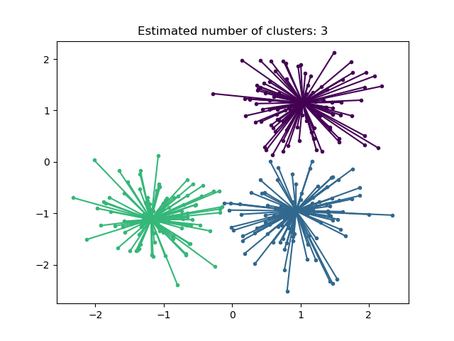

---

#### 7.5.2 谱聚类

谱聚类（Spectral Clustering）是一种增强的聚类算法，在许多场景下它好于很多传统聚类算法。它把数据点看成是 graph 图里面的节点，并且把聚类问题转换成了 graph 图分割问题。

典型的谱聚类由三个基本步骤组成：

1. 建立相似度 Graph
2. 投影数据到低维空间（切图）
3. 

### 7. 6 聚类总结

基于 scikit-learn 官方文档，以下是对常见聚类算法的综合比较。

| 方法名称                 | 参数                                       | 可扩展性                                      | 适用场景                                                       | 几何结构（使用的度量）               |
| :----------------------: | :----------------------------------------- | :-------------------------------------------- | :------------------------------------------------------------- | :----------------------------------- |
| **K-Means**              | 聚类数量                                   | 支持大量样本，中等数量聚类（使用 MiniBatch）  | 通用场景、簇大小均匀、几何结构平坦、聚类数不宜过多、归纳式     | 点间距离                             |
| **Affinity propagation** | 阻尼系数、样本偏好                         | 不适用于大量样本                              | 聚类数多、簇大小不均、非平坦几何、归纳式                       | 图距离（如近邻图）                   |
| **Mean-shift**           | 带宽                                       | 不适用于大量样本                              | 聚类数多、簇大小不均、非平坦几何、归纳式                       | 点间距离                             |
| **Spectral clustering**  | 聚类数量                                   | 中等样本量、较少聚类数                        | 聚类数少、簇大小均匀、非平坦几何、直推式                       | 图距离（如近邻图）                   |
| **Ward hierarchical clustering** | 聚类数或距离阈值                         | 支持大量样本和较多聚类                        | 聚类数多、可能带有连通性约束、直推式                           | 点间距离                             |
| **Agglomerative clustering** | 聚类数或距离阈值、连接类型、距离度量       | 支持大量样本和大量聚类                        | 聚类数多、可能带有连通性约束、支持非欧距离、直推式             | 任意 pairwise 距离                   |
| **DBSCAN**               | 邻域大小                                   | 超大量样本、中等聚类数                        | 非平坦几何、簇大小不均、剔除噪声点、直推式                     | 最近点之间的距离                     |
| **HDBSCAN**              | 最小簇成员数、最小近邻点数                 | 大量样本、中等聚类数                          | 非平坦几何、簇大小不均、剔除噪声点、直推式、层次式、支持变密度 | 最近点之间的距离                     |
| **OPTICS**               | 最小簇成员数                               | 超大量样本、大量聚类                          | 非平坦几何、簇大小不均、变密度、噪声剔除、直推式               | 点间距离                             |
| **Gaussian mixtures**    | 多个参数                                   | 扩展性较差                                    | 平坦几何、适用于密度估计、归纳式                               | 到中心的马氏距离 (Mahalanobis)       |
| **BIRCH**                | 分支因子、阈值、可选全局聚类器             | 支持大量样本和大量聚类                        | 大规模数据集、噪声剔除、数据降维、归纳式                       | 点间欧氏距离                         |
| **Bisecting K-Means**    | 聚类数量                                   | 超大量样本、中等聚类数                        | 通用场景、簇大小均匀、平坦几何、无空簇、归纳式、层次式         | 点间距离                             |

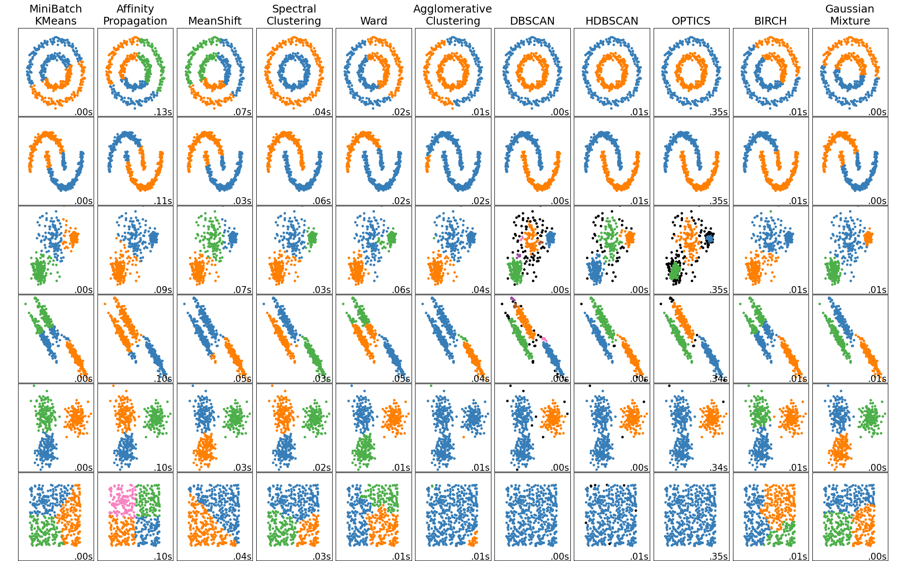


