# 机器学习

## 0. 概述

机器学习按照模型类型分为监督学习模型、无监督学习模型两大类：

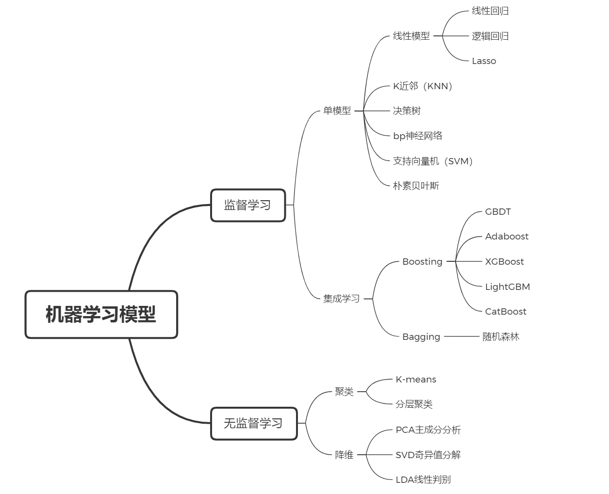

简单的归纳就是，是否有监督（supervised），就看输入数据是否有标签（label）。输入数据有标签，则为有监督学习；没标签则为无监督学习。

---
## 1. 线性回归
线性回归是机器学习最基础的内容，它的很多算法和思想，在后续很多的高级算法中都有体现。
- 阶段概述：
    - 本阶段讲解，**多元线性回归**，**梯度下降法**，**归一化**，**正则化**，**Lasso回归**，**Ridge回归**，**多项式回归**。
- 达成目标：
    - 通过本阶段学习，从推导出多元线性回归算法的损失函数，到实现开发和应用算法，再到对算法从数据预处理上，以及损失函数上的优化都将整体彻底掌握。对后面学习更多算法，甚至深度学习都将起到举一反三的效果。

### 1.1 线性回归基础

#### 1.1.1 线性回归概述
**多元线性回归**公式：
$$
\hat{y} = \beta_0 + \beta_1 X
$$
- parameter:
  - $\hat{y}$ ：预测值(Predicted value)
  - $\beta_0$ ：偏置项(Intercept)
  - $\beta_1$ ：权重(Slope)
  - $X$ ：特征变量(Predicter)

回归一词的由来：
**回归**简单来说就是“回归平均值”(regression to the mean)
但是这里的mean并不是把历史数据直接当成未来的预测值，而是会把**期望值**当作预测值

**中心极限定理（central limit theorem）**
是概率论中讨论随机变量序列部分和分布渐近于正态分布的一类定理。这组定理是数理统计学和误差分析的理论基础，指出了**大量随机变量**累积分布函数逐点**收敛到正态分布**的积累分布函数的条件。

在自然界与生产中，一些现象受到许多相互独立的随机因素的影响，如果每个因素所产生的影响都很微小时，总的影响可以看作是服从正态分布的。中心极限定理就是从数学上证明了这一现象。

#### 1.1.2 误差与损失函数

**误差**可以表示为：
$$
\mathcal{E}_i = \mid \mathtt{y}_i - \hat{\mathtt{y}}_i \mid
$$
由中心极限定理可知，对于足够大样本空间，可以认为误差服从正态分布，即为 **$\mathcal{E} \sim N(\mu, \sigma^2)$**
所以有：
$$
f(\epsilon \mid \mu, \sigma^2) = \frac{1}{\sqrt{2\pi\sigma^2}} e^{-\frac{(\epsilon - \mu)^2}{2\sigma^2}}
$$
通常认为这个假设的期望$\mu$为0，而不能限制方差$\sigma^2$的大小，所以有：
$$
f(\epsilon \mid \mu, \sigma^2) = \frac{1}{\sqrt{2\pi\sigma^2}} e^{-\frac{\epsilon ^2}{2\sigma^2}}
$$

下面根据**最大似然估计**的方法找最优解$\theta$
似然函数为：
$$
L_{\theta}(\epsilon_1, \epsilon_2,\dots,\epsilon_{m})
= f(\epsilon_1, \dots,\epsilon_{m} \mid \mu, \sigma^2)
= \prod_{i=1}^{m} \frac{1}{\sqrt{2\pi\sigma^{2}}} \exp\left(-\frac{\epsilon_i^{2}}{2\sigma^{2}}\right)
$$
代入误差的表达式，有：
$$
L_{\theta}(\epsilon_1, \epsilon_2,\dots,\epsilon_{m}) 
= \prod_{i=1}^{m} \frac{1}{\sqrt{2\pi\sigma^{2}}} \exp\left(-\frac{(y_i - \theta^{T} x_i)^{2}}{2\sigma^{2}}\right) 
$$

两边同时取对数 :
$$
\begin{split}
\mathcal{l}(\theta)
&= \ln L(\theta)\\
&= \ln \prod_{i=1}^{m} \frac{1}{\sqrt{2\pi\sigma^{2}}} \exp\left(-\frac{(y_i - \theta^{T} x_i)^{2}}{2\sigma^{2}}\right)\\
&= \sum_{i=1}^{m} \ln \frac{1}{\sqrt{2\pi\sigma^{2}}} \exp\left(-\frac{(y_i - \theta^{T} x_i)^{2}}{2\sigma^{2}}\right)\\
&= m \ln \frac{1}{\sqrt{2\pi\sigma^{2}}} - 
    \frac{1}{\sigma^2} \cdot \frac{1}{2} \sum_{i=1}^{m}(y_i - \theta^{T} x_i)^{2}
\end{split}
$$

最优化(寻找使似然函数最大的参数$\theta$)：
$$
\begin{split}
\theta^{*}
&= \arg \max_{\theta} L_{\theta}(\epsilon_1,\dots,\epsilon_{m})\\[5pt]
&= \arg \max_{\theta} \ln L_{\theta}(\epsilon_1,\dots,\epsilon_{m})\\
&= \arg \max_{\theta} \ln \prod_{i=1}^{m} \frac{1}{\sqrt{2\pi\sigma^{2}}} \exp\left(-\frac{(y_i - \theta^{T} x_i)^{2}}{2\sigma^{2}}\right) \\
&= \arg \max_{\theta} \left(m \ln \frac{1}{\sqrt{2\pi\sigma^{2}}} - 
    \frac{1}{\sigma^2} \cdot \frac{1}{2} \sum_{i=1}^{m}(y_i - \theta^{T} x_i)^{2} \right)
\end{split}
$$

所以有**损失函数**：
$$
J(\theta) = \frac{1}{2} \sum_{i=1}^{m}(h_\theta(x_i) - y_i)^{2}
$$
为消除样本容量的影响，将系数更正为$\frac{1}{m}$，那么有：
$$
J(\theta) = \frac{1}{m} \sum_{i=1}^{m}(h_\theta(x_i) - y_i)^{2}
$$
这可以看作是由均方误差（Mean Squared Error）来决定的损失函数，所以该损失函数名为**MSE损失函数**，是衡量一个模型性能好坏的一个重要指标。

---

#### 1.1.3 解析解的推导
我们现在有了损失函数形式，也明确了目标就是要最小化损失函数，那么接下来问题就是 $\theta$ 什么时候可以使得损失函数最小了。
$$
\begin{split}
J(\theta) = \frac{1}{m} \sum_{i=1}^{m} (h_\theta(x_i) - y_i)^{2} &= \frac{1}{m} (X \theta - y)^{T} (X \theta - y)\\
&= \frac{1}{m} (\theta^{T} X^{T} X \theta - \theta^{T} X^{T} y - y^{T} X \theta + y^{T}y)
\end{split}
$$

对损失函数求导
$$
\frac{\partial J(\theta)}{\partial \theta} = \frac{1}{m} X^{T} (X \theta - y)
$$
令它等于0得：
$$
\theta = (X^{T}X)^{-1} X^{T}y
$$
> **注意：**
>
> - 上述解析解涉及矩阵逆的计算，解析解只在**满秩**或**半正定**的时候才成立。
> - 但是大多数实际问题都不满足这个要求，这会得到多个解，这就需要我们对其引入**正则化**。
> - 局部最优解与全局最优解：当损失函数是凸函数的时候，局部最优解就是全局最优解。
>     - 凸函数的判定，最为典型的方法是看黑塞矩阵（Hessian Matrix）是否半正定
>     - 黑塞矩阵是由目标函数在点 X 处的二阶偏导数组成的对称矩阵
>     - 由于线性回归的损失函数实质上就是$A^{T}A$,所以线性回归的损失函数一定是半正定的

---

### 1.2 进阶
上面已经推到完线性回归基础的解析解，但是在实际应用中很难满足使用条件，下面讲的梯度下降法、归一化、正则化、Lasso回归等，是帮助应用的一些手段。
#### 1.2.1 梯度下降法
- 解决问题：梯度下降法（Gradient Descent）是无约束最优化问题的求解算法。
- 使用的情景：
  上面所讲的多元线性回归推导过程中，最让我们的计算得以简化的一个条件是——线性回归基本模型的损失函数是个**凸函数**，可以快速地通过求一个极值的方法确定最优解。但对于更常见的**非凸函数**而言，我们会得到多个极值点，是计算变得复杂。而梯度下降法就是为解决这个问题而出现的，它利用迭代的手段，去逼近我们想要的最优解。
- 思想：类似于**数字炸弹**的游戏，采用"**猜**"的方式去逼近最优的答案。
  - 判断迭代的方向是否正确（及好像数字炸弹游戏中，主持人的作用）：
    1. 损失函数Loss是否在变小
    2. 梯度的绝对值是否在减小
- 梯度下降法**基本公式**： $ W_{j}^{t+1} = W_{j}^{t} - \eta \cdot g_{j} $
  - $g_{j}$：梯度（gradient）$g_{j} = \dfrac{\partial loss}{\partial W_{j}}$
  - $\eta$：学习率（learning rate），需要设置合适的参数，确保收敛到全局最优解。
  - $W_{j}$：为向量 $\theta$中的某一个，$j = 1,2,\dots, m$
- 梯度下降法流程
  1. 瞎蒙，Random随机θ，随机一组数值$W_0,\cdots,W_n$（Random Initial Value）<br>
  2. 求梯度,$g_{j} = \dfrac{\partial loss}{\partial W_{j}}$<br>
  3. if $g<0$, theta 变大，if $g>0$, theta 变小<br>
  4. 判断是否收敛（convergence），如果收敛跳出迭代，如果没有达到收敛，回第2步继续
---
**梯度下降法在线性回归的应用**
<div style="width: 100%; overflow-x: auto; white-space: nowrap; border: 1px solid #ddd; padding: 10px;">

**损失函数的导函数**

各个维度的$w_{j}$求导得：

$$
\begin{aligned}
g_{j} 
&= \frac{\partial loss}{\partial W_{j}} \\[5pt]
&= \frac{\partial}{\partial W_{j}} \frac{1}{2}(h_{w}(x) - y)^{2}\\[8pt]
&= (h_{w}(x) -  y) x_{j}
\end{aligned}
$$

将各个维度的$w_{j}$统一为：

$$
\theta_{j}^{t+1} = \theta_{j}^{t} - \eta \cdot (h_{\theta}(x)-y) \cdot x_{j}
$$

</div>

<div style="width: 100%; overflow-x: auto; white-space: nowrap; border: 1px solid #ddd; padding: 10px;">

**三种梯度下降法**

- 全量梯度下降（Batch Gradient Descent）：
    $$
    \theta_{j}^{t+1} = \theta_{j}^{t} - \eta \cdot \sum_{i=1}^{m}(h_{\theta}(x^{(i)})-y^{(i)}) \cdot x_{j}^{(i)}
    $$

- 随机梯度下降（Stochastic Gradient Descent）：
    $$
    \theta_{j}^{t+1} = \theta_{j}^{t} - \eta \cdot (h_{\theta}(x^{(i)})-y^{(i)}) \cdot x_{j}^{(i)}
    $$

- 小批量梯度下降（Mini-Batch Gradient Descent）：
    $$
    \theta_{j}^{t+1} = \theta_{j}^{t} - \eta \cdot \sum_{i=1}^{batch \_ size}(h_{\theta}(x^{(i)})-y^{(i)}) \cdot x_{j}^{(i)}
    $$

</div>

<div style="width: 100%; overflow-x: auto; white-space: nowrap; border: 1px solid #ddd; padding: 10px;">

**轮次与批次**

- 轮次（epoch）：轮次顾名思义是把我们已有的训练集数据学习多少轮

- 批次（batch）：批次这里指的的我们已有的训练集数据比较多的时候，一轮要学习太多数据，那就把一轮次要学习的数据分成多个批次，一批一批数据的学习

</div>

---

#### 1.2.2 归一化
- 目的：归一化（Normalization）的一个目的是使得最终梯度下降的时候可以不同维度θ参数可以在接近的调整幅度上，使不同维度上的影响不会因数量产生偏差。
- 本质：无量纲化。
- 最大值最小值归一化（min-max scaling）：
  $$
  x_{i.j}^{*} = \frac{x_{i,j} - x_{j}^{min}}{x_{j}^{max}-x_{j}^{min}}
  $$
  **优点**是一定可以把数值归一到0到1之间
  **缺点**是如果有一个*离群值*,会使得一个数值为1，其它数值都几乎为0，所以受离群值的影响比较大。
  `from sklearn.preprocessing import MinMaxScaler`
- 标准归一化
  $$
  X_{new} = \frac{X_{i}-Mean}{Deviation} 
  $$
  相对于最大值最小值归一化来说，因为标准归一化是除以的是标准差，而标准差的计算会考虑到所有样本数据，所以受到离群值的影响会小一些，这就是除以方差的好处！但是如果是使用标准归一化不一定会把数据缩放到0到1之间了。
  `from sklearn.preprocessing import StandardScaler`

- 强调
  我们在做特征工程的时候，很多时候如果对训练集的数据进行了预处理，比如这里讲的归一化，那么未来对测试集的时候，和模型上线来新的数据的时候，都要进行相同的数据预处理流程，而且所使用的均值和方差是来自当时训练集的均值和方差！
  因为我们人工智能要干的事情就是从训练集数据中找规律，然后利用找到的规律去预测未来。这也就是说假设训练集和测试集以及未来新来的数据是属于同分布的！从代码上面来说如何去使用训练集的均值和方差呢？如果是上面代码的话，就需要把scaler对象持久化，回头模型上线的时候再加载进来去对新来的数据使用。
  
---

#### 1.2.3 正则化
- 前导知识
  - **过拟合**（over fit）：拟合过度，训练集的准确率升高的同时，测试集的准确率反而降低。学的过度了，做过的卷子都能再次答对，考试碰到新的没见过的题就考不好。
  
  - **欠拟合**（under fit）：还没有拟合到位，训练集和测试集的准确率都还没有到达最高。学的还不到位。
  
  - **鲁棒性**（Robust）：模型的泛化能力。
    
    > **说明**：
    >
    > 以下面两个式子描述同一条直线：
    > $0.5x_{1} + 0.4x_{2} + 0.3 = 0$
    > $5x_{1} + 4x_{2} + 3 = 0$
    > 第一个更好，因为下面的公式的系数是上面的十倍，**当$w$越小公式的容错的能力就越好**。
    >
    > 因为把测试集带入公式中如果测试集原来是100在带入的时候发生了一些偏差，比如说变成了101，第二个模型结果就会比第一个模型结果的偏差大多。
    
    所以，根据公式$\hat{y} = w^{T} x$,当变量出现一点错误时，会被$w$放大而影响到$\hat{y}$。但是$w$也不能太小，太小时没办法做分类。
  
- 目的：正则化（Regularization）就是防止过拟合，增加模型的鲁棒性，让模型的泛化能力和推广能力更加的强大

- 实质：
  正则化（鲁棒性调优）的本质就是牺牲模型在训练集上的正确率来**提高推广能力**，W在数值上越小越好，这样能抵抗数值的扰动。同时为了保证模型的正确率W又不能极小。
  故而人们将原来的损失函数加上一个惩罚项，这里面损失函数就是原来固有的损失函数，比如回归的话通常是MSE，分类的话通常是CrossEntropy交叉熵，然后在加上一部分惩罚项来使得计算出来的模型W相对小一些来带来泛化能力。

  惩罚项有**L1正则项**或者**L2正则项**
  $$
  L_{1} = \sum_{i=0}^{m} \mid w_{i} \mid \\
  L_{2} = \sum_{i=0}^{m} w_{i}^{2}
  $$
  其实L1和L2正则的公式数学里面的意义就是范数，代表空间中向量到原点的距离，
  *L-P范数*
  $$
  L_{P} = \|x\|_{P} = \left( \sum_{i=1}^{n} |x_i|^{P} \right)^{1/P}
  $$
  详情见：
  [范数动画详解](https://www.bilibili.com/video/BV1GM4y1c78K/?spm_id_from=333.1387.homepage.video_card.click&vd_source=62b6bb4c48ac16b4c1e4b27a2fce3817)
  [范数与正则化](http://www.cnblogs.com/MengYan-LongYou/p/4050862.html)

当我们把多元线性回归损失函数加上L2正则的时候，就诞生了Ridge岭回归。
当我们把多元线性回归损失函数加上L1正则的时候，就孕育出来了Lasso回归。
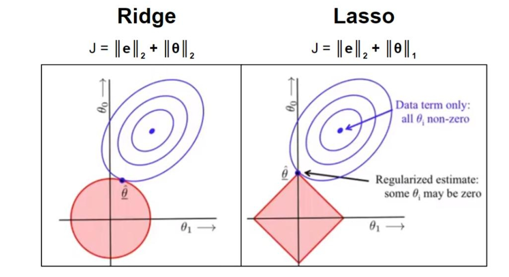
- 其实L1和L2正则项惩罚项可以加到任何算法的损失函数上面去提高计算出来模型的泛化能力的。

- **L1 稀疏L2平滑**（从梯度的角度出发）：

    通常我们会说L1正则会使得计算出来的模型有的$W$趋近于0，有的$W$相对较大，相当于将$W$参数向两个极端发展；

    而L2会使得$W$参数整体变小。

- total loss，根据我们对模型泛化能力的需求，常在惩罚项乘上一个权重系数$\lambda$。$\lambda$越大，表示越看重模型的泛化能力，通常可以设置为0.4。
  $$
  J_{total\_ loss} = \|Xw-y\|_{2}^{2} + \lambda \|w\|_{P}
  $$
  所以$w$为：
  $$
  w^{*} = \arg \min_{w} \|Xw-y\|_{2}^{2} + \lambda \|w\|_{P}
  $$
---

#### 1.2.4 多元线性回归的衍生算法
- Ridge回归（MSE+L2）
  `from sklearn.linear_model import Ridge`
  $$
  \min_{w} \|Xw-y\|_{2}^{2} + \alpha \|w\|_{2}^{2}
  $$

- Lasso回归（MSE+L1）
  `from sklearn.linear_model import Lasso`
  $$
  \min_{w} \frac{1}{2n_{samples}}\|Xw-y\|_{2}^{2} + \alpha \|w\|_{1}
  $$

- 弹性网络回归（ElasticNet Regression）=> 同时使用了L1正则项和L2正则项
  `from sklearn.linear_model import ElasticNet`
  $$
  \min_{w} \frac{1}{2n_{samples}}\|Xw-y\|_{2}^{2} + \alpha \rho \|w\|_{1} +  \frac{\alpha(1-\rho)}{2}\|w\|_{2}^{2}
  $$
  <br>
  总结：

    | 模型       | 正则项 | 特征选择 | 处理共线性 | 使用场景                          |
    | :--------- | :----: | :------: | :--------: | :-------------------------------- |
    | Ridge      |   L2   |    否    |     好     | 共线性数据，防止过拟合            |
    | Lasso      |   L1   |    是    |    不好    | 高维数据，特征选择                |
    | ElasticNet | L1+L2  |    是    |     好     | 高维+共线性数据，平衡选择与稳定性 |

- 多项式升维（polynomial regression）
  目的：解决欠拟合的问题。
  对于多项式回归来说主要是为了扩展线性回归算法来适应更广泛的数据集，应对数据非线性的问题。
  这是一种数据预处理的手段，在`sklearn.preprocessing`模块下
  以两个维度为例：
  - 多项式回归公式是：$\hat{y} = w_0 + w_1 x_1 + w_2 x_2 $
  - 二阶多项式升维得到的公式为：$\hat{y} = w_0 + w_1 x_1 + w_2 x_2 + w_3 x_1^2 +  w_4 x_2^2 + w_5  x_1 x_2$

---

**代码实现**

**使用Scikit-Learn进行LinearRegression、Ridge回归、Lasso回归和ElasticNet回归**
原文链接:https://blog.csdn.net/qq_30868737/article/details/109495544

**Linear Regression**
- 参数
    `LinearRegression(fit_intercept=True, normalize=False, copy_X=True, n_jobs=None)`
    <div style="width: 100%; overflow-x: auto; white-space: nowrap; border: 1px solid #ddd; padding: 10px;">

    • `fit_intercept` ：是否有截据，如果没有则直线过原点;

    • `normalize` ：是否将数据归一化;

    • `copy_X` ：默认为True，当为True时，X会被copied,否则X将会被覆写;

    • `n_jobs` ：默认值为1。计算时使用的核数

    </div>

    <br>
- 属性：
    <div style="width: 100%; overflow-x: auto; white-space: nowrap; border: 1px solid #ddd; padding: 10px;">
   • `coef`_ ：array,shape(n_features, ) or (n_targets, n_features)。回归系数(斜率)。
    <br>
   • `intercept_` ：截距
    </div>
   
   
    <br>
- LinearRegression方法：
    <div style="width: 100%; overflow-x: auto; white-space: nowrap; border: 1px solid #ddd; padding: 10px;">
    • `fit(x,y,sample_weight=None)` ：x和y以矩阵的形式传入，sample_weight则是每条测试数据的权重，同样以矩阵方式传入（在版本0.17后添加了sample_weight）。
    <br>• `predict(x)` ： 预测方法，用来返回预测值
    <br>• `get_params(deep=True)` ： 返回对regressor 的设置值
    <br>
    • `score(X,y,sample_weight=None)` ： 评分函数，将返回一个小于1的得分，可能会小于0
    </div>

```python
import numpy as np
from sklearn.linear_model import LinearRegression
import matplotlib.pyplot as plt


X1 = 2*np.random.rand(100, 1)
X2 = 2*np.random.rand(100, 1)
X = np.c_[X1, X2]

y = 4 + 3*X1 + 5*X2 + np.random.randn(100, 1)

reg = LinearRegression(fit_intercept=True)
reg.fit(X, y)
print(reg.intercept_, reg.coef_)

X_new = np.array([[0, 0],
                  [2, 1],
                  [2, 4]])
y_predict = reg.predict(X_new)

# 绘图进行展示真实的数据点和我们预测用的模型
plt.plot(X_new[:, 0], y_predict, 'r-')
plt.plot(X1, y, 'b.')
plt.axis([0, 2, 0, 25])
plt.show()
```
**Ridge**
- 参数
  `Ridge(alpha=1.0, fit_intercept=True, normalize=False, copy_X=True, max_iter=None, tol=0.001, solver='auto')`
    <div style="width: 100%; overflow-x: auto; white-space: nowrap; border: 1px solid #ddd; padding: 10px;">

    • `alpha` ：指定权重值，默认为1。

    • `fit_intercept` ：bool类型，是否需要拟合截距项，默认为True。

    • `normalize` ：bool类型，建模时是否对数据集做标准化处理，默认为False。

    • `copy_X` ：bool类型，是否复制自变量X的数值，默认为True。

    • `max_iter` ：指定模型的最大迭代次数。

    • `tol` ：指定模型收敛的阈值，默认为0.0001。

    • `solver` ：求解器，有auto, svd, cholesky, sparse_cg, lsqr几种，一般我们选择auto，一些svd，cholesky也都是稀疏表示中常用的omp求解算法中的知识，大家有时间可以去了解。

    </div>

**Lasso**
- 参数
   `Lasso(alpha=1.0, fit_intercept=True, normalize=False, precompute=False, copy_X=True, max_iter=1000, tol=0.0001, warm_start=False, positive=False, random_state=None, selection=‘cyclic’)`

    <div style="width: 100%; overflow-x: auto; white-space: nowrap; border: 1px solid #ddd; padding: 10px;">   

    • `alpha` ：指定权重值，默认为1。

    • `fit_intercept` ：bool类型，是否需要拟合截距项，默认为True。

    • `normalize` ：bool类型，建模时是否对数据集做标准化处理，默认为False。

    • `precompute` ：bool类型，是否在建模前计算Gram矩阵提升运算速度，默认为False。

    • `copy_X` ：bool类型，是否复制自变量X的数值，默认为True。

    • `max_iter` ：指定模型的最大迭代次数。

    • `tol` ：指定模型收敛的阈值，默认为0.0001。

    • `warm_start` ：bool类型，是否将前一次训练结果用作后一次的训练，默认为False。

    • `positive` ：bool类型，是否将回归系数强制为正数，默认为False。

    • `random_state` ：指定随机生成器的种子。

    • `selection` ：指定每次迭代选择的回归系数，如果为’random’，表示每次迭代中将随机更新回归系数；如果为’cyclic’，则每次迭代时回归系数的更新都基于上一次运算。

    </div>

**ElasticNet**
- 参数
    `ElasticNet(self, alpha=1.0, l1_ratio=0.5, fit_intercept=True, normalize=False, precompute=False, max_iter=1000, copy_X=True, tol=1e-4, warm_start=False, positive=False, random_state=None, selection=’cyclic’)`

    <div style="width: 100%; overflow-x: auto; white-space: nowrap; border: 1px solid #ddd; padding: 10px;">

    • `alpha` ：float, optional 混合惩罚项的常数，默认是1，看笔记的得到有关这个参数的精确数学定义。alpha = 0等价于传统最小二乘回归，通过LinearRegression求解。因为数学原因，使用alpha = 0的lasso回归时不推荐的，如果是这样，你应该使用 LinearRegression 。

    • `l1_ratio` ：float 弹性网混合参数，0 <= l1_ratio <= 1，对于 l1_ratio = 0，惩罚项是L2正则惩罚。对于 l1_ratio = 1是L1正则惩罚。

    • `fit_intercept` ：bool类型，是否需要拟合截距项，默认为True。

    • `normalize` ：bool类型，建模时是否对数据集做标准化处理，默认为False。

    • `precompute` ：bool类型，是否在建模前计算Gram矩阵提升运算速度，默认为False。

    • `copy_X` ：bool类型，是否复制自变量X的数值，默认为True。

    • `max_iter` ：指定模型的最大迭代次数。

    • `tol` ：指定模型收敛的阈值，默认为0.0001。

    • `warm_start` ：bool类型，是否将前一次训练结果用作后一次的训练，默认为False。

    • `positive` ：bool类型，是否将回归系数强制为正数，默认为False。

    • `random_state` ：指定随机生成器的种子。

    • `selection` ：指定每次迭代选择的回归系数，如果为’random’，表示每次迭代中将随机更新回归系数；如果为’cyclic’，则每次迭代时回归系数的更新都基于上一次运算。

    </div>

**使用SGDRegressor**        
`from sklearn.linear_model import SGDRegressor` 
随机梯度下降求解器（SGDRegressor）在很多模型中都有使用，适用于大规模数据和高维特征，因为它是增量式学习的，可以逐步更新模型参数而不需要一次性加载所有数据。
- 参数
    `SGDRegressor(loss='squared_error', *, penalty='l2', alpha=0.0001, l1_ratio=0.15, fit_intercept=True, max_iter=1000, tol=0.001, shuffle=True, verbose=0, epsilon=0.1, random_state=None, learning_rate='invscaling', eta0=0.01, power_t=0.25, early_stopping=False, validation_fraction=0.1, n_iter_no_change=5, warm_start=False, average=False)`
    <div style="width: 100%; overflow-x: auto; white-space: nowrap; border: 1px solid #ddd; padding: 10px;">

    • `loss` ：损失函数，可选值：squared_error（默认）：普通最小二乘回归（均方误差）。huber：Huber 损失（对异常值鲁棒）。epsilon_insensitive：支持向量回归（SVR）的线性损失。squared_epsilon_insensitive：SVR 的平方损失。

    • `penalty` ：正则化类型，l2（默认）：L2 正则化（Ridge 回归）。l1：L1 正则化（Lasso 回归）。elasticnet：L1 + L2 组合正则化。None：无正则化。

    • `learning_rate` ：学习率，constant：固定学习率（需指定 eta0）。optimal：动态调整（基于 alpha 和 t）。invscaling：随时间递减（公式：eta0 / pow(t, power_t)）。adaptive：当损失稳定时自动减小学习率。

    • `max_iter`；最大迭代次数，默认1000.

    • `tol` ：损失下降容忍度（默认1e-3）。当损失变化小于该值时提前停止。

    • `random_state` ：固定随机种子，确保结果可复现。

    </div>


---

[**实战**](../.\source\py\实战保险花销预测.ipynb)
步骤：
1. EDA(Explore Data Analysis) 数据探索分析 => 将数据可视化，判断其分布，将其转化为类正态分布。
2. 数据清洗 => 删除、填充、异常值处理。
3. 特征工程
   1. 特征构造
   2. 特征转换
        <div style="width: 100%; overflow-x: auto; white-space: nowrap; border: 1px ; padding: 10px;">

        | 技术                   | 适用场景                   | 示例                               | 导入方式                                                     |
        | :--------------------- | :------------------------- | :--------------------------------- | :----------------------------------------------------------- |
        | 标准化(StandardScaler) | 基于距离的模型（SVM、KNN） | 将特征缩放到均值为0、方差为1       | `from sklearn.preprocessing import StandardScaler`           |
        | 归一化 (MinMaxScaler)  | 神经网络、图像数据         | 缩放到[0,1]区间                    | `from sklearn.preprocessing import MaxAbsScaler`             |
        | 非线性变换             | 解决偏态分布               | $\log(x+1), \sqrt{x}$              | 使用 `numpy` 库进行科学计算                                  |
        | 类别编码               | 转换非数值特征             | One-Hot、目标编码(Target Encoding) | `from sklearn.preprocessing import LabelEncoder` <br> `from sklearn.preprocessing import OneHotEncoder` <br> `pandas.get_dummies` |
        | 分箱 (Binning)         | 将连续值离散化             | 年龄分段为[0-18,19-30,...]         |                                                              |

        </div>
   3. 特征选择
4. 模型评估

---

## 2. 线性分类

- 阶段概述：本阶段讲解，**逻辑回归算法**，**Softmax回归算法**，**SVM支持向量机算法**，**SMO优化算法**。

- 达成目标：通过本阶段学习，推导逻辑回归算法、SVM算法的判别式和损失函数，算法的优化、实现算法和应用开发实战。将会对分类算法有深入认知，对于理解后续神经网络算法和深度学习学习至关重要。

### 2.1 广义线性模型解决二分类问题

#### 2.1.1 广义线性模型
我们观察对数线性回归模型：
$$
\ln \hat{y} = w^{T} x + b
$$
它的实质是让 $w^{T} x + b$ 去逼近 $y$ 。在形式上仍是线性回归，但本质上是在求取输入空间到输出空间的**非线性函数映射关系**。
所以推广到一般，考虑可微函数 $g(\cdot)$，令：
$$
\hat{y} = g^{-1}(w^{T}x + b)
$$
这样就得到了**广义线性模型**，函数 $g(\cdot)$ 称为“联系函数”。

- 注意，广义线性回归适用场景：
  - 目标变量 $y$ 服从[**指数族分布**](https://geekdaxue.co/read/kaiba-20hbu@aev2fm/unh5cn)（指数族分布有高斯分布、二项分布、伯努利分布、多项分布、泊松分布、指数分布、beta 分布、拉普拉斯分布、gamma分布等）；
  - 指数族分布的表达式：
  $$
  p(y \mid \eta) = b(y)  \cdot \exp \left( \eta^{T}T(y) - a(\eta) \right)
  $$
  >  $\eta$ ： 为自然参数；
  >  $T(y)$ ： 为充分统计量（sufficient statistic），一般情况下就是 $y$ 本身，即 $T(y)=y$  。
  >  $a(\eta)$ ： 为对数部分函数（log partition function），这部分确保 $p(y \mid \eta)$ 的积分为 1 ，起到归一化的作用。
  >  $b(y)$ ：不是很重要，通常取为 1 。

#### 2.1.2 逻辑回归
根据广义线性模型，做二分类任务的基本手段是找一个**单调可微的函数**将分类任务的真实标记$y$与线性回归模型的预测值$\hat{y}$联系起来。
首先，对于二分类任务，其输出标记 $y \in \{0, 1\}$ ，而线性模型产生的预测值 $\hat{y}$ 为实值，于是，需要将实值 $\hat{y}$ 转换0/1值，有理想的“**单位越阶函数**”（unit-step function）：
$$
y = 
\begin{cases} 
0, & z < 0; \\[3pt]
0.5, & z = 0; \\[3pt]
1, & z > 0. 
\end{cases}
$$

考虑联系函数需要可微，可以引入一种“S形曲线”（Sigmiod函数），最典型的是对数几率函数（logistic function）:
$$
h_{\theta}(x)  =  g(\theta^{T}x) =  \frac{1}{1+e^{-\theta^{T}x}}
$$


逻辑回归（Logistic Regression）不是一个回归的算法，逻辑回归是一个分类的算法。
逻辑回归算法是基于多元线性回归的算法。所以，逻辑回归这个分类算法是线性的分类器。

---

**对数几率函数的推导**
由于研究的是二分类问题，可以假设真实目标标记$y$可近似服从伯努利分布（0-1分布），即$y \sim BBernoulli( \phi)$,有：

$$
\begin{aligned}
p(y \mid \phi) 
&= \phi^{y} (1- \phi)^{1-y} \\[8pt]
&= \exp \left\{ y \ln \phi + (1-y) \ln (1-\phi) \right\} \\[5pt]
&= \exp \left\{ \ln \left( \frac{\phi}{1-\phi} \right) \cdot y + \ln (1-\phi) \right\}
\end{aligned}
$$
对比指数族分布的通式，可知：$\eta = \theta^{T}x = \ln \left(\frac{\phi}{1-\phi} \right)$
变形可得对数几率函数 $\phi = \dfrac{1}{1 + e^{-\theta^{T}x} }$
<br>
回过头来看多元线性回归，我们假设目标变量y服从正态分布，$y \sim N(\mu , \sigma^2)$经过类似的推导，也可以得到多元线性回归的通式 $\hat{y} = \theta^{T}x$

---

#### 2.1.3 损失函数
对于真实标记 $y$ 与 预测值 $\hat{y}$

|       | 真实标记 |        预测值        |
| :---: | :------: | :------------------: |
| 正例  |    1     |  $ g(\theta^{T}x) $  |
| 反例  |    0     | $ 1-g(\theta^{T}x) $ |

即：
$p(y = 1 \mid x;\theta) =  g(\theta^{T}x) $ 
$p(y = 0 \mid x;\theta) =  1-g(\theta^{T}x)$
统一为：
$$
p(y \mid x;\theta) = \left( g(\theta^{T}x) \right)^{y} \cdot \left( 1-g(\theta^{T}x) \right)^{1-y}
$$
**似然函数**为：
$$
\begin{aligned}
L(\theta) 
&= \prod_{i=1}^{m} p(y^{(i)} \mid x^{(i)}; \theta)\\[5pt]
&= \prod_{i=1}^{m} \left( g \left(\theta^{T}x^{(i)} \right) \right)^{y^{(i)}} \cdot \left( 1-g \left(\theta^{T}x^{(i)} \right) \right)^{1-y^{(i)}} 
\end{aligned}
$$

两边同时取对数：
$$
\begin{aligned}
\ell(\theta)
&= \ln L(\theta) \\
&= \sum_{i=1}^{m} \left(y^{(i)} \ln \left( g \left(\theta^{T}x^{(i)} \right) \right) + (1-y^{(i)}) \ln \left( 1-g \left(\theta^{T}x^{(i)} \right) \right) \right)
\end{aligned}
$$

最优化：
$$
\theta^{*} = \arg \max_{\theta} \ell(\theta) = \arg \min_{\theta} (- \ell(\theta))
$$

损失函数：
$$
J(\theta) = - \sum_{i=1}^{m} \left(y^{(i)} \ln \left( g \left(\theta^{T}x^{(i)} \right) \right) + (1-y^{(i)}) \ln \left( 1-g \left(\theta^{T}x^{(i)} \right) \right) \right)
$$
可用**梯度下降法**求解。
先看联系函数--对数几率函数 $g(z) = \dfrac{1}{ 1+e^{-z} }$ 的导数：
$$
\begin{aligned}
g'(z)
&= \frac{\mathrm{d}}{\mathrm{d}z} \left( \frac{1}{1 + e^{-z}} \right) \\[5pt]  % 增加行间距
&= -\frac{1}{(1 + e^{-z})^2} \cdot \left( -e^{-z} \right) \\[5pt]
&= \frac{1}{1 + e^{-z}} \cdot \left( 1 - \frac{1}{1 + e^{-z}} \right) \\[5pt]
&= g(z) \cdot \bigl( 1 - g(z) \bigr)  % 使用 \bigl \bigr 强调括号
\end{aligned}
$$

对损失函数求偏导：
$$
\begin{aligned}
\frac{\partial}{\partial \theta_j} J(\theta) 
&= -\frac{1}{m} \sum_{i=1}^m \left( y^{(i)} \frac{1}{h_\theta(x^{(i)})} \frac{\partial}{\partial \theta_j} h_\theta(x^{(i)}) - (1-y^{(i)}) \frac{1}{1-h_\theta(x^{(i)})} \frac{\partial}{\partial \theta_j} h_\theta(x^{(i)}) \right) \\[10pt]
&= -\frac{1}{m} \sum_{i=1}^m \left( y^{(i)} \frac{1}{g(\theta^T x^{(i)})} - (1-y^{(i)}) \frac{1}{1-g(\theta^T x^{(i)})} \right) \frac{\partial}{\partial \theta_j} g(\theta^T x^{(i)}) \\[10pt]
&= -\frac{1}{m} \sum_{i=1}^m \left( y^{(i)} \frac{1}{g(\theta^T x^{(i)})} - (1-y^{(i)}) \frac{1}{1-g(\theta^T x^{(i)})} \right) g(\theta^T x^{(i)})(1-g(\theta^T x^{(i)})) \frac{\partial}{\partial \theta_j} \theta^T x^{(i)} \\[10pt]
&= -\frac{1}{m} \sum_{i=1}^m \left( y^{(i)} (1-g(\theta^T x^{(i)})) - (1-y^{(i)}) g(\theta^T x^{(i)}) \right) x_j^{(i)} \\[10pt]
&= -\frac{1}{m} \sum_{i=1}^m (y^{(i)} - g(\theta^T x^{(i)})) x_j^{(i)} \\[10pt]
&= \frac{1}{m} \sum_{i=1}^m (h_\theta(x^{(i)}) - y^{(i)}) x_j^{(i)}
\end{aligned}
$$

得到：
$$
\frac{\partial}{\partial \theta_j} J(\theta) = \frac{1}{m} \sum_{i=1}^m (h_\theta(x^{(i)}) - y^{(i)}) x_j^{(i)}
$$
**不难发现，这个导函数与多元线性回归推导出来的形式上一致。**

> 含正则项的损失函数（以L2为例）：
> $$
> J(\theta) = - \frac{1}{m} \sum_{i=1}^{m} \left[ y^{(i)} \frac{1}{h_\theta(x^{(i)})} \frac{\partial}{\partial \theta_j} h_\theta(x^{(i)}) + (1-y^{(i)}) \frac{1}{1-h_\theta(x^{(i)})} \frac{\partial}{\partial \theta_j} h_\theta(x^{(i)}) \right] + \frac{\lambda}{m} \sum_{i=1}^{m} \theta_{j}^{2}
> $$
>
> $$
> \frac{\partial}{\partial \theta_{j}} J(\theta) = \frac{1}{m} \sum_{i=1}^{m} (h_\theta(x^{(i)}) - y^{(i)}) x_j^{(i)} + \frac{\lambda}{m} \theta_{j}
> $$

---

**鸢尾花数据集实战**

```python
'''
The iris dataset is a classic and very easy multi-class classification
    dataset.

    =================   ==============
    Classes                          3
    Samples per class               50
    Samples total                  150
    Dimensionality                   4
    Features            real, positive
    =================   ==============
'''
import numpy as np
from sklearn import datasets
from sklearn.linear_model import LogisticRegression

iris = datasets.load_iris()
print(list(iris.keys()))
print(iris['DESCR'])
print(iris['feature_names'])

X = iris['data'][:, 3:]
print(X)

print(iris['target'])
# y = (iris['target'] == 2).astype(np.int)
y = iris['target']
print(y)

# 分类学习器通常称为“分类器”（classifier）
# binary_classifier = LogisticRegression(solver='sag', max_iter=1000)
# binary_classifier.fit(X, y)
# 多分类的分类器，"ovr"对应的时OvR的LR模型，"multinomial"对应的Softmax回归模型
# multi_classifier = LogisticRegression(solver='sag', max_iter=1000, multi_class='multinomial')
multi_classifier = LogisticRegression(solver='sag', max_iter=1000, multi_class='ovr')
multi_classifier.fit(X, y)

X_new = np.linspace(0, 3, 1000).reshape(-1, 1)
print(X_new)
y_proba = multi_classifier.predict_proba(X_new)
print(y_proba)
y_hat = multi_classifier.predict(X_new)
print(y_hat)
```

---

#### 2.1.4 利用二分类解决多分类问题

多分类学习的基本思路是“**拆解法**”,即将多分类任务拆为若干个二分类任务。

最经典的拆分策略有三种：
- “**一对一**”（One vs. One，简称OvO）；
- “**一对余**”（One vs. Rest，简称OvR）；
- “**多对多**”（Many vs. Many，简称MvM）。

1. OvO：将多个类别两两配对，从而产生 $\frac{N(N-1)}{2}$ 个二分类任务，得到 $\frac{N(N-1)}{2}$ 个结果，最终结果可由“投票”产生。

2. OvR：每次将一个类作为正例，其他类为反例，训练 $N$ 个分类器。在测试时，若仅有一个分类器预测为正类，则对应的类别表及作为最终结果；若有多个分类器预测为正类，则通常考虑个分类器预测置信度，选择置信度最大的类别表及作为分类结果。
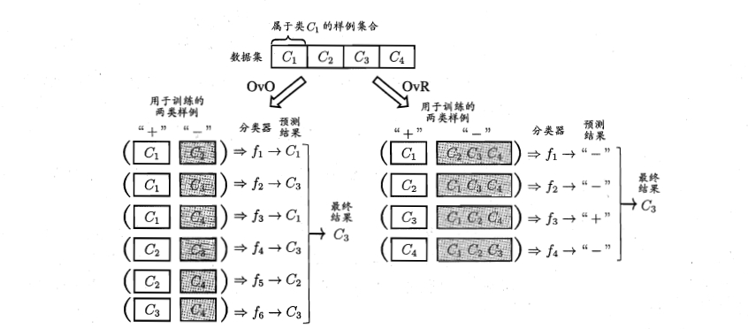

> OvO 与 OvR 两种策略的预测性能，在多数情况下两者差不多。
> 对于类别较少的情况，OvR只需训练 $N$ 个训练器，内存开销和测试时间更小；
> 但是当类别很多事，由于OvR的每个分类器多使用全部训练样例，训练时间开销反而更大。

3. MvM：每次将若干个类作为正类，若干个其他类作为反类。可以看出MvM是OvR和OvO更一般的形式。<br>
    对于MvM正、反类的构造一种常用的技术是“纠错输出码”（Error Correcting Output Codes，简称ECOC）.主要分为两步：<br>
    编码：对N个类别做M次划分，每次划分将一部分类别划分为正类，一部分类别划分为反类，从而形成一个二分类训练集；这样一共产生M个训练集，可训练出M个分类器。
    解码：测试时，M个分类器分别对测试样本x进行预测，这样预测的结果就形成了一个编码。将这个编码与每个类别各自的编码进行比较，找到距离最短的类别作为最终分类的结果。

---

### 2.2 Softmax回归解决多分类问题
对于服从**伯努利分布**的目标变量，可以通过 **Logistic回归** 建模。
对于服从**多项式分布**的目标变量，处理多分类问题，可以通过 **Sotfmax** 回归建模。

#### 2.2.1 前导知识--多项式分布
多项式分布（Multinomial Distribution）是二项分布（Binomial Distribution）的推广。
- 二项分布
    - 定义：n 次独立伯努利试验中成功次数的分布。
    - 随机变量：$X \sim Binomial(n,p)$，$X$表示成功次数。
    - PMF：
    $$
    P(X = k) = \dbinom{n}{k} \, p^{k} \, (1 - p)^{n - k}, \quad k \in \bigl\{0, 1, \ldots, n\bigr\}
    $$
    - 性质：$E(X) = np \ Var(X) = np(1-p)$

- 多项式分布
    - 定义：二项分布的推广，描述多类别（k≥2）独立试验中各类别出现次数的联合分布。
    - 随机变量：$ X=(X_1,\cdots, X_k) \sim Multinomial(n,p)$，其中$X_i$表示第$i$类结果的次数，$p = (p_1, \cdots, p_k)$为各类概率。
    - PMF：
    $$
    P(X = x) = \frac{n!}{x_1! \cdots x_k!} p_1^{x_1} \cdots p_k^{x_k}, \quad \sum_{i=1}^k x_i = n
    $$

    - 性质： $ \sum\limits_{i=1}^{k} p_i = 1$

<div style="width: 100%; overflow-x: auto; white-space: nowrap; border: 1px ; padding: 10px;">

| 分布       | 试验类型       | 结果类别数      | 随机变量维度 | PMF公式 | 主要用途                 |
|------------|----------------|-----------------|--------------|-----------------------|--------|
| 0-1分布    | 单次试验       | 2               | 标量         | $$P(X=x) = p^x(1-p)^{1-x}, \quad x \in \{0,1\}$$                       | 单次二值结果             |
| 二项分布   | $n$ 次试验     | 2               | 标量         | $$P(X=k) = \binom{n}{k}p^k(1-p)^{n-k}, \quad k \in \{0,1,\dots,n\}$$  | 某类结果的累计次数       |
| 多项式分布 | $n$ 次试验     | $k \geq 2$      | **向量**         | $$P(\mathbf{X}=\mathbf{x}) = \frac{n!}{\prod_{i=1}^k x_i!}\prod_{i=1}^k p_i^{x_i}$$ | 多类别的联合计数分布     |

</div>

#### 2.2.2 多项分布转变为指数分布族的推导

从联合概率密度函数出发：
$$
\begin{aligned}
P(y; \varphi) &= \varphi_1^{I(y=1)} \varphi_2^{I(y=2)} \cdots \varphi_{k-1}^{I(y=k-1)} \varphi_k^{I(y=k)} \\[5pt]
&= \varphi_1^{I(y=1)} \varphi_2^{I(y=2)} \cdots \varphi_{k-1}^{I(y=k-1)} \varphi_k^{1-\sum_{i=1}^{k-1} I(y=i)} \\[5pt]
&= \exp\left(\ln \left( \varphi_1^{I(y=1)} \varphi_2^{I(y=2)} \cdots \varphi_{k-1}^{I(y=k-1)} \varphi_k^{1-\sum_{i=1}^{k-1} I(y=i)} \right)\right) \\[5pt]
&= \exp\left(\sum_{i=1}^{k-1} I(y=i)\ln\varphi_i + \left(1-\sum_{i=1}^{k-1} I(y=i)\right)\ln\varphi_k\right) \\[3pt]
&= \exp\left(\sum_{i=1}^{k-1} I(y=i)\ln\left(\frac{\varphi_i}{\varphi_k}\right) + \ln\varphi_k\right) \\[3pt]
&= \exp\left(\sum_{i=1}^{k-1} T(y)\ln\left(\frac{\varphi_i}{\varphi_k}\right) + \ln\varphi_k\right) \\[8pt]
&= \exp\left(\eta^T T(y) - a(\eta)\right)
\end{aligned}
$$

自然参数：
$$
\eta = 
\begin{bmatrix}
\ln(\varphi_1/\varphi_k) \\[5pt]
\ln(\varphi_2/\varphi_k) \\[5pt]
\vdots \\
\ln(\varphi_{k-1}/\varphi_k)
\end{bmatrix}
$$
整理得：
$$
\eta_i = \ln\frac{\varphi_i}{\varphi_k} \quad \Rightarrow \quad \varphi_i = \varphi_k e^{\eta_i}
$$
由归一化条件：
$$
\begin{aligned}
\sum_{j=1}^k \varphi_j &= \sum_{j=1}^k \varphi_k e^{\eta_j} = 1 \\[5pt]
\Rightarrow \varphi_k &= \frac{1}{\sum_{j=1}^k e^{\eta_j}} \\[5pt]
\varphi_i &= \frac{e^{\eta_i}}{\sum_{j=1}^k e^{\eta_j}}
\end{aligned}
$$

至此，我们就得到了 softmax 回归的公式：
$$
h_\theta(x^{(i)}) = 
\begin{bmatrix}
p(y^{(i)} = 1|x^{(i)}; \theta) \\
p(y^{(i)} = 2|x^{(i)}; \theta) \\
\vdots \\
p(y^{(i)} = k|x^{(i)}; \theta)
\end{bmatrix} 
= \frac{1}{\sum_{j=1}^k e^{\theta_j^T x^{(i)}}} 
\begin{bmatrix}
e^{\theta_1^T x^{(i)}} \\
e^{\theta_2^T x^{(i)}} \\
\vdots \\
e^{\theta_k^T x^{(i)}}
\end{bmatrix}
$$

---

#### 2.2.3 损失函数
似然函数：
$$
L(\theta) = \prod_{i=1}^{m}p(y^{(i)} \mid x^{(i)} ; \theta) = \prod_{i=1}^{m} \prod_{j=1}^{k} \phi_{j}^{I(y^{(i)} = j )}
$$

对数似然函数：
$$
\begin{aligned}
\ell(\theta) 
&= \ln L(\theta)
= \sum_{i=1}^{m} \sum_{j=1}^{k} I(y^{(i)} = j ) \cdot \ln \left( \frac{e^{\theta_j^{T} x^{(i)}}}{\sum_{l=1}^{k} e^{\theta_l^{T} x^{(i)}}} \right)
\end{aligned}
$$

所以损失函数为：
$$
J(\theta) = -\frac{1}{m} \left[ \sum_{i=1}^{m} \sum_{j=1}^{k} I(y^{(i)} = j ) \cdot \ln \left( \frac{e^{\theta_j^{T} x^{(i)}}}{\sum_{l=1}^{k} e^{\theta_l^{T} x^{(i)}}} \right) \right]
$$

**Logistic Regression 是 Softmax Regression 在 k=2 时的一个特例**

当使用 LR 和 SR 去解决多分类问题的区别和算法选择：

- LR 使用 OvR 策略时，是将多分类问题转化为 n 个**独立**的二分类问题，它给出的是重新划分标签后属于这个类的概率，可能会碰到两种类的概率差不多的情况，这时就需要根据置信度去实现。
- SR 综合考量各个类别，倾向将所有的结果单独划分到一个类别中去。
- 选择算法时，需要根据实际需求选择：
  - 若需要将一个东西准确的划分到某一个类，可以选择 Softmax 回归，例如生物学的物种划分、邮件类别的划分等。
  - 若是使用算法给出某一个类的可能性，来辅助判断，可以选择 Logistic 回归，例如AI医疗，通过图像或病症的描述（这种因不同类别但是存在交叉的特征时）给出可能的疾病。
---

### 2.3. 支持向量机
支持向量机（Support Vector Machine，SVM）：**本身是一个二元分类算法，是对感知器算法模型的一种扩展**，现在的SVM 算法支持线性分类和非线性分类的分类应用，并且也能够直接将SVM应用于回归应用中，同时通过 OvR 或者 OvO 的方式我们也可以将SVM 应用在多元分类领域中。在不考虑集成学习算法，不考虑特定的数据集的时候，在分类算法中SVM可以说是特别优秀的。

思想：从向量角度出发，SVM模型将样本点映射到高维空间的向量，通过寻找一个超平面将不同类别的样本分开，通过这个超平面来做分类。

> 做分类的算法大致上有：LR、KNN、DT（决策树）、RT（随机森林）、XGBoost，还有很多概率模型，如贝叶斯。

#### 2.3.1 前导知识
- **距离**
    几何距离：二维平面中，点 $(x_i,y_i)$ 到直线 $ax + by + c = o$的距离为：
    $$
    d = \frac{| a x_i + b y_i + c |}{\sqrt{a^2+b^2}}
    $$

    推广到高维空间中，任意一个点$x^{(i)}$到超平面$w^{T}x + b = 0$的距离为：
    $$
    \gamma = \frac{|wx^{(i)}+b|}{\| w\|}
    $$

- [**拉格朗日乘子法**](https://blog.csdn.net/LittleEmperor/article/details/105057670)
  
  <br>

    <div style="width: 100%; border: 1px solid #ddd; padding: 10px;">

    <p>在解决有约束条件的最优化问题时，有时能使用消元法，利用约束条件将目标函数转化为无约束的极值求解问题，但这局限性比较大，大部分情况下很难适用，比如等式约束为高次耦合非线性。<p>

    所以，在大多数情况下，我们使用**拉格朗日乘子法**

  ---

    **带约束条件的最优化问题泛化表示**：

  $$
    \begin{cases} 
    \min f(X) & X \in \mathbb{E}^n \\[5pt]
    \text{S.t. } c_i(X) \leq 0 & i = 1, 2, \cdots, m \quad \& \quad h_j(X) = 0 & j = 1, 2, \cdots, l
    \end{cases}
  $$

    构造拉格朗日函数：
  $$
    L(X,\alpha,\beta) = f(X) + \sum_{i=1}^{m}\alpha_i c_i(X) + \sum_{\beta_j=1}^{l}\beta_j h_j(X)
  $$

    极值条件为：

  $$
    \begin{cases}
    \nabla_x L(x,\alpha,\beta) = 0\\[5pt]
    \nabla_{\alpha} L(x,\alpha,\beta) = 0\\[5pt]
    \nabla_{\beta} L(x,\alpha,\beta) = 0
    \end{cases}
  $$

  ---

   L1、L2正则实质上就是使用拉格朗日乘数法得到的一种结果。

    </div>

- **拉格朗日对偶**

    <div style="width: 100%; border: 1px solid #ddd; padding: 10px;">

    [PDF](../source/article/lagrangian_multiplier.pdf)
    
    [MD](../source/article/lagrangian_multiplier.md)

    </div>
    
    <br>
    
- **坐标上升算法**
  
    <div style="width: 100%; border: 1px solid #ddd; padding: 10px;">
    
    坐标上升法（Coordinate Ascent, CA）是一种用于优化问题的迭代方法，常用于机器学习、统计推断和信号处理等领域。它是坐标下降法（Coordinate Descent, CD）的对偶方法，而坐标下降法更为常见。两者的核心思想类似，都是在每次迭代时，仅优化一个变量的方向，使目标函数单调上升（或下降），而保持其他变量固定。
    
    **基本原理**
    
    坐标上升法的核心思想是，在高维优化问题中，每次固定其他变量，仅对一个变量进行优化更新，以逐步提高目标函数的值。假设目标函数为$ f(x_1, x_2, \dots, x_n)$，那么在每次迭代中，我们选择一个变量 x_i 并在其方向上优化，使得：
    $$
    x_i^{(t+1)} = \arg\max_{x_i} f(x_1^{(t)}, x_2^{(t)}, \dots, x_i, \dots, x_n^{(t)})
    $$
    然后依次更新其他变量，直到满足收敛条件。
    
    与梯度上升（Gradient Ascent）的区别
    - 梯度上升 计算目标函数在所有变量方向上的梯度，并同时更新所有变量。
    - 坐标上升 仅优化一个变量的方向，使得每次更新更简单，适用于维度较高但梯度计算困难的问题。
    
    **应用**
    - 期望最大化（EM）算法：在EM算法的M步中，经常使用坐标上升方法优化参数，使对数似然函数单调上升。
    - 变分推断（Variational Inference）：用于最大化证据下界（ELBO），优化概率模型的近似后验分布。
    - 推荐系统：如矩阵分解模型的优化，可用坐标上升法交替更新用户和物品的嵌入向量。
    
    **优缺点**
    
    优点：
    - 在梯度计算困难或不可行时仍然适用。
    - 每次迭代仅优化一个变量，计算较为简单。
    
    缺点：
    - 可能收敛较慢，尤其在变量间耦合较强时。
    - 不一定保证收敛到全局最优解。
    
    </div>
    
    <br>
    
- **SMO算法**
  
    <div style="width: 100%; border: 1px solid #ddd; padding: 10px;">

    [PDF](../source/article/SMO.pdf)
    
    [MD](../source/article/SMO.md)
    
    序列最小优化（Sequential Minimal Optimization，SMO）是基于 CA 改进的一种算法的基本思路是先固定$\alpha_i$之外的所有参数，然后求$\alpha_i$上的极值。
    
    由于存在约束 $\sum\limits_{i=1}^{m} \alpha_i y^{(i)} = 0$，所以若固定$\alpha_i$之外的所有参数，$\alpha_i$可由其他变量导出。
    
    所以对于原始目标函数优化的对偶问题：
    
    $$
    \alpha^{*} = \min_{\alpha} \frac{1}{2} \sum_{i=1}^{m} \sum_{j=1}^{m} \alpha_i \alpha_j y^{(i)} y^{(j)} K(x^{(i)} ,x^{(j)}) - \sum_{i=1}^{m} \alpha_i\\[8pt]
    s.t. \quad
    \begin{cases}
    \sum\limits_{i=1}^{m} \alpha_i y^{(i)} = 0\\[10pt]
    0 \leq \alpha_i \leq C
    \end{cases}
    $$
    
    SMO 每次选择两个变量$\alpha_i$和$\alpha_j$（**启发式的**），并固定其他参数，SMO不断执行下面两个步骤直至收敛：
    
    - 选择接下来要更新的一对$\alpha_i$和$\alpha_j$：采用启发式的方法进行选择，以使目标函数最大程度地接近其全局最优值。
    - 将目标函数对$\alpha_i$和$\alpha_j$进行优化，保持其它所有的参数不变
    
    >“**启发式**”的解释：<br>
    >注意到只需选取的 $\alpha_i$ 和 $\alpha_j$ 中有一个不满足 KKT 条件，目标函数就会在迭代后减小。直观来看，KKT条件违背的程度越大，变量更新后可能导致的目标函数减幅越大，于是 SMO 先选取违背KKT条件程度最大的变量，第二个变量应选择一个使目标函数值见效最快的变量，但是由于比较各变量所对应的目标函数减幅的复杂度过高，因此 SMO 采用了这样的一个启发式：**使选取的两变量所对应样本之间的间隔最大**。<br>
    >
    >一种直观的解释是：这样的两个变量有很大的差别，与对两个相似的变量进行更新比较，对它们更新会给目标函数值带来更大的变化。
    
    当固定其他参数后，仅优化两个参数的过程能做到十分高效。具体来说，仅考虑 $\alpha_i$ 和 $\alpha_j$ 时，对偶问题的约束可重写为：
    
    $$
    \alpha_i y^{(i)} + \alpha_j y^{(j)} = c = - \sum_{k \neq i,j} \alpha_k y^{(k)} \ , \quad \alpha_i \geq 0 \ , \quad \alpha_j \geq 0
    $$
    
    这一用该式消去对偶问题的$\alpha_j$，得到一个关于$\alpha_i$的单变量二次规划问题，仅有的约束是$\alpha_i \geq 0$：
    
    $$
    \alpha^{*} = \min_{\alpha} \frac{1}{2} \sum_{i=1}^{m} \sum_{j=1}^{m} \alpha_i (c - \alpha_i y^{(i)}) y^{(i)} K(x^{(i)} ,x^{(j)}) - \sum_{i=1}^{m} \alpha_i
    $$
    
    </div>

---

#### 2.3.2 感知器算法思想
感知器（Perceptron）的思想很简单：在任意空间中，感知器模型寻找的就是一个超平面，能够把所有的二元类别分割开。感知器模型的前提是：数据是线性可分的。
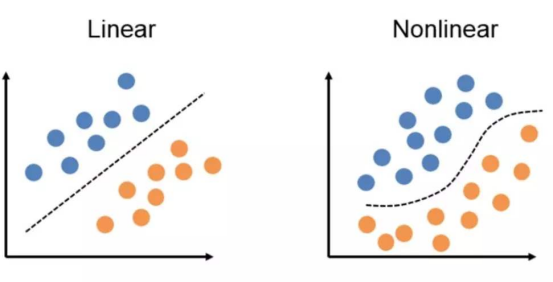

对于 $m$ 个样本，每个样本 $n$ 维特征，二分类标记 $y \in \{-1,1\}$ 的训练集$D$ ：
$$
D = \{ (x^{(1)},y^{(1)}), (x^{(2)},y^{(2)}), \cdots , (x^{(m)},y^{(m)})\}\\[5pt]
\quad y^{(i)} \in \{1,-1\}
\quad x^{(i)} = (x_{1}^{(i)}, x_{2}^{(i)}, \cdots, x_{n}^{(i)})
$$
目标是找到一个超平面：
$$
\theta_{0} + \theta_{1} x_1 + \cdots + \theta_{n} x_n = 0 \quad \to \quad \theta x = 0
$$
让一个类别的样本满足 $\theta x < 0$，另一个类别的样本满足 $\theta x > 0$

所以感知器模型判别式可以表达为：
$$
y = sign(\theta x) = 
\begin{cases}
+1, \quad \theta x > 0\\[5pt]
-1, \quad \theta x < 0
\end{cases}
$$

> 回过头来看**逻辑回归的几何意义**，又何尝不是向量空间找到一个超平面，超平面一侧的点计算分数结果为负，另一侧结果分数为正，只不过最后不直接看 sign 符号，而是根据 sigmoid 函数将分数映射到 0-1 之间通过最大似然来赋予概率意义。

**损失函数**
由于感知器的标签y仅仅是表示两个不同的类，并没有相关的概率意义，所以我们抛弃最大似然估计的方法来求损失函数。

对于正确的分类，我们发现 $y \cdot \theta x > 0$，对于错误的分类，有 $y \cdot \theta x < 0$

所以我们可以定义我们的损失函数为：期望使分类错误的所有样本到超平面的距离之和最小。

引入标记$y$可以将求距离的绝对值去掉，所以有：
$$
\gamma_{right} = \frac{y^{(i)}(wx^{(i)}+b)}{\| w\|}\\[8pt]
\gamma_{wrong} = - \frac{y^{(i)}(wx^{(i)}+b)}{\| w\|}
$$

所以损失函数：
$$
L(\theta) = \sum_{i=1}^{m} -\frac{y^{(i)}(\theta x^{(i)})}{\| \theta\|}
$$

因为此时分子和分母中都包含了 $θ$ 值，当分子扩大 N 倍的时候，分母也会随之扩大，也就是说分子和分母之间存在倍数关系，所以可以固定分子或者分母为 1，然后求另一个即分子或者分母的倒数的最小化作为损失函数。为简单起见，将分母固定为 1，简化后的损失函数为：
$$
L(\theta) = \sum_{i=1}^{m} -y^{(i)} \theta x^{(i)}
$$

使用梯度下降法来求最优解。
$$
\frac{\partial}{\partial \theta} L(\theta) = - \sum_{i=1}^{m} y^{(i)} \cdot x^{(i)}
$$

---

#### 2.3.3 SVM算法
SVM 也是通过寻找超平面，用于解决二分类问题的分类算法，模型判别式与感知器相同，但 SVM 的损失函数与感知器和逻辑回归都不同。

- LR：通过最大似然估计寻找超平面；
- Perceptron：通过判错的点来寻找超平面；
- SVM：通过支持向量寻找超平面。

正是这三者造成了损失函数的不同。
感知器和逻辑回归都是通过最小化损失函数来得到 $\theta$ ，而 SVM 有两种手段，一种是先找支撑向量,另一种是直接最小化一个损失函数（为合页损失，hinge loss）。

SVM 较感知器的优势是 SVM 的泛化能力更强。
SVM 的思想：让离超平面比较近的点尽可能的远离这个超平面，增强模型的鲁棒性。 $\quad \Rightarrow \quad$  有约束条件的二次优化问题--“离超平面最近”、“尽可能远” $\quad \Rightarrow \quad$ 求解方法--**拉格朗日乘子法**
$$
\max_{w,b} \gamma_{min} = \frac{y_{min}(w^T x_{min} + b)}{\| w \|}\\[8pt]
s.t. \quad \gamma^{'(i)} = y^{(i)} \left(w^Tx^{(i)} + b \right) \ge \gamma^{'}_{min} \quad (i = 1,2,\cdots, m)
$$

<div style=" border: 1px solid #ddd; padding: 10px;">
**支持向量**（Support Vector）：距离超平面最近的几个满足判别式的点称为“支持向量”。

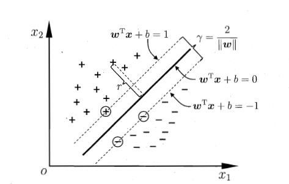

两个异类支持向量到超平面的距离之和称为“间隔（margin）”：
$$
\gamma = \frac{2}{\|w\|}
$$
</div>

---

##### 硬分隔 SVM
一组 $(w,b)$ 只能确定一个超平面，而一个超平面可由无数组 $(w,b)$ 表达，不同的 $(w,b)$ 使最近的点的 $\gamma^{'}$ 不同，所以只用找到一组 $(w,b)$ 使得 $\gamma^{'}_{min}=1$，就可以将最优化问题转化为：

$$
\begin{aligned}
&\left\{
\begin{aligned}
&\max \frac{2}{\|w\|_2} \\
&\text{s.t.} \quad y^{(i)}\left(w^T x^{(i)} + b\right) \geq 1
\end{aligned}
\right. \\[10pt]
\Leftrightarrow \quad &
\left\{
\begin{aligned}
&\min \frac{1}{2} \|w\|_2^2 \\
&\text{s.t.} \quad y^{(i)}\left(w^T x^{(i)} + b\right) \geq 1
\end{aligned}
\right.
\end{aligned}
$$

构造拉格朗日函数：

$$
L(w,b,\alpha) = \frac{1}{2} \| w \|_{2}^{2} - \sum_{i=1}^{m} \alpha_i \left[ y^{(i)} \left( w^{T} x^{(i)} + b \right) \right] \quad \& \quad \alpha_i \ge 0
$$

可将原始有约束的最优化问题转化为对拉格朗日函数进行无约束的最优化问题（即二次规划问题）：

$$
\min_{w,b} \max_{a_i \geq 0} L(w, b, a)
$$

由于我们的原始问题满足 f(x) 为凸函数，那么可以将原始问题的极小极大优化转换为对偶函数的极大极小优化进行求解：

$$
\begin{aligned}
&\min_{w,b} \max_{a_i \geq 0} L(w, b, a) \text{原始问题}\\
\Rightarrow
&\max_{a_i \geq 0} \min_{w,b} L(w, b, a) \text{对偶问题}
\end{aligned}
$$

**第一步--求极小 $\quad \Rightarrow \quad$ $\min\limits_{w,b} L(w, b, \alpha)$**

$$
\begin{aligned}
\frac{\partial L}{\partial w} = 0 \quad &\Rightarrow \quad w = \sum_{i=1}^{m} \alpha_i y^{(i)} x^{(i)}\\
\frac{\partial L}{\partial b} = 0 \quad &\Rightarrow \quad \sum_{i=1}^{m} \alpha y^{(i)} = 0
\end{aligned}
$$

反代回 $L(w, b, \alpha)$：

$$
\begin{aligned}
L(w, b, \alpha) 
&= \frac{1}{2} \| w \|_{2}^{2} - \sum_{i=1}^{m} \alpha_i \left[ y^{(i)} \left( w^{T} x^{(i)} + b \right) \right]\\[8pt]
&= \frac{1}{2} w^T w - \sum_{i=1}^{m} \alpha_i y^{(i)} w^T x^{(i)} - \sum_{i=1}^{m} \alpha_i y^{(i)} b + \sum_{i=1}^{m} \alpha_i\\[8pt]
&= \frac{1}{2} w^T \sum_{i=1}^{m} \alpha_i y{(i)} x^{(i)} - \sum_{i=1}^{m} \alpha_i y^{(i)} w^T x^{(i)} + \sum_{i=1}^{m} \alpha_i\\[8pt]
&= -\frac{1}{2} w^T \sum_{i=1}^{m} \alpha_i y{(i)} x^{(i)} + \sum_{i=1}^{m} \alpha_i\\[8pt]
&= -\frac{1}{2} \left(\sum_{i=1}^{m} \alpha_i y{(i)} x^{(i)} \right)^{T} \left(\sum_{i=1}^{m} \alpha_i y{(i)} x^{(i)} \right) + \sum_{i=1}^{m} \alpha_i\\[8pt]
&= -\frac{1}{2} \sum_{i=1}^{m} \sum_{j=1}^{m} \alpha_i \alpha_j y^{(i)} y^{(j)} \langle x^{(i)} ,x^{(j)}\rangle + \sum_{i=1}^{m} \alpha_i
\end{aligned}
$$

约束条件为：

$$
\begin{aligned}
s.t. \quad \sum_{i=1}^{m} \alpha_i y^{(i)} &= 0\\
\alpha_i &\ge 0, \quad i = 1,2,\cdots,m
\end{aligned}
$$

**第二步--对对偶函数的优化问题**：

$$
\alpha^{*} = \max_{\alpha} -\frac{1}{2} \sum_{i=1}^{m} \sum_{j=1}^{m} \alpha_i \alpha_j y^{(i)} y^{(j)} \langle x^{(i)} ,x^{(j)}\rangle + \sum_{i=1}^{m} \alpha_i\\
\begin{aligned}
s.t. \quad \sum_{i=1}^{m} \alpha_i y^{(i)} &= 0\\
\alpha_i &\ge 0, \quad i = 1,2,\cdots,m
\end{aligned}
$$

取个负号，转化为求极小值得问题：

$$
\alpha^{*} = \min_{\alpha} \frac{1}{2} \sum_{i=1}^{m} \sum_{j=1}^{m} \alpha_i \alpha_j y^{(i)} y^{(j)} \langle x^{(i)} ,x^{(j)}\rangle - \sum_{i=1}^{m} \alpha_i\\
\begin{aligned}
s.t. \quad \sum_{i=1}^{m} \alpha_i y^{(i)} &= 0\\
\alpha_i &\ge 0, \quad i = 1,2,\cdots,m
\end{aligned}
$$

通常使用 **SMO**（Sequential Minimal Optimization）算法进行求解，可以求得一组 $\alpha^{*}$ 使得函数最优化。

**确定超平面**：

$$
w^{*} = \sum_{i=1}^{m} \alpha^{*} y^{(i)} x^{(i)}
$$

对于偏置项 $b$，注意到对任意支持向量 $(x_s,y_s)$ 都有 $y_sf(s_s) = 1$,即：

$$
y_s \left( \sum_{i \in S} \alpha_i y^{(i)} (x^{(i)})^T x_s + b \right) = 1 \quad \text{其中} S = \{i \: | \: \alpha_i > 0, i = 1,2,\cdots,m\}\text{为所有支持向量得下标集}
$$

选任意支持向量求解 $b_s^{*}$：

$$
b_s^{*} = y_s - \sum_{i \in S} \alpha_i y^{(i)} (x^{(i)})^T x_s + b
$$
上式中：由于 $y_s \pm 1$，所以$\frac{1}{y_s} = y_s$

为增强其鲁棒性，可以使用所有支持向量求解的平均值作为最终的结果 $b^{*}$：

$$
b^{*} = \frac{1}{|S|} \sum_{i \in S} b_s^{*} = \frac{1}{|S|} \sum_{i \in S} \left(y_s - \sum_{i \in S} \alpha_i y^{(i)} (x^{(i)})^T x_s + b \right)
$$

上述是硬分隔SVM的求解过程。

<div style=" border: 1px solid #ddd; padding: 10px;">

**求解流程小结：**

1. 原始目标：求得一组 $w$ 和 $b$ 使得分隔 margin 最大
2. 转换目标：通过拉格朗日函数构造目标函数，问题由求得 $(w,b)$ 转换为求 $\alpha$
   
    $$
    \alpha^{*} = \max_{\alpha} -\frac{1}{2} \sum_{i=1}^{m} \sum_{j=1}^{m} \alpha_i \alpha_j y^{(i)} y^{(j)} \langle x^{(i)} ,x^{(j)}\rangle + \sum_{i=1}^{m} \alpha_i\\
    \begin{aligned}
    s.t. \quad \sum_{i=1}^{m} \alpha_i y^{(i)} &= 0\\
    \alpha_i &\ge 0, \quad i = 1,2,\cdots,m
    \end{aligned}
    $$

3. 利用SMO算法求得 $\alpha^{*}$
4. 利用求得的 $\alpha^{*}$ 求得 $w^{*}$ 和 $b^{*}$
    $$
    w^{*} = \sum_{i=1}^{m} \alpha^{*} y^{(i)} x^{(i)}
    $$

    $$
    b^{*} = \frac{1}{|S|} \sum_{i \in S} b_s^{*} = \frac{1}{|S|} \sum_{i \in S} \left(y_s - \sum_{i \in S} \alpha_i y^{(i)} (x^{(i)})^T x_s + b \right)
    $$
    </div>

---

##### 软间隔 SVM

有些时候，线性不可分是由噪声点决定的。

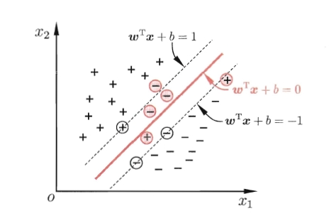

我们允许某些样本不满足约束

$$
y^{(i)}\left(w^T x^{(i)} + b\right) \geq 1
$$

而我们也希望在最大化间隔的同时，不满足约束的样本应尽可能少，于是优化目标可写为：

$$
\min_{w,b} \frac{1}{2} \|w\|^2 + C\sum_{i=1}^{m} \ell_{0/1} \left( y^{(i)}(w^T x^{(i)} + b) -1  \right)
$$

其中 $C>0$，是个常数，$\ell_{0/1}$ 称为“0/1损失函数”：

$$
\ell_{0/1} = 
\begin{cases}
1,&\text{if z < 0;}\\
0,&\text{otherwise}  
\end{cases}
$$

显然，当 $C$ 为无穷大时，所有样本点均满足约束条件，失去分类的意义；当 $C$ 为有限值，表明只有某一下点才可以不满足约束条件。

但是， **$\ell_{0/1}$ 非凸、非连续，数学性质不好**，通常采用其他的函数来代替 $\ell_{0/1}$ ，称为“代替损失（surrogate loss）”。代替损失函数一般具有较好的数学性质，它们通常是凸的连续函数且是 $\ell_{0/1}$ 的上界。

三种常用的替代损失函数如下：

- 合页损失（hinge loss）：$\ell_{hinge}(z) = \max(1, 1-z)$
- 指数损失（exponential loss）：$\ell_{exp}(z) = exp(-z)$
- 对数损失（logistic loss）：$\ell_{log}(z) = log(1+exp(-z))$

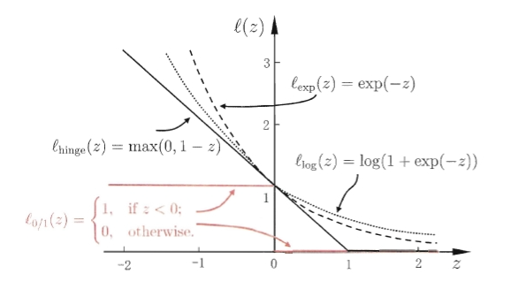<br>

若**采用hinge损失**，优化目标可写为：

$$
\min_{w,b} \frac{1}{2} \|w\|^2 + C\sum_{i=1}^{m} \max \left(0, 1- y^{(i)}(w^T x^{(i)} + b)  \right)
$$

引入松弛变量 $\xi_i \geq 0$（以松弛变量 $\xi$ 表示异常点嵌入间隔面的深度），目标函数重写为：

$$
\min \frac{1}{2} \|w\|_2^2 + C \sum_{i=1}^{m} \xi_i \\[10pt]
$$

约束条件放松为：

$$
\begin{aligned}
s.t. &\quad y^{(i)}\left(w^T x^{(i)} + b\right) \geq 1 - \xi_i\\[5pt]
&\quad \xi_i \geq 0, \quad i = 1,2,\cdots,m
\end{aligned}
$$

**构造拉格朗日函数**：
$$
L(w,b,\xi, \alpha, \mu) = \frac{1}{2} \|w\|_2^2 + C \sum_{i=1}^{m} \xi_i - \sum_{i=1}^{m} \alpha_i \left[y^{(i)}\left(w^T x^{(i)} + b\right) - 1 + \xi_i \right] - \sum_{i=1}^{m} \mu_i \xi_i \quad (\alpha_i \geq 0,\quad \mu_i \geq 0)
$$

**优化原始问题**：
$$
\min_{w, b, \xi} \: \max_{\substack{\alpha_i \geq 0 \\ \mu_i \geq 0}} L(w,b,\xi, \alpha, \mu)
$$

**对偶问题**：
$$
\max_{\substack{\alpha_i \geq 0 \\ \mu_i \geq 0}} \: \min_{w, b, \xi} L(w,b,\xi, \alpha, \mu)
$$

**对偶问题求解**：
$$
\begin{aligned}
\nabla_{w} L = 0 \quad &\Rightarrow \quad w = \sum_{i=1}^{m} \alpha_i y^{(i)} x^{(i)}\\[5pt]
\nabla_{b} L = 0 \quad &\Rightarrow \quad \sum_{i=1}^{m} \alpha_i y^{(i)} = 0\\[5pt]
\nabla_{\xi} L = 0 \quad &\Rightarrow \quad C - \alpha_i - \mu_i = 0
\end{aligned}
$$

**反代回拉格朗日函数**得：
$$
L = -\frac{1}{2} \sum_{i=1}^{m} \sum_{j=1}^{m} \alpha_i \alpha_j y^{(i)} y^{(j)} \langle x^{(i)} ,x^{(j)}\rangle + \sum_{i=1}^{m} \alpha_i
$$

其形式与硬分隔得一样，但约束条件发生变化：

$$
s.t. \quad
\begin{cases}
\sum\limits_{i=1}^{m} \alpha_i y^{(i)} = 0\\[8pt]
C - \alpha_i - \mu_i = 0\\[5pt]
\alpha_i \geq 0\\[5pt]
\mu_i \geq 0
\end{cases}
$$

由于新得目标函数中没有出现常数 $C$，将约束条件中的 $C$ 消掉得待优化函数：

$$
\alpha^{*} = \min_{\alpha} \frac{1}{2} \sum_{i=1}^{m} \sum_{j=1}^{m} \alpha_i \alpha_j y^{(i)} y^{(j)} \langle x^{(i)} ,x^{(j)}\rangle - \sum_{i=1}^{m} \alpha_i\\[8pt]
s.t. \quad
\begin{cases}
\sum\limits_{i=1}^{m} \alpha_i y^{(i)} = 0\\[10pt]
0 \leq \alpha_i \leq C
\end{cases}
$$

这个仍可以用SMO来求解。

超平面的解与硬分隔SVM的一致。

<div style=" border: 1px solid #ddd; padding: 10px;">

**线性支持向量机小结**

1. 硬间隔SVM与软间隔SVM对比

| 特性                | 硬间隔SVM (Hard Margin SVM)                 | 软间隔SVM (Soft Margin SVM)                |
|---------------------|--------------------------------------------|--------------------------------------------|
| **适用场景**        | 数据严格线性可分                            | 数据近似线性可分/含噪声                    |
| **原始目标函数**    | $\min \dfrac{1}{2} \|\| w\|\|_{2}^{2} $         | $\min \dfrac{1}{2} \|\|w\|\|_{2}^{2} + C\sum\xi_i$ |
| **约束条件**        | $y_i(w^Tx_i + b) \geq 1$ | $y_i(w^Tx_i + b) \geq 1-\xi_i$ , $\xi_i \geq 0$ |
| **拉格朗日函数**    | $L = \dfrac{1}{2}\|\|w\|\|_{2}^{2} - \sum\alpha_i[y_i(w^Tx_i + b)-1]$ | $L = \dfrac{1}{2}\|\|w\|\|_{2}^{2} + C\sum\xi_i - \sum\alpha_i[y_i(w^Tx_i + b)-1+\xi_i] - \sum\mu_i\xi_i$ |
| **对偶问题目标**    | $\max \sum\alpha_i - \dfrac{1}{2}\sum\sum\alpha_i\alpha_jy_iy_jx_i^Tx_j$ | $\max \sum\alpha_i - \dfrac{1}{2}\sum\sum\alpha_i\alpha_jy_iy_jx_i^Tx_j$ |
| **对偶约束条件**    | $\alpha_i \geq 0$, $\sum\alpha_iy_i = 0$   | $0 \leq \alpha_i \leq C$, $\sum\alpha_iy_i = 0$ |
| **KKT条件**         | $\alpha_i[y_i(w^Tx_i + b)-1] = 0$ | $\alpha_i[y_i(w^Tx_i + b)-1+\xi_i] = 0$ , $\mu_i\xi_i = 0$ |
| **超平面解**        | $w^{*} = \sum\alpha_iy_ix_i$ <br> $b^{*} = y_i - w^Tx_i$ (对支持向量) | $w^{*} = \sum\alpha_iy_ix_i$ <br> $b^{*}$ 由$0 < \alpha_i < C$的支持向量确定 |
| **支持向量特性**    | 位于间隔边界上 ($y_i(w^Tx_i + b) = 1$) | 三种类型：<br> 1. 边界支持向量 ($0 < \alpha_i < C$)<br> 2. 非边界支持向量 ($\alpha_i = C$)<br> 3. 误分类支持向量 ($\xi_i > 0$) |
| **参数影响**        | 无调节参数                                 | 惩罚参数 $C$ 控制分类错误容忍度：<br> - $C \to \infty$：逼近硬间隔<br> - $C \to 0$：允许更多分类错误 |
| **几何解释**        | 寻找最大间隔超平面                         | 间隔最大化与分类错误最小化的权衡           |
| **主要优势**        | 理论最优解（当数据线性可分）               | 对噪声和异常值鲁棒，泛化性能更好           |
| **主要局限**        | 对非线性可分数据完全失效                   | $C$值需通过交叉验证调优                    |

2. 关键差异说明

- 松弛变量 $\xi_i$
    软间隔SVM引入松弛变量 $\xi_i \geq 0$ 量化分类错误程度：
    - $\xi_i = 0$：样本分类正确且在间隔外
    - $0 < \xi_i < 1$：样本分类正确但在间隔内
    - $\xi_i \geq 1$：样本被误分类

- 惩罚参数 $C$
  - **$C$ 的物理意义**：单位分类错误的惩罚权重
  - **调优方法**：通常通过网格搜索在 $[10^{-3}, 10^{3}]$ 对数空间寻找最优值
  - **平衡原理**：$ \frac{1}{C} $ 等价于正则化强度

- 支持向量类型（软间隔）
  
    | 类型                | $\alpha_i$ 范围       | $\xi_i$ 值     | 几何位置               |
    |---------------------|----------------------|---------------|-----------------------|
    | 边界支持向量        | $0 < \alpha_i < C$   | $\xi_i = 0$   | 恰在间隔边界上        |
    | 非边界支持向量      | $\alpha_i = C$       | $\xi_i = 0$   | 在间隔边界正确侧      |
    | 误分类支持向量      | $\alpha_i = C$       | $\xi_i > 0$   | 在间隔边界错误侧/误分类区 |

> **实践建议**：现实数据中严格线性可分的情况罕见，软间隔SVM（L1正则化）是实际应用中的标准选择。通过交叉验证选择适当的$C$值，可在模型复杂度和泛化能力之间取得平衡。

</div>

---

##### 非线性 SVM

对于线性不可分的问题，我们自然可以想到**升维**的思路，将线性不可分的问题转变为线性可分的问题。

- **初始角度**
    <br>
    对于线性的SVM来说，最优化问题为：
    $$
    \alpha^{*} = \min_{\alpha} \frac{1}{2} \sum_{i=1}^{m} \sum_{j=1}^{m} \alpha_i \alpha_j y^{(i)} y^{(j)} \langle x^{(i)} ,x^{(j)}\rangle - \sum_{i=1}^{m} \alpha_i\\[8pt]
    s.t. \quad
    \begin{cases}
    \sum\limits_{i=1}^{m} \alpha_i y^{(i)} = 0\\[10pt]
    0 \leq \alpha_i \leq C
    \end{cases}
    $$

    我们可以想到利用 $\phi(x)$ 对训练集升维，最优化问题就转变为：
    $$
    \alpha^{*} = \min_{\alpha} \frac{1}{2} \sum_{i=1}^{m} \sum_{j=1}^{m} \alpha_i \alpha_j y^{(i)} y^{(j)} \langle \phi(x^{(i)}) ,\ \phi(x^{(j)}) \rangle - \sum_{i=1}^{m} \alpha_i\\[8pt]
    s.t. \quad
    \begin{cases}
    \sum\limits_{i=1}^{m} \alpha_i y^{(i)} = 0\\[10pt]
    0 \leq \alpha_i \leq C
    \end{cases}
    $$

    但是粗暴的升维会给问题带来巨大的“**维度爆炸**”问题，时间空间消耗很可怕。

<br>

- **引入核函数**
    <br>    
    我们发现在SVM学习过程中，只需要求得  $\langle \phi(x^{(i)}) ,\ \phi(x^{(j)}) \rangle$  的结果，并不需要知道具体的 $\phi(x)$ 是什么。于是先驱们决定，跳过 $\phi(x)$ 直接定义 $\langle \phi(x^{(i)}) ,\ \phi(x^{(j)}) \rangle$ 的结果，这样既可以达到升维的效果，又可以避免维度爆炸的问题

    定义：

    $$
    K(x,z) = \phi(x) \phi(z)
    $$

    此时，对偶问题的目标函数变成了：

    $$
    \alpha^{*} = \min_{\alpha} \frac{1}{2} \sum_{i=1}^{m} \sum_{j=1}^{m} \alpha_i \alpha_j y^{(i)} y^{(j)} K(x^{(i)} ,x^{(j)}) - \sum_{i=1}^{m} \alpha_i\\[8pt]
    s.t. \quad
    \begin{cases}
    \sum\limits_{i=1}^{m} \alpha_i y^{(i)} = 0\\[10pt]
    0 \leq \alpha_i \leq C
    \end{cases}
    $$

    判别函数（超平面）变成：

    $$
    y = \left(\sum\limits_{i=1}^{m} \alpha^{*}_{i} y^{(i)} K(x^{(i)},\  x) \right) + b^{*}
    $$

> **常用的核函数有**：
    线性核函数：
     $$
        K(x,z) = x \cdot z
     $$
    多项式核函数：
     $$
        K(x,z) = (\gamma x \cdot z + r)^d
     $$
    高斯核函数：
     $$
        K(x,z) = \exp{ \{-\gamma \|x - z \|^2 \}}
     $$
    sigmiod核函数：
     $$
     K(x,z) = \tanh{(\gamma x \cdot z + r)}
     $$

---

##### SVM算法流程总结

<div style=" border: 1px solid #ddd; padding: 10px;">

1. **选择某个核函数及其对应的超参数**
2. **选择惩罚系数$C$**
3. **构造最优化问题**：
    $$
    \alpha^{*} = \min_{\alpha} \frac{1}{2} \sum_{i=1}^{m} \sum_{j=1}^{m} \alpha_i \alpha_j y^{(i)} y^{(j)} K(x^{(i)} ,x^{(j)}) - \sum_{i=1}^{m} \alpha_i\\[8pt]
    s.t. \quad
    \begin{cases}
    \sum\limits_{i=1}^{m} \alpha_i y^{(i)} = 0\\[10pt]
    0 \leq \alpha_i \leq C
    \end{cases}
    $$
4. **利用SMO算法求解出一组$\alpha^{*}$**
5. **利用求得的$\alpha^{*}$求得 $w^{*}$ 和 $b^{*}$**
    $$
    w^{*} = \sum_{i=1}^{m} \alpha^{*} y^{(i)} x^{(i)}
    $$

    $$
    b^{*} = \frac{1}{|S|} \sum_{i \in S} b_s^{*} = \frac{1}{|S|} \sum_{i \in S} \left(y_s - \sum_{i \in S} \alpha_i y^{(i)} (x^{(i)})^T x_s + b \right)
    $$
6. **学得的超平面和最终判别式**为：
    $$
    \sum\limits_{i=1}^{m} \alpha^{*}_{i} y^{(i)} K(x^{(i)},\  x) + b^{*} = 0
    $$

    $$
    f(x) = sign(\sum\limits_{i=1}^{m} \alpha^{*}_{i} y^{(i)} K(x^{(i)},\  x) + b^{*})
    $$

</div>

---

##### SVM概率化输出
标准SVM的无阈值输出为：

$$
f(x) = h(x) + b
$$

其中：

$$
h(x) = \sum_{i} y^{(i)} \alpha_i K(x^{(i)},x)
$$

Platt 利用 **Sigmoid-fitting** 的方法，将标准的SVM输出结果进行后处理，转换成后验概率：

$$
P(y=1 \mid f) = \frac{1}{1+ \exp(Af + B)}
$$

sigmoid-fitting 方法的优点在于保持SVM稀疏性的同时，可以良好的估计后验概率。

用极大似然估计来估计公式中的参数$A,B$。

定义训练集为$(f_i, t_i)$，其中$t_i$为目标概率输出值，将$y_i$缩放到$(0,1)$之间，有：

$$
t_i = \frac{y_i + 1}{2} \quad y_i \in {-1, 1}
$$

极小化训练集上的负对数似然函数：

$$
\min - \sum_i t_i \ln(p_i) + (1-t_i)\ln(1-p_i)
$$

其中：

$$
p_i = \frac{1}{1+\exp(A f_i + B)}
$$

---


## 3. 决策树

- 阶段概述：本阶段讲解，**决策树算法**、**随机森林算法**、**Adaboost算法**、**GBDT算法**、**XGBoost算法**。

- 达成目标：通过本阶段学习，掌握非线性决策树系列算法，重点掌握Kaggle神奇XGBoost算法，理解GBDT和XGBoost涉及的公式推导，本阶段的掌握将大大提升学员数据挖掘的能力，对于后续理解Kaggle实战阶段内容会起到很大的帮助。

### 3.1 概述

决策树是属于有监督机器学习的一种，起源非常早，符合直觉并且非常直观，模仿人类做决策的过程，早期人工智能模型中有很多应用，现在更多的是使用基于决策树的一些集成学习的算法。这章我们把决策树算法理解透彻非常有利于后面去学习集成学习。

- 阶段概述：本阶段讲解，**决策树算法**、**随机森林算法**、**Adaboost算法**、**GBDT算法**、**XGBoost算法**。

- 达成目标：通过本阶段学习，掌握非线性决策树系列算法，重点掌握Kaggle神奇XGBoost算法，理解GBDT和XGBoost涉及的公式推导，本阶段的掌握将大大提升学员数据挖掘的能力，对于后续理解Kaggle实战阶段内容会起到很大的帮助。

- 模型特点：
    - 可以处理非线性的问题
    - 可解释性强，没有比较抽象的系数 $\theta$
    - 模型简单，模型预测效率高  $\Rightarrow$  `if... else...`
    - 不容易显示的使用函数表达，不可微

### 3.2 决策树模型基础

#### 3.2.1 决策树基础结构
决策树是一种基于树结构的监督学习模型，由以下数学元素构成：

- **树结构**：$T = (V, E)$
  - $V$：节点集合（包括根节点、内部节点、叶节点）
  - $E$：有向边集合（表示特征分割路径）

- **节点类型**：
  - 根节点：$v_{\text{root}}$（包含全部样本）
  - 内部节点：$v_j$（应用分裂规则）
  - 叶节点：$v_{\text{leaf}}$（输出预测结果）

#### 3.2.2 数学表达

- **整体方式表达**：
  
    $$
    G(\mathbf{x}) = \sum_{t=1}^T q_t(\mathbf{x}) \cdot g_t(\mathbf{x})
    $$

    | 符号 | 含义 | 数学描述 |
    |------|------|----------|
    | $T$ | 叶节点总数 | 等于路径数量 |
    | $q_t(\mathbf{x})$ | 路径指示函数 | $\mathbb{I}[\mathbf{x} \text{ 属于第 } t \text{ 条路径}]$ |
    | $g_t(\mathbf{x})$ | 叶节点预测值 | 常数函数 $g_t(\mathbf{x}) = c_t$ |
    | $c_t$ | 叶节点输出值 | 分类：多数类概率<br>回归：样本均值 |

    >**路径指示函数 $q_t(\mathbf{x})$**
    >定义样本$\mathbf{x}$是否通过路径$t$到达叶节点：$q_t(\mathbf{x}) = \prod\limits_{k=1}^{d_t} \mathbb{I}[\text{condition}_k(\mathbf{x})]$
    >其中：
    >$\quad d_t$：路径$t$的深度
    >$\quad \text{condition}_k$：路径上第$k$个节点的分裂条件
    >
    >
    >
    >**叶节点值 $g_t(\mathbf{x})$**
    >对于到达叶节点$t$的所有样本：
    >$$
    >g_t(\mathbf{x}) = \begin{cases} 
  >\arg\max_{k} p_k^{(t)} & \text{(分类)} \\[10pt]
  >\dfrac{1}{|S_t|}\sum\limits_{i\in S_t} y_i & \text{(回归)}
  >\end{cases}
  >$$
  
- **迭代方式表达**：
    $$
    G(\mathbf{x}) = \sum_{c=1}^C \mathbb{I}[b(\mathbf{x}) = c] \cdot G_c(\mathbf{x})
    $$

    | 符号 | 含义 | 数学描述 |
    |:----:|------|----------|
    | $G(\mathbf{x})$ | 整棵树的预测函数 | $G: \mathbb{R}^d \to \mathcal{Y}$ |
    | $b(\mathbf{x})$ | 分支判断函数 | $b: \mathbb{R}^d \to \{1,2,\dots,C\}$ |
    | $G_c(\mathbf{x})$ | 第$c$分支的子树预测 | $G_c: \mathbb{R}^d \to \mathcal{Y}$ |
    | $\mathbb{I}[\cdot]$ | 指示函数 | $\mathbb{I}[true]=1$, $\mathbb{I}[false]=0$ |
    | $C$ | 分支数量 | 由特征空间划分决定 |

    从迭代的角度，可以构建决策树的基本模型，以伪代码的形式给出：

    ```python
    def DecisionTree(data D = {(x_n, y_n)}_{n=1}^N):
    if termination_criteria_met(D):          # 终止条件检查
        return base_hypothesis(D)            # 返回叶节点预测
    
    else:
        # 1. 学习分支判断函数
        b = learn_branching_criteria(D)      
        
        # 2. 根据分支条件划分数据集
        D_c = { (x_n, y_n) ∈ D | b(x_n) = c } for c=1..C
        
        # 3. 递归构建子树
        G_c = DecisionTree(D_c) for each c
        
        # 4. 返回完整决策树
        return G(x) = sum_{c=1}^C I[b(x)=c] * G_c(x)
    ```

    <div style="width: 100%; border: 1px solid #ddd; padding: 10px;">

    算法关键组件:

    - 分支数量选择 (Number of Branches)
        | 类型 | 分支数$C$ | 特点 | 适用场景 |
        |------|-----------|------|----------|
        | **二叉树** | 2 | 每次分裂产生两个子节点 $\Rightarrow$ 结构简单，计算高效 | 最常用，适用于所有特征类型 $\Rightarrow$（数值型/类别型） |
        | **多叉树** | >2 | 一次分裂产生多个子节点 $\Rightarrow$ 减少树深度 | 类别型特征（如one-hot编码）$\Rightarrow$ 离散特征取值较多时 |
        | **混合树** | 可变 | 不同节点分支数不同 $\Rightarrow$ 自适应数据分布 | 复杂数据分布 $\Rightarrow$ 特征类型混合的场景 |

    - 分支条件设计 (Branching Criteria)
        **数学表达**：
        $$
        b(\mathbf{x}) = \begin{cases} 
        1 & \text{if } f_j(\mathbf{x}) \leq \tau_j \\[5pt]
        2 & \text{if } f_j(\mathbf{x}) > \tau_j \\
        \vdots & \\[5pt]
        C & \text{其他条件}
        \end{cases}
        $$

        **常见分裂类型**：
        | 类型 | 数学形式 | 示例 | 适用特征 |
        |------|----------|------|----------|
        | **数值特征分裂** | $x_j \leq \tau$ | 年龄 ≤ 30 | 连续型特征 |
        | **类别特征分裂** | $x_j \in S$ | 颜色 ∈ {红,蓝} | 离散型特征 |
        | **组合特征分裂** | $x_i + x_j \leq \tau$ | 收入+资产 ≤ 50万 | 特征交互 |
        | **非线性分裂** | $x_j^2 \leq \tau$ | 面积² ≤ 100 | 多项式特征 |

    - 终止条件 (Termination Criteria)
        | 条件类型 | 数学表达 | 说明 | 目的 |
        |----------|----------|------|------|
        | **最大深度** | $d \geq d_{\max}$ | 树达到预设最大深度 | 控制模型复杂度 |
        | **最小样本** | $\|S\| < n_{\min}$ | 节点样本数小于阈值 | 防止过拟合 |
        | **纯度阈值** | $H(S) < \epsilon$ | 节点熵小于阈值 | 提前停止分裂 |
        | **增益阈值** | $\Delta I < \delta$ | 信息增益小于阈值 | 避免无效分裂 |
        | **无改进** | $\Delta \text{MSE} < \delta$ | 均方误差改进不足 | 回归树专用 |

    - 叶节点预测 (Base Hypothesis)
        **数学形式**：
        $$
        g_t(\mathbf{x}) = \begin{cases} 
        \arg\max\limits_{k} \dfrac{1}{|S_t|} \sum \mathbb{I}(y_i=k) & \text{(分类)} \\[5pt]
        \dfrac{1}{|S_t|} \sum y_i & \text{(回归)} \\[10pt]
        \log \dfrac{p}{1-p} & \text{(概率预测)}
        \end{cases}
        $$

        **叶节点类型**：
        
        | 类型 | 输出 | 特点 | 适用场景 |
        |------|------|------|----------|
        | **常数叶** | 标量值 | 简单高效，标准实现 | 大多数分类/回归问题 |
        | **模型叶** | 简单模型 | 叶节点拟合局部模型 | 复杂局部模式 |
        | **概率叶** | 概率分布 | 输出类别概率 | 不确定性估计、集成学习基模型 |  
    
    </div>

---

### 3.3 决策树模型关键

#### 3.3.3 划分选择

如何选择最优化分属性呢，一般而言，我们希望决策树的分支节点所包含的样本尽可能属于同一类别，即节点的“纯度（purity）”越来越高。

1. **信息增益（ID3）**

    <div style="width: 100%; border: 1px solid #ddd; padding: 10px;">
    在信息论里熵叫作信息量，即**熵是对不确定性的度量**。从控制论的角度来看，应叫不确定性。
    
    在信息世界，熵越高，则能传输越多的信息，熵越低，则意味着传输的信息越少。$\Rightarrow$ 信息量 = 熵 = 不确定性 $\Rightarrow$ 熵表示不纯度（Impurity）<br>
    
    **信息熵**（Information Entropy）是度量样本集合纯度最常用的一种指标。
    假定当前样本集合 $D$ 中第$k$类样本所占的比例为$p_k \ (k = 1,2,\cdots, \mid \mathcal{Y} \mid)$，则集合$D$的信息熵定义为：
    $$
    \text{Ent}(D) = -\sum_{k=1}^{\mid \mathcal{Y} \mid} p_k \log_2 p_k
    $$
    **$\text{Ent}(D)$ 的值越小，则 $D$ 的纯度越高。<br>**
    假定离散属性 $a$ 有 $V$ 个可能的取值 $\{a^1,a^2,\cdots,a^v \}$，若使用 $a$ 来对样本集合 $D$ 进行划分，则会产生 $V$ 个分支节点，其中第 $v$ 个分支节点包含了 $D$ 中所有在属性 $a$ 上取值为 $a^v$ 的样本，记为 $D^v$。我们可以计算出 $D^v$ 的信息熵，并且考虑到不同分支节点所包含的样本数不一样，给分支节点赋予权重 $\dfrac{\mid D^v \mid}{\mid D \mid}$，区分样本数带来的影响，得到用属性 $a$ 对样本集 $D$ 进行划分所获得的**信息增益**（information gain）：
    $$
    \text{Gain}(D,a) = \text{Ent}(D) - \sum_{v=1}^{V} \dfrac{\mid D^v \mid}{\mid D \mid} \text{Ent}(D^v)
    $$
    
    一般而言，信息增益越大，意味着使用属性 $a$ 来划分所划分所获得的纯度提升越大，因此，我们可以用信息增益来进行决策树的划分属性选择，即：
    
    $$
    a^{*} = \arg \max_{a \in A} \ \text{Gain}(D,a)
    $$
    
    著名的**ID3决策树学习算法**就是以信息增益为准则来选择划分属性的。
    
    </div>
    <br>
    
2. **增益率（C4.5）**
    <div style="width: 100%; border: 1px solid #ddd; padding: 10px;">
    
    > **信息增益准则对可取值数目较多的属性有所偏好**（例如，当样本拥有编号、地址、手机号等具有唯一性的属性时，将这种属性当作划分的依据分出来的结果肯定是最“干净”的，但是这样训练出来的模型泛化性能非常糟糕）。
    
    为减少这种偏好可能带来的不利影响，著名的C4.5决策树算法不直接使用信息增益，而是使用增益率（Gain Ratio）来选择划分属性。<br>
    增益率定义为：
    $$
    \text{Gain\_ratio}(D,a) = \frac{\text{Gain}(D,a)}{\text{IV}(a)}
    $$
    
    其中 $\text{IV}(a)$ 称为属性 $a$ 的固有值（Intrinsic Valve）：
    
    $$
    \text{IV}(a) = - \sum\limits_{v=1}^{V} \dfrac{\mid D^v \mid}{\mid D \mid} \log_2 \dfrac{\mid D^v \mid}{\mid D \mid}
    $$
    
    属性 $a$ 的可能取值数目越多（即 $V$ 越大），则 $\text{IV}(a)$ 的值通常会越大。
    <br>
    
    >需要注意的是，增益率准则对取值数目较少的属性可能有偏好，因此C4.5算法并不是直接选择增益率最大的候选划分属性，而是使用了一个启发式：**先将候选划分属性中找到信息增益高于平均水平的属性，再从中选择增益率高的。**
    
    </div>
    <br>
    
3. **基尼指数（CART）**
    <div style="width: 100%; border: 1px solid #ddd; padding: 10px;">
    
    基尼系数是指国际上通用的、用以衡量一个国家或地区居民**收入差距**的常用指标。<br>
    > 基尼系数最大为 “1”，最小等于 “0”。基尼系数越接近 0 表明收入分配越是趋向平等。国际惯例把 0.2 以下视为收入绝对平均，0.2-0.3 视为收入比较平均；0.3-0.4 视为收入相对合理；0.4-0.5 视为收入差距较大，当基尼系数达到 0.5 以上时，则表示收入悬殊。
    
    我们将经济学的基尼系数的概念引入到机器学习中来，当**基尼系数越小，代表 $D$ 集合中的数据越纯**。<br>
    数据集 $D$ 的纯度可由**基尼值**来度量：
    $$
    \begin{aligned}
    \text{Gini}(D) &= \sum_{k=1}^{\mid \mathcal{Y} \mid} \sum_{k^{'} \neq k} p_k p_{k^{'}}\\
    &= \sum\limits_{k=1}^{\mid \mathcal{Y} \mid} p_k (1-p_k)\\
    &= 1- \sum_{k=1}^{\mid \mathcal{Y} \mid} p_k^2
    \end{aligned}
    $$
    
    Gini 是一种概率化的表达，它在进行计算的时候效率高。
    
    属性 $a$ 的**基尼系数**定义为：
    $$
    \text{Gini\_index} (D,a) = \sum_{v=1}^{V} \dfrac{\mid D^v \mid}{\mid D \mid} \text{Gini}(D^v)
    $$
    
    于是，在候选属性集合 $A$ 中，选择一个使得划分后基尼指数最小的属性作为最优化分属性：
    
    $$
    a^{*} = \arg \min_{a \in A} \ \text{Gini\_index}(D,a)
    $$
    
    以著名的鸢尾花数据集为例：
    <br>
    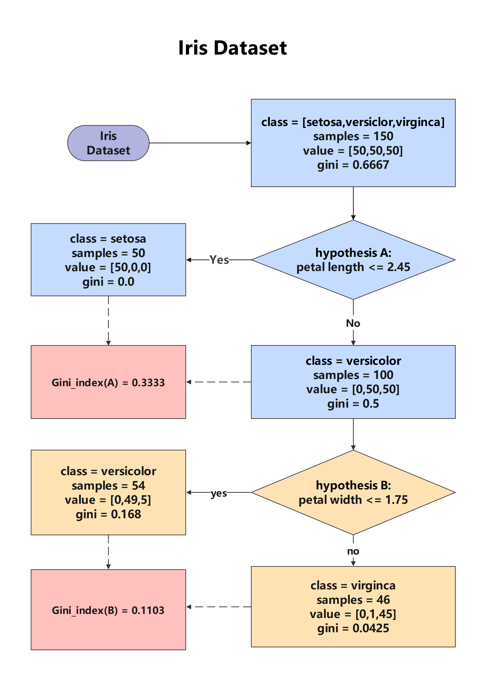
    
    </div>
    <br>
    
4. 分裂手段的选择

    决策树划分准则的关键是看经过一个操作之后，如何来衡量划分后的结果比划分前更纯净了。

    现在最常用的决策树树形结构是二叉树结构，所以分裂的指标一般是信息增益（Entropy）和基尼指数（Gini）。

    信息熵和基尼指数都是用来衡量数据集纯度的指标。在数据维度较低、数据比较清晰的情况下，信息熵和基尼系数没有太大的区别。但是在处理数据维度很大、噪音很大的数据时，基尼系数通常表现更好。

    但两者应用时产生的差异很小。

    信息熵与基尼系数的对比:
    - 信息熵：计算复杂度较高，但在清晰数据上表现好。
    - 基尼系数：计算简单，且在噪音数据上更鲁棒。

---

#### 3.3.4 剪枝处理

**剪枝（Pruning）是决策树学习算法对付“过拟合”的主要手段，也是根本方法。**

在决策树学习过程中，为了尽可能正确的分类训练样本，节点划分过程将不断重复，有时会造成决策树分支过多，导致因训练样本学的太过了，在应用到测试集的时候反而效果不好。因此，可**通过主动去掉一些分支来降低过拟合的风险**（从另一个角度来看，也是决定决策树学习的深度，到什么程度停止）。

决策树剪枝的基本策略有**预剪枝**（prepruning）和**后剪枝**（post-pruning）：

- 预剪枝是指在决策树生成过程中，对每个结点**划分前先进行估计**，若当前节点的划分不能带来决策树泛化性能的提升，则停止划分并将当前节点标记为叶节点。

- 后剪枝则是先**从训练集生成一颗完整的决策树，然后自底层向上对非叶节点进行考察**，若将该节点对应的子树替换为叶节点能带来决策树泛化性能提升，则将该子树替换为叶节点。

- 预剪枝和后剪枝最基础的手段是靠**精确度（也可以说错误率）的评估**。

    对样例集 $D$ ，分类错误率定义为：

    $$
    E(f;D) = \dfrac{1}{m}\sum_{i=1}^{m} \mathbb{I}(f(\mathbf{x}_i \neq y_i))
    $$

    精度则定义为：

    $$
    acc(f,D) = \dfrac{1}{m} \sum_{i=1}^{m} \mathbb{I}(\mathbf{x}_i = y_i)
    $$

    更一般的，对于数据分布 $D$ 和概率密度函数 $p(\cdot)$ ，错误率与精度可分别描述为：
    $$
    E(f;D) = \int_{x \sim D} \mathbb{I}(f(x) \neq y) p(x) dx\\[5pt]
    \begin{aligned}
    acc(f;D) &= \int_{x \sim D} \mathbb{I}(f(x) = y) p(x) dx\\[5pt]
    &= 1- E(f;D)
    \end{aligned}
    $$

- 性能比较

    - 时间开销

        预剪枝：测试时间开销降低，训练时间开销降低

        后剪枝：测试时间开销降低，训练时间开销增加

    - 过/欠拟合风险

        预剪枝：过拟合风险降低，欠拟合风险增加（**贪心**——一次收益不是很好的划分后面可能具有很高收益的划分）

        后剪枝：过拟合风险降低，欠拟合风险基本不变

<div style="width: 100%; border: 1px solid #ddd; padding: 10px;">

- 决策树分类器模型的调用：<br>  

    `class sklearn.tree.DecisionTreeClassifier(*, criterion='gini', splitter='best', max_depth=None, min_samples_split=2, min_samples_leaf=1, min_weight_fraction_leaf=0.0, max_features=None, random_state=None, max_leaf_nodes=None, min_impurity_decrease=0.0, class_weight=None, ccp_alpha=0.0, *monotonic_cst=None)`<br>    
    [DecisionTreeClassifier — scikit-learn 1.7.1 documentation](https://scikit-learn.org/stable/modules/generated/sklearn.tree.DecisionTreeClassifier.html#decisiontreeclassifier)<br>    
    主要参数如下： 

    | 参数 | 选项 | 默认 | 说明 |
    |------|------|------|------|
    | **`criterion`** | "gini", "entropy" | "gini" | 分裂质量衡量标准 |
    | **`splitter`** | "best", "random" | "best" | 分裂点选择策略 |
    | **`max_features`** | int/float/str | None | 考虑的最大特征数 |
    | **`class_weight`** | dict/balanced | None | 类别权重处理不平衡数据 |
    | **`ccp_alpha`** | float | 0.0 | **后剪枝**复杂度参数 |

    <br>
    主要预剪枝参数如下：  

    | 超参数 | 类型 | 默认值 | 作用 | 推荐范围 |
    |--------|------|--------|------|----------|
    | **`max_depth`** | int | None | 树的最大深度 | 3-10 (深树易过拟合) |
    | **`min_samples_split`** | int/float | 2 | 节点分裂所需最小样本数 | 2-20 (或0.01-0.1) |
    | **`min_samples_leaf`** | int/float | 1 | 叶节点所需最小样本数 | 1-10 (或0.005-0.05) |
    | **`min_weight_fraction_leaf`** | float | 0.0 | 叶节点最小权重和 | 0.0-0.5 |
    | **`max_leaf_nodes`** | int | None | 最大叶节点数量 | 10-100 |
    | **`min_impurity_decrease`** | float | 0.0 | 分裂所需最小不纯度减少量（收益Grain） | 0.0-0.1 |   

    <br>
    示例：
    
    ```python
    # 适度预剪枝（推荐）
    DecisionTreeClassifier(
        max_depth=5,
        min_samples_split=10,
        min_samples_leaf=5,
        max_leaf_nodes=20
    )
    
    # 严格预剪枝（欠拟合风险）
    DecisionTreeClassifier(
        max_depth=2,
        min_samples_split=50,
        min_samples_leaf=20
    )
    # 可能成为浅层决策树桩
    ```

</div>


后剪枝：

常用的三种后剪枝方法：

1. REP—**错误率**降低剪枝
2. PEP—悲观剪枝（C4.5）
3. CCP（ Cost-Complexity Pruning）—代价复杂度剪枝（CART）


代价复杂度剪枝（CART）：

剪枝策略：在**模型复杂度**和**预测精度**之间寻找最优平衡。

该算法为子树 $T_t$ 定义了代价（cost）和复杂度（complexity）以及一个可由用户设置的衡量代价与复杂度之间关系的参数 $\alpha$ ，其中，**代价指在剪枝过程中因子树 $T_t$ 被叶节点替代而增加的错分样本**，**复杂度表示剪枝后子树 $T_t$ 减少的叶结点数**，$\alpha$ 则表示剪枝后树的复杂度降低程度与代价间的关系，定义为：
$$
R_{\alpha}(T) = R(T) + \alpha \times |\widetilde{T}|
$$

> - $R(T)$：子树T的预测误差（回归常用MSE）
>
> - $|\widetilde{T}|$：子树T的叶节点数量（复杂度度量）
>
> - $\alpha$：复杂度惩罚系数（≥0）
>
>     $\alpha=0$：只考虑误差，保留完整树（过拟合风险）
>
>     $\alpha\rightarrow ∞$：无限惩罚复杂度$\rightarrow$单节点树（欠拟合）

对于每个非叶节点 $t$ ：
$$
\alpha = \dfrac{R(t)-R(T_t)}{\mid \widetilde{T_t} \mid - 1}
$$

> 其中，
>
> - $\mid \widetilde{T_t} \mid$：子树 $T_t$ 中叶节点数；
>
> - $R(t)$：节点 $t$ 剪枝后的误差（作为叶节点），计算公式为$R(t) = t(t) \cdot p(t)$
>
>     ​               $r(t)$为节点 $t$ 错分样本率，$p(t)$为落入节点 $t$ 的样本所占样本的比例；
>
> - $R(T_t)$：以 $t$ 为根的子树 $T_t$ 的误差，计算公式为$R(T_t) = \sum R(i)$，$i$ 为子树 $T_t$ 下的叶节点。

CCP剪枝算法分为两个步骤：

- 对于完全决策树T的每个非叶结点计算 $\alpha$ 值，循环剪掉具有最小 $\alpha$ 值的子树，直到剩下根节点。在该步可得到一系列的剪枝树$\{T_0,T_1,T_2,\cdots,T_m \}$,其中 $T_0$ 为原有的完全决策树，$T_m$ 为根结点，$T_i+1$ 为对  $T_i$  进行剪枝的结果；
- 从子树序列中，根据真实的误差估计选择最佳决策树。

这个剪枝的方式对应到`sklearn.tree.DecisionTreeClassifier`里面的`ccp_alpha`参数。

[Example: Post pruning decision trees with cost complexity pruning — scikit-learn 1.7.1 documentation](https://scikit-learn.org/stable/auto_examples/tree/plot_cost_complexity_pruning.html#sphx-glr-auto-examples-tree-plot-cost-complexity-pruning-py)

[Source code Downloaded from scikit-learn.org](../source/py/plot_cost_complexity_pruning.py)

---

#### 3.3.5 回归树

回归决策树主要指CART（classification and regression tree）算法，内部结点特征的取值为“是”和“否”， 为二叉树结构。

所谓回归，就是根据特征向量来决定对应的输出值。回归树就是将特征空间划分成若干单元，每一个划分单元有一个特定的输出。因为每个结点都是“是”和“否”的判断，所以划分的边界是平行于坐标轴的。对于测试数据，我们只要按照特征将其归到某个单元，便得到对应的输出值。

回归树用到的划分准则为**MSE**。


`class sklearn.tree.DecisionTreeRegressor(*, criterion='squared_error', splitter='best', max_depth=None, min_samples_split=2, min_samples_leaf=1, min_weight_fraction_leaf=0.0, max_features=None, random_state=None, max_leaf_nodes=None, min_impurity_decrease=0.0, ccp_alpha=0.0, monotonic_cst=None)`


具体参考——[决策树-回归（作者：禺垣笔记）](https://zhuanlan.zhihu.com/p/42505644)

---

#### 3.3.6 经典决策树算法

- ID3和C4.5

    ID3（Iterative Dichotomiser 3，迭代二叉树3代）由Ross Quinlan于1986年提出。1993年，他对ID3进行改进设计出了C4.5算法。

    我们已经知道ID3与C4.5的不同之处在于，ID3根据信息增益选取特征构造决策树，而C4.5则是以信息增益率为核心构造决策树。既然C4.5是在ID3的基础上改进得到的，那么这两者的优缺点分别是什么？

    **使用信息增益会让ID3算法更偏向于选择值多的属性**。信息增益反映给定一个条件后不确定性减少的程度，必然是分得越细的数据集确定性更高，也就是信息熵越小，信息增益越大。因此，在一定条件下，值多的属性具有更大的信息增益。而C4.5则使用信息增益率选择属性。信息增益率通过引入一个被称作分裂信息(Split information)的项来惩罚取值较多的属性，分裂信息用来衡量属性分裂数据的广度和均匀性。这样就改进了ID3偏向选择值多属性的缺点。**相对于ID3只能处理离散数据，C4.5还能对连续属性进行处理**，具体步骤为：

    1. 把需要处理的样本(对应根节点)或样本子集(对应子树)按照连续变量的大小从小到大进行排序。
    2. 假设该属性对应的不同的属性值一共有N个，那么总共有N−1个可能的候选分割阈值点，每个候选的分割阈值点的值为上述排序后的属性值中两两前后连续元素的中点，根据这个分割点把原来连续的属性分成bool属性。实际上可以不用检查所有N−1个分割点。(连续属性值比较多的时候，由于需要排序和扫描，会使C4.5的性能有所下降。)
    3. 用信息增益比率选择最佳划分。

    

    C4.5其他优点

    - 在树的构造过程中可以进行剪枝，缓解过拟合；

    - 能够对连续属性进行离散化处理（二分法）；

    - 能够对缺失值进行处理；

    

- CART

    CART（Classification And Regression Tree，分类回归树）由L.Breiman，J.Friedman，R.Olshen和C.Stone于1984年提出，是一种应用相当广泛的决策树学习方法。值得一提的是，CART和C4.5一同被评为数据挖掘领域十大算法。

    **CART算法采用一种二分递归分割的技术，将当前的样本集分为两个子样本集，使得生成的的每个非叶子节点都有两个分支。因此，CART算法生成的决策树是结构简洁的二叉树。**

    作为一种决策树学习算法，CART与ID3以及C4.5不同，它使用基尼系数（Gini coefficien）对属性进行选择，GINI系数越小则划分越合理。

---

## 4. 神经网络

神经网络算法大部分归类为**有监督学习**，所以它处理的对象为回归或分类任务。

### 4.1 概述

人工神经网络(Artificial Neural Network， 简写为ANN)，也简称为神经网络(NN)，直接设计灵感来源于生物神经系统的基本原理，尤其是大脑中神经元之间的信息传递方式。

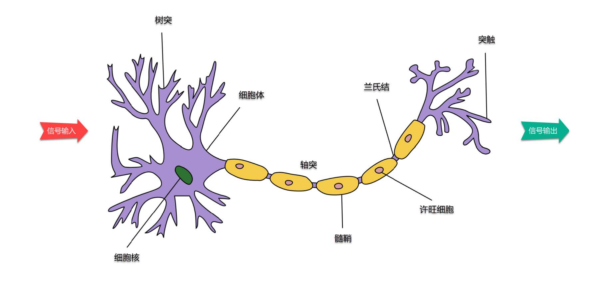

在生物神经网络中，每个神经元与其他神经元相连，信号（电信号）由树突接收，并在细胞体中进行处理，若电位超过某一阈值，那么它就会被激活，传递“兴奋”给下一个神经元。

树突 $\quad \Rightarrow \quad$ 输入层（接收信号）

细胞体 $\quad \Rightarrow \quad$ 隐藏层（整合处理信号）

突触 $\quad \Rightarrow \quad$ 输出层（输出信号）

**单个神经元**（Neuron，或uint）结构示意图：

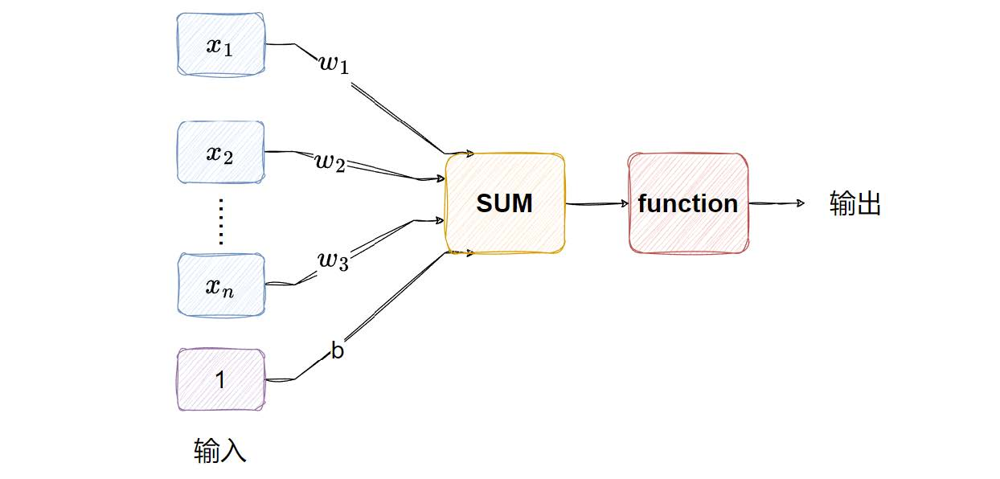

将上述生物神经元处理信号的过程抽象出来，就得到沿用至今的“**M-P神经元模型**”，神经元接受来自 $n$ 个其他神经元的输入信号，这些信号通过**带权重的连接**（这个权重就是神经网络需要寻找的参数矩阵）进行传递，神经元接收到的总输入将与神经元的阈值进行比较，然后通过**激活函数**（Activation Function）处理以产生神经元的输出。

将多个神经元通过一定的层次连接起来，就构成了神经网络，下面是**神经网络**结构示意图：

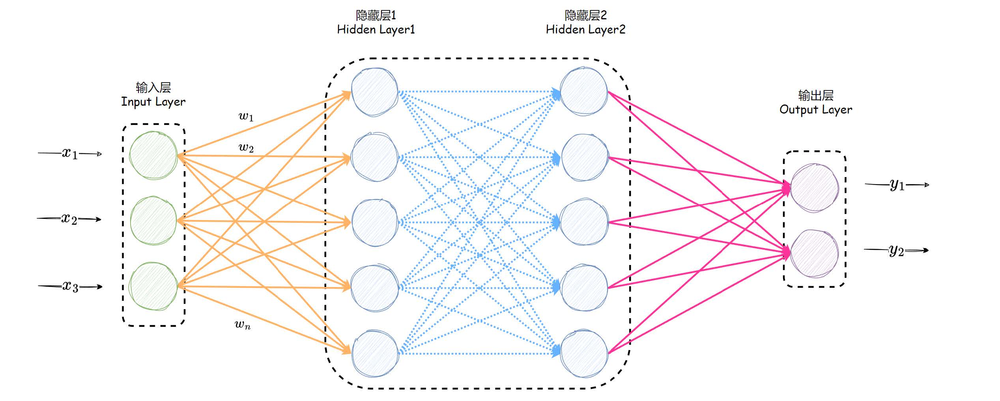

> 上图中所示结构是一种全连接（Full connected），它由以下两点特征：
>
> - 同一层的神经元之间没有连接
> - 第 $N$ 层的每个神经元和第 $N-1$ 层的所有神经元相连

---

### 4.2 激活函数

#### 4.2.1 激活函数的作用

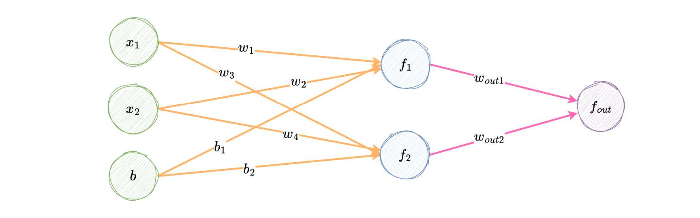

假如没有经过激活函数的处理，如上述简单的神经网络，不管中间经过了多少层，最终的结果一定可以用最开始的输入线性表示，这使得多层的神经网络失去意义，这样为何不采用线性回归的算法呢？其次，这样将无法处理非线性问题，引入激活函数就是引入**非线性变换**。

常见的激活函数类型有：

- 应对二分类问题的Sigmoid函数
- 应对多分类问题的Softmax函数
- 应对回归问题的恒等函数，即$f(x)=x$

下面将对各函数进行详细说明。

#### 4.2.2 Sigmoid函数

数学表达式为：
$$
f(x) = \text{sigmoid} (x) = \frac{1}{1+e^{-x}} = \frac{e^x}{1+e^x}\\
f^{'}(x) = \frac{1}{1+e^{-x}}(1-\frac{1}{1+e^{-x}}) = f(x)(1-f(x))
$$
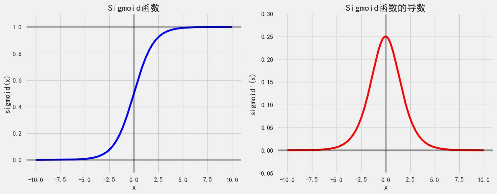

依据图像分析Sigmoid函数，Sigmoid函数具有以下明显特征：

- **函数是平滑过渡的 $S$ 型曲线，适于梯度下降法等优化算法**。
- 函数可以将任意的输入映射到 $(0,1)$ 之间，该特性使其天然适合表示概率（如二分类任务中输出概率），输出可直接解释为事件发生的可能性。
- 函数不是0中心的，均值不为0，会导致后续层的梯度更新出现一些问题。
- 导函数呈钟形曲线，最大值在 $x=0$​ 处，导数的最大值为0.25，向两侧逐渐衰减至0。反向传播时，中间区域的梯度较大，参数更新速度较快；但输入值远离0时（$\mid x \mid>5$），梯度接近0，称为梯度饱和现象，导致梯度消失，深层网络难以训练。
- 导数的取值不大，最大也只有1/4，深层次的神经网络在链式求导时，因多次乘以较小的数，进一步**加剧梯度消失**问题。

#### 4.2.3 tanh函数

双曲正切函数 $\tanh(x)$ 与sigmoid函数类似，但性质更好。

数学表达式为：
$$
f(x) = \tanh(x) = \dfrac{e^x - e^{-x}}{e^x + e^{-x}}\\
f^{'}(x) = 1- f^2(x)
$$
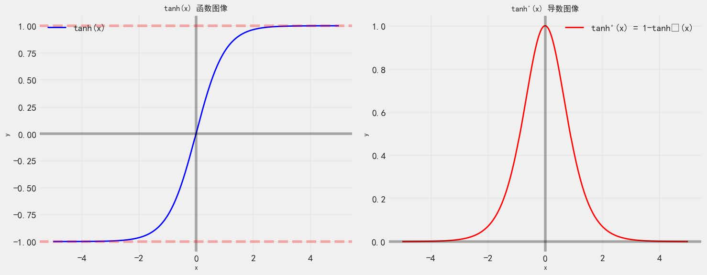

tanh函数具有以下明显特征：

- 平滑过渡的 $S$ 型曲线,函数在整个实数域内连续且无限可导。
- 函数可以**将任意的输入映射到 $(-1,1)$ 之间，零中心化**。
- 与sigmoid函数相比，tanh导函数更陡，梯度饱和现象出现更早（大约在 $\mid x \mid > 3$处就出现）。
- tanh导函数能取到1，比sigmoid更适合训练。

#### 4.2.4 ReLU函数

数学表达式为：
$$
f(x) = \max (0,x)\\[5pt]
f^{'}(x) = 
\begin{cases}
1 \quad \quad if \ \  x>0\\[3pt]
0 \quad \quad if \ \  x \leq 0
\end{cases}
$$
ReLU函数在神经网络中的优势：

- 缓解梯度消失问题，ReLU在正值区域的梯度恒为1，避免了梯度消失，尤其适合深层网络。

- 计算高效，仅需判断输入是否大于0，计算速度远超sigmoid和tanh（无需指数运算）。

- 减轻过拟合，当输入为负时输出0，使得部分神经元“死亡”。但是如果神经元输出始终为0（例如初始化权重过小或学习率过高），梯度在反向传播时也为0，导致神经元“永久死亡”（Dead ReLU 问题）。

    > 使用Leaky ReLU 公式：$f(x) = \max (\alpha x, x)$， 其中 $\alpha$ 是小的正数。可以在一种程度上规避”永久死亡的问题“

#### 4.2.5 Softmax函数

数学表达式为：
$$
\text{softmax}(z_j) = \dfrac{e^{z_j}}{\sum_{k=1}^{K}e^{z_k}}
$$
每个输出值在0到1之间，且所有输出之和为1，代表每个类别的概率，输出直观的概率解释。但类别过多时计算成本高，且指数计算可能不够高效。

详细内容见：[Linear_classification.md  2.2 Softmax回归解决多分类问题](Linear_classification.md)

#### 4.2.6 小结

| 激活函数       | 公式                                                                 | 优点                                       | 缺点                                      | 适用场景                     |
|:--------------:|----------------------------------------------------------------------|--------------------------------------------|-------------------------------------------|------------------------------|
| **Sigmoid**    | $ \sigma(x) = \dfrac{1}{ 1+e^{-x} } $                                | 输出在$(0,1)$，适合概率输出                | 梯度消失、计算量大、非零中心化            | 二分类输出层、早期神经网络   |
| **Tanh**       | $ \tanh(x) = \dfrac{ e^x-e^{-x} }{ e^x+e^{-x} } $                      | 输出零中心化,映射到$(-1,1)$，梯度优化上比Sigmoid强 | 梯度消失问题仍存在                        | 隐藏层（较少用）             |
| **ReLU**       | $ \text{ReLU}(x) = \max(0,x) $                                     | 计算快、缓解梯度消失                        | Dead ReLU 问题   | 隐藏层（主流选择）           |
| **Leaky ReLU** | $ \text{LReLU}(x) = \max(\alpha x,x) $ | 缓解神经元死亡（$\alpha$常取0.01）         | 需调参 $\alpha$，效果不稳定              | 隐藏层（ReLU的改进版）       |
| **Parametric ReLU** | 类似Leaky ReLU，但α可学习                                        | 自适应负区间斜率                            | 增加计算复杂度                            | 深层网络（如ResNet）         |
| **Swish**      | $\text{Swish}(x)= x\cdot\sigma(\beta x)$，β可调             | 平滑、实验性能优于ReLU                      | 计算量稍大                                | 隐藏层（Google推荐）         |
| **GELU**       | $ \text{GELU}(x) = x\cdot\Phi(x) $，$\Phi$为标准正态CDF       | 结合随机正则化思想，适合预测模型            | 计算复杂                                  | Transformer<br>如BERT、GPT |
| **Softmax**    | $ \text{softmax}(x_i) = \dfrac{ e^{x_i} }{ \sum_{k=1}^{K}e^{x_j} }$ | 输出多分类概率分布                          | 仅适用于输出层                            | 多分类输出层                 |

激活函数的使用方法
1. 隐藏层激活函数

      - 默认选择：优先使用 ReLU（计算快、效果好）
      - 改进选择：若遇到神经元死亡（如输出全为0），改用 Leaky ReLU 或 ELU
      - 深层网络：可尝试 Swish 或 GELU（需更多计算资源）
2. 输出层激活函数

      - 二分类：Sigmoid（输出概率）

      - 多分类：Softmax（输出互斥概率）

      - 回归问题：线性激活（无激活函数）

3. 应用场景
    1. 计算机视觉（CNN）：ReLU（速度快）、Swish（高性能）
    2. 自然语言处理（RNN/Transformer）：GELU（BERT、GPT）、Tanh（早期LSTM）
    3. 强化学习：ReLU（稳定训练）
    4. 生成对抗网络（GAN）：Leaky ReLU（防止梯度消失）


---


### 4.3 初始化参数

所谓初始化参数，它的对象是神经网络的每个神经元连接的权重。

参数初始化是神经网络训练的起点，合适的初始化可以加速训练收敛，帮助模型找到更好的局部最优解，直接影响模型的效率。

**不正确初始化的权重会导致梯度消失或爆炸问题**，从而对训练过程产生负面影响。（对于梯度消失问题，权重更新很小，导致收敛速度变慢——这使得损失函数的优化变慢，在最坏的情况下，可能会阻止网络完全收敛。相反，使用过大的权重进行初始化可能会导致在前向传播或反向传播过程中梯度值爆炸。）

**初始化要求**

- 保持每层激活值的均值接近于0
- 保持每层激活值的方差保持稳定

**常用的初始化方法**

- 全零或等值初始化 	`nn.init.ones_()` `nn.init.zeros_()` `n.init.constant_()`

    由于初始化的值全都相同，每个神经元学到的东西也相同，将导致“对称性(Symmetry)”问题。$\Rightarrow$ 不推荐

- 从均匀分布（Uniform Distribution）中采样    `nn.init.uniform_() `

- 从正态分布（Normal Distribution）中采样      `nn.init.normal_()`

    均值为零，标准差设置一个小值。这样的做好的好处就是有相同的偏差，权重有正有负。比较合理。

- **Xavier/Glorot初始化**
    1. 采用均匀分布采样  $W \sim U(-\dfrac{\sqrt{6}}{\sqrt{n_{in} + n_{out}}},\ \dfrac{\sqrt{6}}{\sqrt{n_{in} + n_{out}}})$	`nn.init.xavier_uniform_()  `
        1. 采用正态分布采样  $W \sim N(0,\ \sqrt{\dfrac{2}{n_{in} + n_{out}}})$	`nn.init.xavier_normal_()`
- **kaiming/He初始化**
    1. 采用均匀分布采样  $W \sim U(-\dfrac{\sqrt{6}}{\sqrt{n_{in} }},\ \dfrac{\sqrt{6}}{\sqrt{n_{in} }})$	`nn.init.kaiming_uniform_()`
    2. 采用正态分布采样  $W \sim N(0,\ \sqrt{\dfrac{2}{n_{in}}})$	`nn.init.kaiming_normal_()`

[Example: 4.2_parameter_initialize.ipynb](../source/py/4.2_parameter_initialize.ipynb)

构建方法:

- 所有自定义的神经网络模型必须继承自 `torch.nn.Module` ，这是 PyTorch 的基类.
- 网络层的定义在`__init__.py` 中(如全连接层 `nn.Linear `、卷积层` nn.Conv2d` 等)
- 前向传播的逻辑在` forward `中实现，当调用模型实例时（如 `model(input_data) `），PyTorch 会自动调用 `forward `方
    法

### 4.4 损失函数

由于神经网络的任务有两类——分类和回归，对应的损失函数也有两类，分类任务用交叉熵损失（Cross-Entropy Loss），回归任务用均方误差（MSE）或平均绝对误差（MAE）来衡量。


#### 4.4.1 交叉熵损失函数

**二分类交叉熵损失函数** (Binary Cross-Entropy Loss)，也称为对数损失 (Log Loss)，用于衡量模型预测概率与真实标签之间的差异。

损失函数为：
$$
\ell = \sum_{i=1}^{m} \left(y^{(i)} \ln \hat{y^{(i)}} \right) + (1-y^{(i)}) \ln \left( 1-\hat{y^{(i)}} \right)
$$
多分类任务通常使用softmax将scores转换为概率的形式，所以多分类的交叉熵损失也叫做 **softmax 损失**，它的计算方法是：
$$
\ell = -\sum_{i=1}^{m} y^{(i)} \ln \left( S(f(x^{(i)})) \right),\quad \quad \text{S是softmax激活函数}
$$

#### 4.4.2 平均绝对误差损失函数

$$
\text{MAE} = \dfrac{1}{m} \sum_{i=1}^{m} \mid y^{(i)} - f(x^{(i)}) \mid
$$

这里的绝对值运算对应于L1范数，因此MAE也被称为 L1  LOSS。

> 使用场景：
>
> 适用于**需要鲁棒性较强的回归任务**，尤其是数据存在异常值时（如金融风控）

#### 4.4.3 均方误差损失函数

$$
\text{MSE} = \dfrac{1}{m} \sum_{i=1}^{m} \left(y^{(i)} - f(x^{(i)}) \right)
$$

> 使用场景：
> 适用于**对异常值不敏感且需要平滑梯度优化的场景**，如预测连续值（房价、温度等）

详细内容见：[Linear_regression.md  1.1.2 误差与损失函数](Linear_regression.md)

#### 4.4.4 Smooth L1

Smooth L1，是L1损失的平滑版本，公式为：
$$
\ell = 
\begin{cases}
0.5(y^{(i)} - f(x^{(i)}))^2 \ , &\quad if \mid x \mid < 1\\[5pt]
\mid y^{(i)} - f(x^{(i)}) \mid - 0.5 \ , &\quad otherwise
\end{cases}
$$

>使用场景：
>常用于目标检测（如Faster R-CNN），解决MAE在零点不平滑的问题

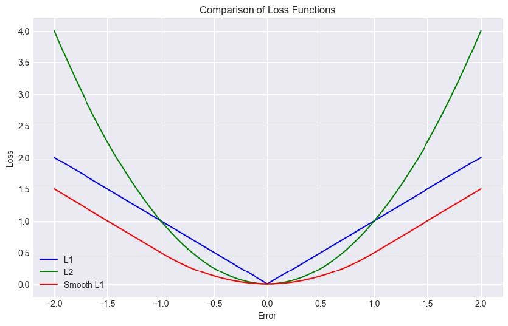

Smooth L1在误差较小时使用平方项，保证梯度平滑；误差较大时使用线性项，避免梯度爆炸。计算效率高，适合大规模数据。但是对超参数（如分段阈值）敏感，需根据任务调整。

---

### 4.5 优化算法

#### 4.5.1 梯度下降法

基本公式：
$$
 W_{j}^{t+1} = W_{j}^{t} - \eta \cdot g_{j} 
$$
详细内容见：[Linear_regression.md  1.2.1 梯度下降法](Linear_regression.md)


在神经网络算法中，梯度的计算采用“**反向传播**”的思想。

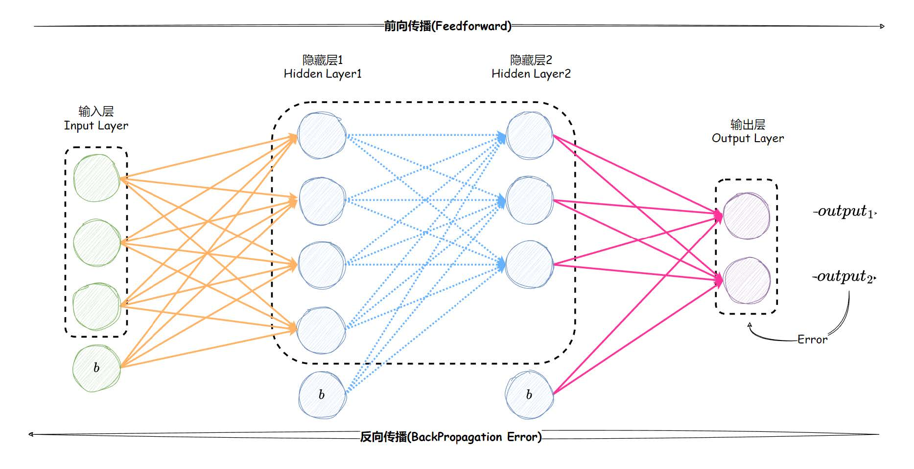

- 前向传播与反向传播的关系

    反向传播依赖于前向传播（Forward Propagation）。在训练过程中：

    **前向传播**是输入数据通过网络的每一层，计算每一层的输出，最终得到网络的预测结果和损失。

    **反向传播**是根据损失，从输出层开始，逐层向输入层传播误差，计算每个参数的梯度(对损失的贡献), 然后根据这些梯度调整参数，使得损失逐步减小。

    简单来说，前向传播是“从输入到输出”，反向传播是“从输出到输入”。

    **反向传播的核心思想基于链式法则，它允许我们在复杂的多层网络中高效地计算梯度，而不需要显式地对每个参数求偏导数**。

以下面这个例子来说明反向传播的思想。

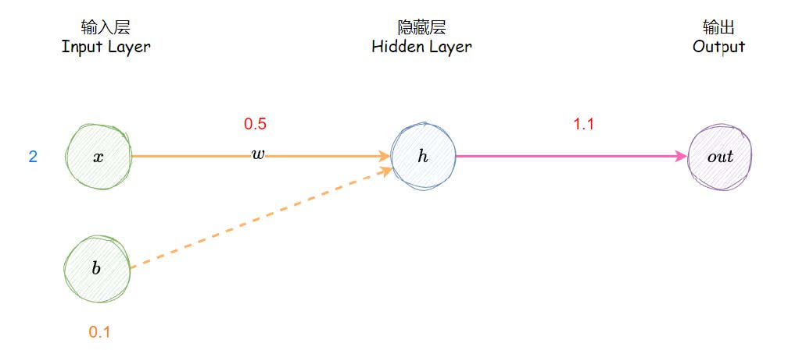

该模型输入 $x = 2$，权重 $w = 5$，偏置 $b = 0.1$，真实值 $y = 1$

---

- 前向传播：

    线性加权和：
    $$
    \hat{y} = wx + b = 1.1
    $$
    采用 Sigmoid 激活函数，输出为：
    $$
    a = \sigma (\hat{y}) = \dfrac{1}{1+e^{-\hat{y}}} \approx 0.75
    $$
    

​	以均方误差来衡量模型好坏（作为损失函数）：
$$
\ell = (a - y)^2 = 0.0625
$$
​	前向传播从输入到输出，得到模型的损失值，该值越小越好，但是很难通过这种方法来优化，因为每一层网络都对结果有贡献，	最终的表达式（其实很难得到这个表达式）很难求梯度，所以很难优化。

---

- 反向传播

    反向传播的核心是通过链式法则逐层计算损失函数 $\ell$ 对模型参数（权重 $w$ 和偏置 $b$）的梯度，从而**更新参数**以最小化损失。

    损失函数是均方误差，其对 $a$ 的导数为：
    $$
    \left. \frac{\partial \ell}{\partial a} \right|_{a=0.75} = \left. 2(a - y) \right|_{a=0.75} = -0.5
    $$
    $a$  对 $\hat{y}$ 求导：
    $$
    \left. \frac{\partial a}{\partial \hat{y}} \right|_{\hat{y} = 1.1} 
    = \left. a \cdot (1-a) \right|_{a=0.75} = 0.1875
    $$

    >这里比较特殊，在于Sigmoid函数的导数  **$\sigma ' = \sigma \cdot(1 - \sigma)$** 。
    
     $\hat{y}$ 对权重 $w$ 求导：
    $$
    \frac{\partial \hat{y}}{\partial w} = x = 2
    $$
    由链式求导法则，得损失函数 $\ell$ 对权 $w$ 得导数为：
    $$
    \dfrac{\partial \ell}{\partial w} = \dfrac{\partial \ell}{\partial a} \cdot \dfrac{\partial a}{\partial \hat{y}} \cdot \dfrac{\partial \hat{y}}{\partial w} = -0.1875
    $$
    链式法则将复杂的导数分解为简单的部分导数相乘，逐层传递梯度。
    
    **负梯度表示需要增加权重 $w$ 以减少损失。**
    
    用梯度下降更新权重，取学习率 $\eta = 0.1$，：
    $$
    w^{new} = w - \eta \cdot \dfrac{\partial \ell}{\partial w} = 0.51875
    $$
    同理得到新得偏置：
    $$
    b^{new} = 0.109375
    $$
    再次从前向传播得方向看，有：
    $$
    \hat{y}^{new} \approx 1.1469\\[3pt]
    a^{new} \approx 0.757\\[3pt]
    \ell^{new} \approx 0.0576
    $$
    $\ell$ 降低，说明更新的方向正确。
    
    ---

>在使用梯度下降算法中，可能会碰到以下情况：
>
>- 平缓区域，梯度值较小，参数优化缓慢
>- “鞍点” ，梯度为 0，参数无法优化
>- 局部最小值
>
>根据这些问题，出了一些对梯度下降算法的优化方法，比如：动量法（Momentum）、Adagrad、RMSprop、Adam等

---

#### 4.5.2 动量优化算法

动量法（Momentum）的灵感来源于物理学中的动量概念。当一个物体运动时，其动量会使其保持原有方向的趋势，从而平滑运动轨迹。在优化中，动量通过累积历史梯度的指数加权平均，使参数更新方向更加一致，从而：

- 加速收敛：在梯度方向一致时累积动量，增大更新步长。

- 减少震荡：在梯度方向变化时，动量抵消部分震荡，使更新更平滑。

在介绍动量法之前，先介绍“**指数加权平均**”这个概念。

<div style="width: 100%; border: 1px solid #ddd; padding: 10px;">

指数加权平均（Exponentially Weighted Moving Average，简称 EWMA）是一种对时间序列数据进行平滑处理的方法，其核心特点是**赋予近期数据更高的权重**，**而历史数据的权重随时间呈指数级衰减**。


数学表达为：
$$
V_t
= \begin{cases}
\theta_0 \  &\quad t = 0\\[3pt]
\beta \cdot V_{t-1} + (1- \beta) \cdot \theta_t \  &\quad t>0
\end{cases}
$$

>- $V_t$：当前时刻的指数加权平均值
>- $V_{t-1}$：前一刻的指数加权平均值
>- $\theta_t$：当前时刻的实际数据
>- $\beta$：衰减因子（0到1之间），决定历史数据的权重下降速度
>
>    有人把 $\beta$ 形象的称为“摩擦系数”，能直观体现 $\beta$ 取不同值时的效果
>
>    - 为 **0** 时，退化为未优化前的梯度更新
>
>    - 为 **1** 时， 表示完全没有摩擦，这样会存在大的问题
>
>    - 取 **0.9** 是一个较好的选择。可能是 **0.9** 的 **60** 次方约等于 **0.001**，相当仅考虑最近的60轮迭代所产生的的梯度，这个数值看起来相对适中合理

下面这个例子显示 EWMA 的效果          	[指数加权平均 作者：LiuHDme  from CSDN]([指数加权平均-CSDN博客](https:/blog.csdn.net/LiuHDme/article/details/104744836))

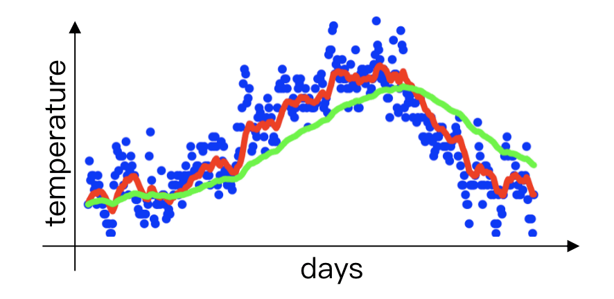

蓝点：采样

红线：$\beta = 0.9$ 时EWMA结果

绿线：$\beta = 0.98$ 时EWMA结果

</div>


回到动量法，它的数学表达为：
$$
v_t = \beta \cdot v_{t-1} + \eta \cdot \nabla J(W_t)\\[5pt]
W_{t+1} = W_t - v_t
$$

>- **动量项 $v_t$**：由历史动量 $\beta \cdot v_{t-1}$ 和当前梯度 $\eta \cdot \nabla W_t$ 加权求和得到，反映了**梯度方向的持续性和衰减性**
>- **参数更新 $W_{t+1}$**：参数基于动量项调整，而非直接使用当前梯度。这种设计能平滑震荡、加速收敛

**动量法的核心优势**：

1. 平滑震荡：动量项通过指数衰减平均**历史**梯度，减少参数更新方向的突变。
2. 加速收敛：在梯度方向一致的区域（如平坦区域），动量项逐步**累积**，推动参数快速接近极值点。
3. 逃离局部极值/鞍点：即使当前梯度趋近于0，**历史**动量仍能维持更新方向。

详细内容见：[深度学习中的Momentum算法原理-CSDN博客](https://blog.csdn.net/gaoxueyi551/article/details/105238182)

---

#### 4.5.3 自适应学习率优化算法

自适应学习率优化算法（Adaptive Gradient Algorithm，简称 AdaGrad）是一种用于优化神经网络和其他机器学习模型的梯度下降算法，其核心特点是**能够自适应地调整学习率**。

AdaGrad 的核心思想是**根据参数的历史梯度信息自适应地调整学习率**。具体来说，对于那些经常更新的参数（梯度较大的参数），学习率会逐渐减小，以避免震荡或过大的步长；而对于更新较少的参数（梯度较小的参数），学习率会相对较大，以加速收敛。

传统梯度下降算法使用固定的学习率 $\eta$ 来更新所有参数。AdaGrad 通过引入一个基于历史梯度的缩放因子，动态调整每个参数的学习率，从而使更新步长更符合数据的特性。

数学表达为：
$$
\theta_{t+1} = \theta_t - \dfrac{\eta}{\sqrt{s_t + \epsilon}}\cdot g_t
$$

>1.  $g_t$ 为损失函数的梯度：
>    $$
>    g_t = \nabla J(\theta_t)
>    $$
>
>2. $s_t$ 为 Adagrad 维护的一个累积变量，记录每个参数的历史梯度平方和：
>    $$
>    s_t = s_{t-1} + g_t^2
>    $$
>    这里，$g_t^2$ 表示梯度的**逐元素**平方。对于多维参数，$s_t$ 是一个向量或矩阵，与 $\theta$ 的维度相同。
>
>3. $\sqrt{s_t + \epsilon}$ 称为缩放因子，其中 $\epsilon$ 为一个极小的的常数（一般取 $10^{-8}$），用来防止除零。$\dfrac{\eta}{\sqrt{s_t + \epsilon}}$ 可以看作每个参数的有效学习率，它会随着 $s_t$ 的增大而减小。

**AdaGrad 优缺点：**

- AdaGrad 具有以下显著优点：
    1. **自适应学习率**：无需手动调整学习率，算法自动根据梯度历史调整每个参数的学习率。
    2. **适合稀疏数据**：对于稀疏特征或梯度较小的参数，Adagrad能加速收敛，非常适合NLP、推荐系统等场景。
    3. **简单易实现**：算法逻辑简单，计算开销较低，适合快速原型开发。
    4. **对初始学习率不敏感**：由于学习率会自适应调整，初始学习率 的选择对结果影响较小。
- AdaGrad 的缺点
    1. **学习率单调递减**：有效学习率持续减小，在训练后期，学习率可能变得极小，导致模型停止学习（**早停问题**）。
    2. **对非凸问题表现不佳**：在非凸优化问题（如深度神经网络）中，AdaGrad可能过早收敛到次优解，因为学习率衰减过快。
    3. **内存需求**：Adagrad 需要存储每个参数的历史梯度平方和 $s_t$ ，对于高维模型，这会增加内存开销。
    4. **不适合所有任务**：对于密集数据或需要长时间训练的任务，AdaGrad的表现可能不如其他算法（如RMSProp或Adam）

---

#### 4.5.4 均方根传播优化算法

均方根传播（Root Mean Square Propagation，简称 RMSProp）优化算法是一种广泛应用于深度学习的优化算法，**旨在通过自适应地调整学习率来加速梯度下降的收敛**。

RMSProp的核心思想是**通过计算梯度的指数平均来动态调整每个参数的学习率**（EWMA + AdaGrad），从而平滑梯度更新，减少振荡，并加速收敛。与 AdaGrad 不同，RMSProp 不累积所有历史梯度的平方，而是使用一个衰减的移动平均，关注近期梯度信息，避免学习率过早或过度缩小。

数学表达为：
$$
\theta_{t+1} = \theta_t - \dfrac{\eta}{\sqrt{v_t + \epsilon}}\cdot g_t
$$

>$v_t$ 为使用指数移动平均更新梯度平方的估计：
>$$
>v_t = \beta \  v_{t-1} + (1-\beta)g_t^2
>$$

**RMSProp 的优缺点：**

- RMSProp 的优点
    1. **自适应学习率**
    2. **快速收敛**：通过关注近期梯度，RMSProp 避免了 AdaGrad 学习率过快衰减的问题，适合非凸优化问题（如深度神经网络）。RMSProp 在许多任务中比 SGD 和 AdaGrad 收敛更快。
- RMSProp 的缺点
    1. **缺乏理论支持**：RMSProp 是一种启发式算法，未在学术论文中正式发表，缺乏严格的数学证明支持其收敛性。其性能依赖于经验调参和具体问题。
    2. **超参数敏感性**：虽然超参数较少，但学习率 $\eta$ 和衰减率 $\beta$ 的选择仍可能显著影响性能，需要针对具体任务调整。
    3. **非通用的最优解**：RMSProp 并非所有优化问题的理想选择。例如，在某些凸优化问题中，AdaGrad 可能更适合；在通用深度学习任务中，Adam 通常优于 RMSProp。
    4. **局部最小值风险**：尽管 RMSProp 擅长处理非凸问题，但仍可能陷入次优的局部最小值或鞍点，尤其在高维空间中。

[Example: 4.5.4_RMSProp.ipynb](../source/py/4.5.4_RMSProp.ipynb)

---

#### 4.5.5 自适应矩估计优化算法

Adam（Adaptive Moment Estimation，自适应矩估计）是一种在深度学习中广泛使用的优化算法。Momentum 善于处理梯度的方向和大小，而 RMSProp 善于调整学习率以应对数据的稀疏性。而 Adam 结合了 Momentum 和 RMSProp 两种优化算法的优点，同时减少它们的缺点，提供一种更加鲁棒的优化解决方案。

- Momentum：通过累积历史梯度的指数移动平均（一阶矩），加速梯度下降，类似于“惯性”
- RMSprop：通过梯度平方的指数移动平均（二阶矩），自适应地调整学习率，适应不同参数的梯度尺度


Adam的核心思想是**维护两个指数移动平均量**：

1. **一阶矩**：记录梯度的方向和大小，类似于动量法的均值
2. **二阶矩**：记录梯度的尺度，类似于RMSprop，用于自适应学习率

数学表达为：
$$
\theta_t = \theta_{t-1} - \dfrac{\eta}{\sqrt{\hat{v}_t} + \epsilon} \cdot \hat{m}_t
$$

> 1. 一阶矩（动量）：通过指数加权平均累积历史梯度，加速平坦方向的收敛
>     $$
>     m_t = \beta_1 \ m_{t-1}\  + (1-\beta_1)g_t
>     $$
>
> 2. 二阶矩（方差）： 捕捉梯度幅度的变化，调整学习率以应对不同参数的特性
>     $$
>     v_t = \beta_2 \ v_{t-1} + (1-\beta_2)g_t^2
>     $$
>
> 3. 偏差修正机制：
>
>     由于 $m_0 = 0$ 和 $v_0 = 0$ ，所以在训练初始阶段，$m_t$ 与 $v_t$ 会严重偏向于 0，尤其是在 $\beta_1$ 和$\beta_2$ 接近 1 时，这会导致 $m_t$ 无法准确反映梯度的真实均值，$v_t$ 无法准确反映梯度平方的真实均值，进而导致更新步长（学习率调整后的梯度）不准确，优化过程可能不稳定或收敛缓慢。所以需要一个偏差修正的机制，如下：
>     $$
>     \hat{m}_t = \dfrac{m_t}{1-\beta_1^t}\\[3pt]
>     \hat{v}_t = \dfrac{v_t}{1-\beta_2^t}\\
>     $$

**Adam 的优缺点：**

- Adam 的优点
    1. **自适应学习率**：尤其适合高维参数空间。
    2. **高效收敛**：在图像分类、自然语言处理等任务中表现出快速收敛性。
    3. **鲁棒性强**：对初始学习率不敏感，且能处理噪声数据和稀疏梯度。
- Adam 的缺点
    1. **局部最优风险**：某些任务中可能过早收敛至次优解，尤其在极大规模数据集上不如带动量的SGD
    2. **超参数调整**：尽管默认参数（$\beta_1 = 0.9, \ \beta_2 = 0.999$）适用多数场景，但特定问题仍需微调

[Example: 4.5.5_Adam.ipynb](../source/py/4.5.5_Adam.ipynb)

---

#### 4.5.6 小结

1. **动量法 (Momentum Method)**

    核心思想
    在每次更新中，将当前梯度与历史梯度的加权平均（动量项）结合，减少震荡并加速向目标方向移动。类似物理中的"球滚下山坡"，动量帮助模型"记住"之前的运动方向。

    数学表达
    $$
    v_t = \beta \cdot v_{t-1} + \eta \cdot \nabla W_t \\[5pt]
    W_{t+1} = W_t - v_t
    $$

2. **Adagrad (Adaptive Gradient Algorithm)**

    核心思想
    根据参数的梯度历史自适应地调整学习率，特别适合处理稀疏数据或凸优化问题。

    数学表达
    $$
    \theta_{t+1} = \theta_t - \frac{\eta}{\sqrt{v_t + \epsilon}} \cdot g_t
    $$

3. **RMSProp (Root Mean Square Propagation)**

    核心思想
    Adagrad的改进版本，通过引入指数移动平均代替梯度平方和的累积，限制历史梯度的影响范围。

    数学表达
    $$
    v_t = \beta v_{t-1} + (1 - \beta) g_t^2 \\[5pt]
    \theta_{t+1} = \theta_t - \frac{\eta}{\sqrt{v_t + \epsilon}} g_t
    $$

4. **Adam (Adaptive Moment Estimation)**

    核心思想
    结合动量法和RMSProp的优点，用梯度的指数移动平均（一阶动量）加速梯度更新，用梯度平方的指数移动平均（二阶动量）自适应调整学习率。

    数学表达
    $$
    m_t = \beta_1 m_{t-1} + (1 - \beta_1) g_t \\[3pt]
    v_t = \beta_2 v_{t-1} + (1 - \beta_2) g_t^2 \\[5pt]
    \hat{m}_t = \frac{m_t}{1 - \beta_1^t} \\
    \hat{v}_t = \frac{v_t}{1 - \beta_2^t} \\
    \theta_t = \theta_{t-1} - \frac{\alpha}{\sqrt{\hat{v}_t + \epsilon}} \hat{m}_t
    $$

---

优化算法对比总结

| 算法 | 核心思想 | 优点 | 缺点 | 适用场景 |
|:----:|:--------:|------|------|----------|
| **Momentum** | 累积历史梯度方向，加速收敛 | 加速收敛、减少震荡、实现简单 | 超参数敏感、可能超调、非凸问题效果有限 | 平坦或狭长谷的损失函数 |
| **Adagrad** | 自适应学习率，基于梯度平方和调整 | 自适应、无需调学习率、适合稀疏数据 | 学习率衰减过快、非凸问题效果差、内存需求大 | 稀疏数据、凸优化问题 |
| **RMSProp** | 用指数移动平均替代累积，改进Adagrad | 学习率衰减合理、适合非凸问题、计算高效 | 仍需调参、对噪声敏感、可能陷入局部极值 | 深度学习、非凸优化、时间序列 |
| **Adam** | 结合动量法和RMSProp，跟踪一阶和二阶动量 | 收敛快、鲁棒性强、默认参数通用、适合复杂模型 | 理论收敛性争议、内存需求高、特定任务可能不如SGD | 大多数深度学习任务、复杂非凸优化 |

选择建议

1. Momentum：适合简单模型或初步实验，需手动调参

2. Adagrad：适合稀疏数据和凸优化，但在深度学习中较少单独使用

3. RMSProp：适合大多数深度学习任务，参数调整相对简单

4. Adam：**默认推荐算法，适合大多数场景，尤其是复杂模型和大规模数据**。如果 Adam 表现不佳，可尝试 RMSProp 或SGD + Momentum 

---

### 4.6 学习率衰减

**学习率衰减**（Learning Rate Decay）是深度学习优化中的一种重要技术，用于在训练过程中逐渐降低学习率，以帮助模型更好地收敛到损失函数的全局或局部最优解。

学习率衰减的核心思想是：

- 初期高学习率：训练初期，模型参数远离最优解，较**大**的学习率可以加速梯度下降，快速逼近较优区域。

- 后期低学习率：随着训练进行，模型逐渐接近最优解，较**小**的学习率可以避免大幅震荡，精细调整参数以稳定收敛。

几种常见的衰减策略有以下三种：固定步长衰减（Step Decay）、指定间隔学习率衰减、指数衰减（Exponential Decay）和余弦衰减（Cosine Annealing）。

1. **固定步长衰减**
    $$
    \eta_t = \eta_0 \cdot \gamma^{\lfloor t/s \rfloor}
    $$

    - $\gamma$ ：衰减因子（通常取 0.1 或 0.5）
    - $s$ ：衰减步长
    - $\lfloor \cdot \rfloor$ ：向下取整

2. **指定间隔学习率衰减**

    指定间隔学习率衰减可以理解为固定步长变体。

    预定义的训练轮数（epoch）或步数（称为“里程碑”，milestones）处，将学习率乘以一个衰减因子 $\gamma$ 。

    与普通的固定步长不同，允许用户指定多个不均匀的里程碑点，在这些点上进行学习率衰减。

3. **指数衰减**
    $$
    \eta_t = \eta_0 \cdot \gamma^t
    $$

4. **余弦衰减**

    学习率按照余弦函数周期性变化，从初始值逐渐下降到一个最小值（可以是 0 或自定义值）。
    $$
    \eta_t = \eta_{\min} + \frac{1}{2}(\eta_0 - \eta_{\min}) \cdot \left(1+\cos (\frac{t}{T}\pi) \right)
    $$

---

### 4.7 正则化

**正则化**（Regularization）是深度学习中用于防止模型过拟合的重要技术。

正则化的核心目标是通过在模型训练过程中引入约束或惩罚，降低模型复杂度，从而提升模型的泛化能力。

常见方法为：

- **显式正则化**：直接在损失函数中添加惩罚项（如 L1 / L2 正则化）
- **隐式正则化**：通过修改训练过程间接约束模型（如数据增强、早停法、随机失活、批标准化等）

下面主要介绍隐式正则化

1. **数据增强**：通过对训练数据进行随机变换，增加数据的多样性，从而提高模型对不同输入的鲁棒性和泛化能力

    - 图像：随机翻转、旋转、缩放、裁剪、颜色抖动

    - 文本：同义词替换、随机插入/删除、回译

    - 语音：添加噪声、改变音调或速度

2. **提前停止**：在训练过程中监控验证集上的性能（如损失或准确率），当验证集性能在若干轮内不再提升时，停止训练以避免过拟合

3. **随机失活**（inverted Dropout）：在训练过程中，随机以一定概率 $p$（通常为 0.2~0.5）丢弃神经网络中的部分神经元及其连接，使得网络在每次前向传播时都使用不同的子网络结构从，而减少神经元之间的共适应性，增强模型的泛化能力
    $$
    h_i^{'} = \begin{cases}
    0 \ , &\quad \text{以概率}p\\
    \dfrac{h_i}{1-p}\ , &\quad \text{以概率}1-p
    \end{cases}
    $$
    训练时，每个神经元的输出 $h_i$ 除以概率 $p$ 保留，以概率 $1-p$ 置零；推理时，输出直接使用 $h_i$ ，无需随机丢弃。

    Dropout 广泛用于全连接层，常用于较深的网络，如 CNN 和 Transformer 。

4. **批标准化**（Batch Normalization）：在每一层的输入进行标准化（均值为 0，方差为 1），然后进行线性变换，以减少内部协变量偏移，从而稳定训练过程。BatchNorm 还具有一定的正则化效果，因为批次内的噪声可以看作一种随机性。


## 参考
- [B站周志华老师《机器学习》课程（up：机器学习学习通）](https://space.bilibili.com/1801542875/lists?sid=4996113&spm_id_from=333.788.0.0)
- [sklearn官方文档 User Guide](https://scikit-learn.org/stable/user_guide.html)
- [sklearn官方文档 API](https://scikit-learn.org/stable/api/index.html)
- [sklearn官方文档 Example](https://scikit-learn.org/stable/auto_examples/index.html)