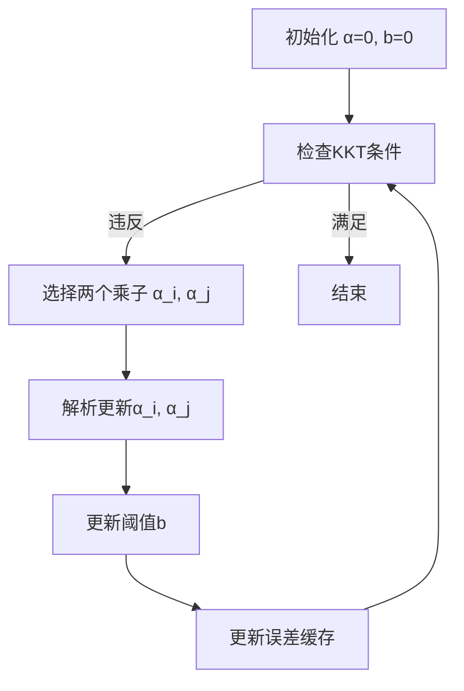

# SMO算法原理及其在SVM求解中的应用

## 1. SMO算法概述
**序列最小优化（Sequential Minimal Optimization, SMO）** 是一种用于高效求解支持向量机（SVM）对偶问题的优化算法。由John Platt于1998年提出，主要解决SVM训练过程中的大规模二次规划（QP）问题。

### 核心思想
- **分解策略**：将大规模QP问题分解为最小规模的子问题（每次只优化两个拉格朗日乘子）
- **启发式选择**：通过启发式规则选择待优化的乘子对
- **解析求解**：对子问题直接进行解析求解（闭式解），避免数值优化

## 2. 算法原理
### 2.1 优化目标
SVM的对偶问题形式：
$$
\max_{\alpha} \sum_{i=1}^m \alpha_i - \frac{1}{2} \sum_{i,j=1}^m \alpha_i \alpha_j y_i y_j K(\mathbf{x}_i, \mathbf{x}_j)
$$
约束条件：
$$
0 \leq \alpha_i \leq C, \quad \sum_{i=1}^m \alpha_i y_i = 0
$$
其中 $K(\cdot)$ 是核函数，$C$ 是惩罚参数。

### 2.2 关键步骤
1. **乘子选择启发式规则**：
   - 外层循环：选择违反KKT条件最严重的乘子 $\alpha_i$
   - 内层循环：根据最大步长准则选择 $\alpha_j$

2. **两变量解析解**：
   固定其他乘子，优化目标简化为二元二次函数：
   $$
   \begin{aligned}
   \alpha_j^{new} &= \alpha_j^{old} + \frac{y_j (E_i - E_j)}{\eta} \\
   \eta &= 2K(\mathbf{x}_i,\mathbf{x}_j) - K(\mathbf{x}_i,\mathbf{x}_i) - K(\mathbf{x}_j,\mathbf{x}_j)
   \end{aligned}
   $$
   其中 $E_k = f(\mathbf{x}_k) - y_k$ 为预测误差。

3. **裁剪约束**：
   - 考虑边界约束 $0 \leq \alpha_i,\alpha_j \leq C$
   - 线性约束 $\alpha_i y_i + \alpha_j y_j = \zeta$ (常数)
   ```python
   if y_i != y_j:
       L = max(0, α_j - α_i)
       H = min(C, C + α_j - α_i)
   else:
       L = max(0, α_i + α_j - C)
       H = min(C, α_i + α_j)
4. 更新阈值b：
    $$
    b = 
    \begin{cases}
        b_1 ,&\quad if 0 \leq \alpha_i \leq C\\
        b_2 ,&\quad if  0 \leq \alpha_j \leq C \\
        (b_1 + b_2)/2 ,&\quad otherwise
    \end{cases}
    $$

## 3. 在SVM中的应用
### 3.1 求解优势

| 特性                | 传统QP解法               | SMO解法                     |
|---------------------|-------------------------|----------------------------|
| **时间复杂度**      | $O(m^3)$               | $O(m^2)$~$O(m^3)$ 实际更优 |
| **空间复杂度**      | 需存储$m×m$核矩阵       | 仅缓存部分核矩阵           |
| **数值稳定性**      | 迭代法易累积误差        | 解析解无累积误差           |
| **大规模处理**      | 受内存限制              | 适合中等规模数据集         |
| **实现复杂度**      | 需专业QP求解器          | 相对简单易实现             |

### 3.2 实现流程




## 4. 参考

[文献](../article/cs229-notes3.pdf)