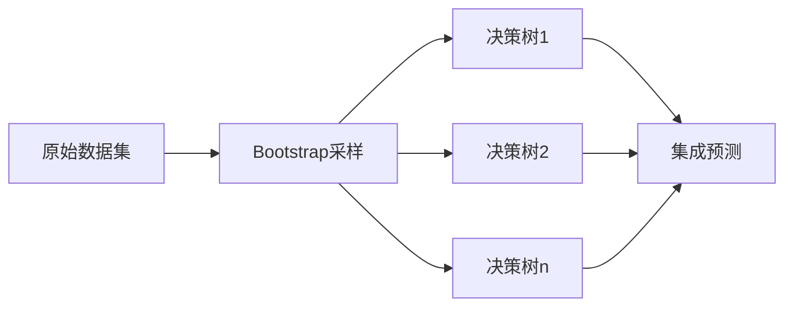

# 随机森林算法详解

## 1. 算法概述
**随机森林（Random Forest）** 是一种基于集成学习的监督学习算法，由Leo Breiman于2001年提出。它通过构建多棵决策树并组合其预测结果来提高模型的准确性和鲁棒性。

### 核心思想
> "集体的智慧优于个体" - 通过聚合多个弱学习器（决策树）构建强学习器

### 关键特性
- 🌳 **Bagging集成**：基于自助采样法构建多棵决策树
- 🎲 **随机特征选择**：节点分裂时随机选择特征子集
- 🤝 **多数表决**：分类任务投票，回归任务平均

## 2. 算法原理
### 训练过程


1. **自助采样（Bootstrap Sampling）**：
   - 从原始数据集（N个样本）中有放回地抽取N个样本
   - 约37%样本未被选中 → **袋外数据（OOB）** 可用于验证

2. **构建决策树**：
   - 在每个节点分裂时，随机选择 $m$ 个特征（$m \ll M$，$M$为总特征数）
   - 从 $m$ 个特征中选择最优分裂点（基尼指数/信息增益）
   - 树完全生长（不剪枝）

3. **聚合预测**：
   - **分类任务**：多数投票法 $ \hat{y} = \text{mode}\{T_1(x), T_2(x), ..., T_k(x)\} $
   - **回归任务**：平均值法 $ \hat{y} = \frac{1}{k}\sum_{i=1}^k T_i(x) $

### 关键参数
| 参数 | 说明 | 推荐值 |
|------|------|--------|
| `n_estimators` | 树的数量 | 100-500 |
| `max_features` | 节点分裂的特征数 | `sqrt(n_features)` (分类)<br>`n_features/3` (回归) |
| `max_depth` | 树的最大深度 | `None` (不限制) |
| `min_samples_split` | 节点分裂最小样本数 | 2-5 |
| `bootstrap` | 是否自助采样 | `True` |
| `oob_score` | 使用OOB评估 | `True` |

## 3. 算法优势
### 🌟 核心优势
1. **抗过拟合能力强**：
   - 随机特征选择降低树间相关性
   - Bagging减少方差

2. **高鲁棒性**：
   - 对噪声和异常值不敏感
   - 无需特征缩放

3. **特征重要性评估**：
   ```python
   # Python示例
   from sklearn.ensemble import RandomForestClassifier
   model = RandomForestClassifier()
   model.fit(X, y)
   print(model.feature_importances_)  # 特征重要性得分
   ```

4. **并行化能力**：
   - 各决策树独立训练 → 支持多核并行计算

### 性能对比（vs 单棵决策树）
| 指标 | 单棵决策树 | 随机森林 |
|------|------------|----------|
| 准确率 | 中等 | ⭐⭐⭐⭐ 高 |
| 抗过拟合 | 弱 | ⭐⭐⭐⭐ 强 |
| 训练速度 | ⚡ 快 | 中等 |
| 可解释性 | 高 | 中等 |

## 4. 数学基础
### 泛化误差分析
随机森林的泛化误差上界：
$$
PE^* \leq \frac{\bar{\rho}(1-s^2)}{s^2}
$$
其中：
- $\bar{\rho}$：树间相关性
- $s$：单棵树的分类强度
- **关键结论**：降低树间相关性可显著减少泛化误差

### 特征重要性计算
特征 $j$ 的重要性：
$$
\text{Importance}_j = \frac{1}{N_T}\sum_{T}\sum_{t \in T} \Delta I(t,j)
$$
- $N_T$：树的总数
- $\Delta I(t,j)$：节点 $t$ 使用特征 $j$ 分裂时的不纯度减少量

## 5. 应用实践
### Python实现示例
```python
# 分类任务
from sklearn.ensemble import RandomForestClassifier

rf_clf = RandomForestClassifier(
    n_estimators=300, 
    max_features='sqrt',
    oob_score=True,
    random_state=42
)
rf_clf.fit(X_train, y_train)
print(f"OOB准确率: {rf_clf.oob_score_:.4f}")

# 回归任务
from sklearn.ensemble import RandomForestRegressor

rf_reg = RandomForestRegressor(
    n_estimators=200,
    max_depth=10,
    min_samples_split=5
)
rf_reg.fit(X_train, y_train)
```

### 使用场景
| 场景类型 | 适用性 | 案例 |
|----------|--------|------|
| 高维数据 | ⭐⭐⭐⭐ | 基因表达数据分析 |
| 特征选择 | ⭐⭐⭐⭐ | 金融风控特征筛选 |
| 非平衡数据 | ⭐⭐⭐ | 欺诈检测（配合class_weight） |
| 基线模型 | ⭐⭐⭐⭐ | 新数据集初步建模 |

## 6. 优化技巧
### 参数调优指南
1. **树的数量**：
   - 增加可提升性能，但边际效益递减
   - 推荐范围：100-500棵

2. **特征选择策略**：
   - 分类：`max_features = sqrt(n_features)`
   - 回归：`max_features = n_features / 3`

3. **处理不平衡数据**：
   ```python
   model = RandomForestClassifier(class_weight='balanced')
   ```

### 常见问题解决方案
| 问题 | 解决方案 |
|------|----------|
| 训练速度慢 | 使用`n_jobs=-1`并行训练 |
| 内存占用高 | 设置`max_samples`限制样本量 |
| 预测延迟大 | 减少树的数量或深度 |

## 7. 进阶扩展
### 算法变体
| 变体名称 | 核心改进 | 适用场景 |
|----------|----------|----------|
| **极端随机树（ExtraTrees）** | 随机选择分裂阈值 | 高维数据 |
| **旋转森林（Rotation Forest）** | 特征空间PCA旋转 | 特征相关性高的数据 |
| **深度森林（Deep Forest）** | 多层森林结构 | 复杂模式识别 |

> **理论证明**：当树的数量 $k \to \infty$ 时，随机森林的泛化误差几乎处处收敛到上界

## 8. 总结
随机森林是一种强大且灵活的机器学习算法：
- ✅ 适用于分类和回归问题
- ✅ 天然支持特征重要性评估
- ✅ 对噪声和异常值具有鲁棒性
- ✅ 易于并行化加速训练

通过合理调整参数和处理数据，随机森林能在各种应用场景中取得优异性能，是机器学习实践中的"瑞士军刀"。